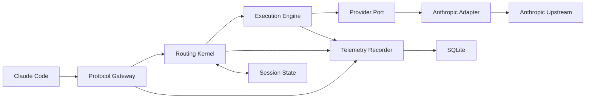

# Coding LLM Router v0.1 设计规格

> 状态：Draft  
> 版本：v0.1  
> 日期：2026-08-14  
> 首个参考客户端：Claude Code  
> 首个上游协议：Anthropic Messages  
> 实施细节：[v0.1 实施附录](./coding-llm-router-v0.1-implementation.md)

## 1. 摘要

Coding LLM Router 是一个本地优先的编程 LLM 路由代理。客户端只连接一个本地地址，路由器根据模型能力、任务信号、上下文规模、失败反馈和用户策略选择实际模型，并统一处理认证、流式转发、故障切换、成本记录和观测。

v0.1 验证以下纵向链路：

```text
Claude Code
  -> Anthropic Messages HTTP interface
  -> deterministic routing
  -> Anthropic provider adapter
  -> Anthropic models
  -> SSE or JSON response
```

第一版使用 Python 3.12。路由规则保持确定性，不引入机器学习分类器，不执行用户仓库中的代码，也不做上下文压缩。

## 2. 问题

编程 Agent 请求具有以下特点：

- 同一会话包含探索、规划、编辑、验证和修复等不同阶段。
- 模型必须满足 tool calling、thinking、vision、长上下文等硬能力要求。
- 结果质量经常要在补丁应用、工具调用、编译或测试之后才能判断。
- SSE 一旦向客户端发送首字节，就不能透明切换模型。
- 请求可能包含私有源码、密钥、内部路径和错误日志。
- 不同供应商对协议字段、事件和错误语义的支持不完全一致。

因此，路由决策不能只依赖最后一条用户 Prompt，也不能把所有失败都当成普通重试。

## 3. 产品范围

### 3.1 v0.1 目标

1. Claude Code 可通过修改 Anthropic base URL 使用本地路由器。
2. 非流式消息、SSE、system block、thinking、tool call、tool result、vision 和 prompt cache 字段可无损代理。
3. 支持虚拟模型 `code/auto`、`code/fast`、`code/balanced` 和 `code/deep`。
4. 支持配置中声明的模型直连别名。
5. `code/auto` 根据确定性规则选择模型，并输出可观测的路由原因。
6. 上游在响应提交前失败时，可切换到能力等价的 fallback。
7. 记录路由、attempt、token、成本和延迟，不默认保存原始 Prompt 或响应。
8. 配置、路由、执行和供应商调用具有清晰的模块 interface。

### 3.2 v0.1 非目标

- OpenAI Chat Completions 或 Responses 接入。
- Anthropic 与 OpenAI 之间的协议转换。
- LiteLLM 长尾供应商接入。
- 机器学习分类器、embedding 或在线学习。
- 自动运行编译、lint、测试或任意用户命令。
- 后生成 LLM judge 或完整响应质量验证。
- Prompt 响应缓存、上下文摘要或压缩。
- Dashboard、多租户、团队计费和分布式部署。
- 跨进程共享 session、provider health 或 rate limit 状态。
- 自动修改 Claude Code 配置文件。

## 4. 核心原则

### 4.1 结果优先

路由目标是在满足任务成功率要求的前提下降低成本与延迟，而不是单纯选择最便宜的模型。

### 4.2 能力约束先于成本

模型不支持请求需要的能力时，不能进入候选集。fallback 也必须保持能力等价。

### 4.3 协议透明

除顶层 `model`、认证 header 和路由器专属 metadata 外，v0.1 不主动改写请求语义。未知字段和未知 SSE event 默认透传。

### 4.4 流式提交不可逆

向客户端发送第一个响应字节后，执行模块不得切换模型或重新生成响应。

### 4.5 隐私默认关闭原文记录

日志和 SQLite 仅记录结构化特征、摘要值和计量数据。消息、tool 参数、tool 结果和模型响应默认不落盘。

### 4.6 单一路由链

虚拟模型、自动路由、能力过滤和 fallback 都编译进同一个 Execution Plan，不维护互不生效的第二套路由配置。

## 5. 领域术语

| 术语 | 定义 |
|---|---|
| Protocol Envelope | 未被破坏性归一化的客户端请求，包含原始 JSON、允许透传的 header 和协议信息 |
| Task Context | 从请求临时提取的路由特征，不包含完整源码副本 |
| Model Target | 一个已配置的供应商、上游模型和能力集合 |
| Route Profile | 客户端请求的虚拟模型，如 `code/fast` 或 `code/auto` |
| Execution Plan | 路由模块生成的不可变执行计划，包含 primary、fallback、超时和原因 |
| Attempt | 对某个 Model Target 的一次上游调用 |
| Commit Point | 第一个响应字节写给客户端的时刻 |
| Outcome Signal | 从 tool result 等输入中提取的成功或失败信号 |
| Route Event | 一次请求最终形成的结构化观测记录 |

## 6. 架构



外部 HTTP interface 是客户端唯一需要了解的 interface。客户端不需要了解供应商、模型能力表、fallback 或持久化实现。

内部只在行为确实需要替换的位置定义 seam：

- `ProviderPort`：生产使用 Anthropic Adapter，验证使用 Fake Adapter。
- `EventStorePort`：生产使用 SQLite Adapter，验证使用 In-memory Adapter。

路由规则、特征提取器和成本计算器是 Routing Kernel 的内部实现，不分别暴露公共 interface。

## 7. 模块设计

### 7.1 Protocol Gateway

职责：

- 接收和验证 HTTP 请求。
- 执行本地认证、请求大小限制和 request ID 分配。
- 构建 Protocol Envelope 和 Task Context。
- 调用 Routing Kernel 和 Execution Engine。
- 将 JSON 或 SSE 返回客户端。
- 将完成记录提交给 Telemetry Recorder。

Gateway 不选择具体模型，不实现重试规则，也不直接读取供应商密钥。

### 7.2 Routing Kernel

Routing Kernel 是纯业务决策模块。相同配置、请求特征和 session 状态必须产生相同 Execution Plan。

```python
class RoutingKernel:
    def plan(self, request: RoutingRequest) -> ExecutionPlan:
        """Build an immutable execution plan from request features and policy."""
```

`plan()` 不执行网络调用、不写数据库、不修改请求，也不依赖 FastAPI。

### 7.3 Execution Engine

Execution Engine 严格执行 Execution Plan，管理 attempt、超时、fallback、取消和 Commit Point。

```python
class ExecutionEngine:
    async def execute(
        self,
        envelope: ProtocolEnvelope,
        plan: ExecutionPlan,
    ) -> ProxyResponse:
        """Execute a routing plan without changing its model selection policy."""
```

Execution Engine 不自行选择计划外模型。计划耗尽后返回明确错误。

### 7.4 Provider Port

```python
class ProviderPort(Protocol):
    async def invoke(self, request: ProviderRequest) -> ProviderExchange:
        """Open an upstream exchange and expose status, headers, and bytes."""
```

Anthropic Adapter 负责：

- 将虚拟模型替换为实际模型 ID。
- 删除本地认证 header，注入上游认证。
- 转发 Anthropic version、beta 和 content negotiation header。
- 暴露原始响应状态、允许返回的 header 和响应字节。
- 将供应商错误归类为统一的 attempt failure。

### 7.5 Telemetry Recorder

Telemetry Recorder 接收已脱敏的 Route Event，异步写入 SQLite 和指标系统。写入失败不能破坏主请求。

```python
class EventStorePort(Protocol):
    async def append(self, event: RouteEvent) -> None:
        """Persist a sanitized route event without raw model content."""
```

### 7.6 Session State

v0.1 使用进程内、有界、带 TTL 的 session 状态。仅在请求提供 `x-llm-router-session-id` 时启用；未提供时请求保持无状态。

状态只包含最近 tier、最近 Outcome Signal、连续失败次数和最近访问时间，不包含消息正文、tool 参数或模型响应。

## 8. HTTP interface

### 8.1 端点

| Method | Path | 说明 |
|---|---|---|
| POST | `/v1/messages` | Anthropic Messages 代理入口 |
| POST | `/v1/messages/count_tokens` | 映射虚拟模型后转发 token 计数 |
| GET | `/health` | 进程存活检查 |
| GET | `/ready` | 配置、数据库和内部模块就绪检查 |
| GET | `/metrics` | 可选 Prometheus 指标，仅监听本地地址 |

### 8.2 本地认证

- 客户端通过 `x-api-key` 或 `Authorization: Bearer` 提供本地 token。
- 两种 header 同时出现时必须表示同一 token，否则返回 `401`。
- token 使用常量时间比较。
- 客户端认证 header 绝不转发给上游。
- 上游 key 从 `LLM_ROUTER_ANTHROPIC_API_KEY` 读取。

### 8.3 Request ID 与请求限制

- 接受合法的 `x-request-id`，否则生成 UUID4。
- 所有响应返回 `x-llm-router-request-id`。
- 默认最大请求体为 16 MiB，可配置但必须有全局上限。
- 拒绝无效 JSON、非法 model 和不受支持的协议版本。
- 拒绝客户端通过请求字段指定任意上游 URL。
- 未识别 JSON 字段通过基本安全校验后保留。

### 8.4 路由响应 header

成功响应包含：

- `x-llm-router-profile`
- `x-llm-router-upstream-model`
- `x-llm-router-route-reason`
- `x-llm-router-policy-version`
- `x-llm-router-attempts`

header 值必须是短、稳定、无敏感内容的枚举或标识符。

### 8.5 错误格式

路由器自身错误使用 Anthropic 兼容格式：

```json
{
  "type": "error",
  "error": {
    "type": "invalid_request_error",
    "message": "The requested route has no capable model."
  },
  "request_id": "8b8..."
}
```

错误 message 和全部日志使用英文。错误不得包含密钥、完整请求、供应商响应正文或本地文件路径。

## 9. 模型 interface

| model | 语义 |
|---|---|
| `code/fast` | 优先低首 token 延迟和低成本 |
| `code/balanced` | 默认质量、成本和延迟平衡 |
| `code/deep` | 优先复杂推理和多步编程能力 |
| `code/auto` | 根据请求特征和 session 信号动态生成计划 |

配置可声明直连别名，例如 `anthropic/sonnet`。只有已声明别名可以直连；任意未配置模型返回 `400 router_unknown_model`。

直连绕过自动 tier 选择，但仍执行能力校验、认证、并发限制、观测和配置中的 fallback。配置 `fallback: []` 表示严格直连。

响应 body 和 SSE `message_start` 保留上游返回的实际模型 ID。虚拟 profile 通过响应 header 暴露。

## 10. Task Context 与路由

### 10.1 Task Context

Task Context 临时包含：

- stream、输入 token 估算、消息轮数和 tool 循环深度。
- 是否包含 tools、tool choice、tool result、thinking、image 和 cache control。
- system block 大小和最近 tool result 的失败信号。
- 是否出现规划、调试、评审、大范围重构等任务信号。
- Route Profile 和可选 session ID。

v0.1 不解析完整仓库、不构建 AST、不调用 embedding。持久化时只保留布尔值、计数、区间和枚举。

### 10.2 决策顺序

```text
resolve requested profile
  -> derive required capabilities
  -> filter incapable or unavailable targets
  -> apply explicit profile or auto-routing rules
  -> apply session escalation
  -> order equivalent fallbacks
  -> emit immutable execution plan
```

### 10.3 硬能力过滤

模型能力表至少包含 input/output token 上限，以及 tools、thinking、vision、prompt cache、streaming 支持情况。

候选模型必须满足请求的全部必需能力和 token 容量。没有候选时返回 `422 router_no_capable_model`，不得静默删除请求能力。

### 10.4 `code/auto` 初始规则

规则按优先级执行：

1. 存在上一轮明确失败信号或连续失败时，选择 `deep`。
2. thinking 预算、上下文规模或 tool 循环深度超过 balanced 阈值时，选择 `deep`。
3. tools、vision、复杂规划、调试、评审或多文件重构至少选择 `balanced`。
4. 短上下文、无 tools、无 thinking、无失败信号的简单请求选择 `fast`。
5. 无法明确归类时选择 `balanced`。

所有阈值来自版本化配置，不散落在 Gateway 或 Provider Adapter 中。

### 10.5 Session 升级

- session 失败信号可提升下一次请求的 tier。
- 明确成功信号将连续失败计数清零。
- 没有新失败时，升级状态在配置的请求数后衰减。
- 不提供 session ID 时不应用跨请求升级。
- 不推断“会话指纹”，避免串联不同任务。

### 10.6 路由原因

Execution Plan 包含一个主原因和零到多个辅助原因，例如 `explicit_fast_profile`、`tool_capability_required`、`large_context`、`failure_escalation`、`uncertain_default_balanced`。原因中不得包含 Prompt 片段。

## 11. Outcome Signal

v0.1 从当前请求已有的 tool result 中保守提取：

- patch apply、命令、compile、lint、test 的成功或失败。
- tool schema 或 tool invocation 错误。
- 上一轮因 token、上下文或供应商错误终止。

无法确认时记录 `unknown`，不能仅凭普通文本中的 `error` 判定失败。显式 outcome 上报 interface 留到后续版本。

## 12. 执行与 fallback

### 12.1 可 fallback

Commit Point 前，以下情况允许执行计划中的下一个 target：

- DNS、连接、TLS、connect timeout 或 response-header timeout。
- HTTP `429`、`500`、`502`、`503`、`504`、`529`。
- 可识别的临时容量错误。

`Retry-After` 只在不超过总 deadline 时遵守。

### 12.2 不可 fallback

- 客户端请求无效。
- 上游 `400`、`401`、`403`、`404`、`413`、`422`。
- 没有能力等价的 fallback。
- 客户端主动取消。
- 已越过 Commit Point。

### 12.3 Attempt 与超时

- 默认最多两个 attempt：primary 加一个 fallback。
- 每个 target 每次请求最多调用一次，不得形成循环。
- fallback 使用剩余 deadline，不重置总 deadline。
- 默认 connect timeout 5 秒、response-header timeout 30 秒。
- 默认非流式总 deadline 120 秒、流式 idle timeout 90 秒。
- 默认流式最大持续时间 30 分钟。

## 13. SSE 语义

Execution Engine 在提交客户端响应前必须：

1. 建立上游连接。
2. 验证 HTTP 状态和 Content-Type。
3. 读取并缓存第一个完整 SSE event。
4. 确认 event 可转发。
5. 写入客户端响应 header 和缓存的首个 event。

第 5 步形成 Commit Point。此前允许 fallback，此后禁止切换模型。

其他要求：

- 保持 event 顺序和 event/data 语义，未知 event 按原始字节透传。
- 不合并 tool delta 或 thinking delta。
- 客户端取消必须传播到上游。
- Commit Point 后上游失败时发送 Anthropic 兼容 error event 并关闭流。
- 统计首 event 延迟和总持续时间。
- 流式响应不设置 `Content-Length`。

## 14. 安全与隐私

- 默认只监听 `127.0.0.1`。
- 监听非 loopback 地址时必须显式启用远程访问并配置认证。
- 上游密钥只从环境变量读取，不进入配置 dump、日志和异常。
- 上游 base URL 只能来自启动配置。
- 删除 hop-by-hop header 和客户端认证 header。
- 错误返回不暴露 traceback。
- SQLite 文件仅允许当前用户读写。
- 不开启浏览器 CORS。
- v0.1 不声称具备公网多租户安全能力。

## 15. 验收标准

1. Claude Code 可通过本地 base URL 完成文本和 tool loop 请求。
2. fixture 证明未知字段、tool/thinking delta 和 SSE 顺序未被破坏。
3. 四个虚拟模型及配置直连模型按规格工作。
4. 每个自动路由决策都有稳定、无敏感信息的 route reason。
5. 能力不足的模型不会进入 primary 或 fallback。
6. Commit Point 前 fallback、Commit Point 后终止语义通过验证。
7. 客户端取消会关闭上游连接。
8. SQLite、日志和指标不包含原始消息、密钥和认证 header。
9. 无效配置在启动阶段被拒绝。
10. 实施附录中的性能目标通过本地基准验证。

## 16. 已确认的架构决策

- v0.1 使用 Python，而不是 Go。
- 先完成同协议透明代理，再做跨协议转换。
- 先使用确定性规则，再考虑机器学习。
- 只允许配置声明的模型和供应商地址。
- Route Profile 是稳定的客户端 interface，实际模型是运行时决策。
- Execution Plan 是路由与执行之间的唯一交接对象。
- SSE Commit Point 后禁止透明 fallback。
- 原始模型内容默认不持久化。
- v0.1 只支持单进程、本地优先部署。

## 17. 后续演进

1. OpenAI Responses inbound 和原生 Provider Adapter。
2. Anthropic/OpenAI 跨协议转换与 golden fixture。
3. 第二个真实供应商和 provider health cooldown。
4. 显式 outcome 上报 interface 和 IDE/Agent 集成。
5. 离线请求回放与策略对比。
6. 基于真实 Outcome Signal 的成功率预测。
7. 团队策略、共享状态和多租户治理。

在获得可靠的任务结果标签前，不引入机器学习路由。

## 18. 待确认

- 项目正式名称、Python package 名和 CLI 命令名。
- 首批 `fast`、`balanced`、`deep` 默认模型建议值。
- 是否在 v0.2 增加显式 `/router/v1/outcomes` interface。
- 是否需要为 Claude Code 提供独立 setup 命令。
