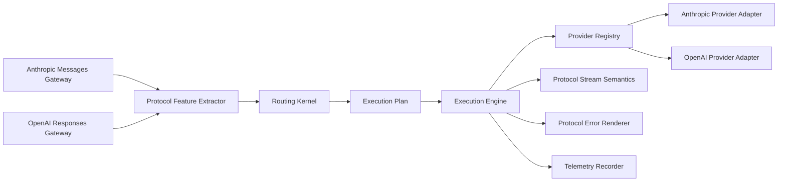

# Coding LLM Router v0.2 OpenAI Responses 设计规格

> 状态：Draft  
> 版本：v0.2  
> 日期：2026-08-14  
> 前置版本：[v0.1 设计规格](./coding-llm-router-v0.1-spec.md)  
> 本版本目标：OpenAI Responses 同协议透明代理

## 1. 摘要

v0.2 在 v0.1 的 Anthropic Messages 链路之外，增加 OpenAI Responses 入站协议和 OpenAI Provider Adapter。

```text
OpenAI-compatible client
  -> POST /v1/responses
  -> OpenAI Responses Gateway
  -> existing Routing Kernel
  -> existing Execution Plan
  -> OpenAI Provider Adapter
  -> OpenAI Responses upstream
```

本版本不做 Anthropic 与 OpenAI 之间的协议转换。OpenAI 请求只能路由到声明为 `openai_responses` 的 Model Target；Anthropic 请求只能路由到 `anthropic_messages` 的 Model Target。

本版本的主要目的不是立刻增加跨供应商能力，而是验证：

> 第二套协议和第二个 Provider 是否可以通过 Adapter 接入，而不修改 Routing Kernel 的业务决策模型。

## 2. 与 v0.1 的关系

### 2.1 保持不变的核心

- `RoutingKernel.plan()` 仍然是纯函数式路由决策入口。
- `ExecutionPlan` 仍是 Routing Kernel 与 Execution Engine 之间唯一的交接对象。
- Execution Engine 仍只执行 plan 中的有序 target。
- Commit Point 前允许 fallback，之后不得切换模型。
- Route Event、成本、延迟和隐私默认值保持不变。
- v0.1 Anthropic fixture 必须继续通过。

### 2.2 v0.2 必须解除的协议耦合

当前 v0.1 实现中以下位置带有 Anthropic-specific 语义，v0.2 必须先抽出内部 seam：

1. `RouterError.anthropic_type` 改为协议无关的内部错误，错误响应由入站协议 Adapter 渲染。
2. Execution Engine 中硬编码的 Anthropic SSE error event 改为 `StreamSemantics` 注入。
3. Anthropic `extract_routing_request()` 改为协议专属 Feature Extractor，输出同一个 `RoutingRequest`。
4. Provider Registry 从 Anthropic 类型注册表改为 `ProviderPort` 注册表。
5. `Capability` 增加 Responses 需要的 `REASONING`、`STRUCTURED_OUTPUT`、`RESPONSE_STATE` 和 `PROVIDER_MANAGED_TOOLS`。

这几项是 v0.2 的架构前置工作，不是可选重构。

## 3. 产品目标与非目标

### 3.1 目标

1. 支持 OpenAI Responses `POST /v1/responses` 的 JSON 和 SSE。
2. 支持 `input`、`instructions`、tools、tool choice、reasoning、text format、多模态 input 和 usage 的透明代理。
3. 支持 OpenAI upstream 的模型别名、认证、并发限制、超时和 bounded fallback。
4. OpenAI 请求可以使用 `code/auto`、`code/fast`、`code/balanced` 和 `code/deep`。
5. OpenAI 与 Anthropic 请求共享同一个 Routing Kernel、Execution Engine、Telemetry Recorder 和 SQLite schema。
6. 所有路由决策都能区分入站协议、上游协议、实际 provider、model 和 policy version。
7. Responses 的 response ID、tool call ID、事件顺序和未知字段不被路由器破坏。

### 3.2 非目标

- Anthropic Messages 与 OpenAI Responses 的互转。
- OpenAI Chat Completions 入站。
- OpenAI Responses 的 Realtime、Batch、Uploads、Files、Vector Stores 和 Assistants 资源管理。
- 由 Router 执行 OpenAI hosted tools，如 web search、file search、computer use 或 code interpreter。
- 改写 `previous_response_id` 或 `conversation` 的服务端状态。
- 跨 OpenAI 账号共享 provider-managed response state。
- 机器学习路由、在线学习和质量 judge。
- 修改 Claude Code、Codex 或其他客户端的配置文件。

## 4. 架构



### 4.1 模块边界

- Gateway Adapter 负责入站协议、认证 header、请求 envelope、响应渲染和协议专属错误。
- Feature Extractor 负责把入站请求转成通用 `RoutingRequest`。
- Routing Kernel 只看协议标识、能力、上下文特征、策略和 session state，不看 OpenAI/Anthropic 字段细节。
- Provider Adapter 负责具体上游 HTTP、认证、model 替换和原始响应字节。
- Stream Semantics 负责校验首个 SSE event 和生成该协议的 post-commit error event。
- Error Renderer 负责将同一个内部 RouterError 渲染成目标入站协议的错误格式。

## 5. 领域对象变化

### 5.1 Protocol

允许值：

```text
anthropic_messages
openai_responses
```

`ProtocolEnvelope.protocol` 和 `RoutingRequest.protocol` 必须一致。

### 5.2 Capability

保留 v0.1：

```text
streaming, tools, thinking, vision, prompt_cache
```

新增：

```text
reasoning             OpenAI reasoning 参数或 reasoning output
structured_output     text.format 或等价结构化输出
response_state        previous_response_id/conversation
provider_managed_tools 上游托管工具
```

`thinking` 与 `reasoning` 是两个独立能力。Routing Kernel 可以把两者都视为 deep 倾向，但不能假设二者语义完全等价。

### 5.3 ModelTarget

ModelTarget 增加：

```text
protocol: Protocol
state_scope: str | None
```

`protocol` 用于禁止跨协议候选；`state_scope` 用于保护 OpenAI provider-managed response state。

### 5.4 RoutingRequest

RoutingRequest 增加：

```text
protocol: Protocol
response_state_requested: bool
provider_managed_tools_requested: bool
```

这些字段是通用路由事实，不包含任何 Claude Code、Codex 或其他客户端名称。

## 6. OpenAI Responses HTTP interface

### 6.1 端点

v0.2 新增：

| Method | Path | 说明 |
|---|---|---|
| POST | `/v1/responses` | OpenAI Responses 代理入口 |

仍然保留 v0.1：

| Method | Path | 说明 |
|---|---|---|
| POST | `/v1/messages` | Anthropic Messages 入口 |
| POST | `/v1/messages/count_tokens` | Anthropic token counting |
| GET | `/health` | 存活检查 |
| GET | `/ready` | 就绪检查 |
| GET | `/metrics` | 本地指标 |

`GET /v1/responses/{response_id}`、`DELETE /v1/responses/{response_id}` 和其他 OpenAI 资源端点不属于 v0.2。

### 6.2 请求透传

OpenAI Gateway 只做以下处理：

1. 本地认证、请求大小限制和 request ID。
2. 校验 body 是 JSON object。
3. 读取顶层 `model` 和 `stream`。
4. 计算 Task Context。
5. 将虚拟 model 替换为 Execution Plan 中的 upstream model。

`input` 可以是 string 或 item array，保持原始形状。`instructions`、tools、tool choice、reasoning、text、include、metadata、store、previous response ID、conversation、truncation 和其他未知字段默认保留。

路由器不得自行添加、删除或重排 input item。

### 6.3 OpenAI 本地认证

- 客户端可以使用 `Authorization: Bearer` 或 `x-api-key` 提供本地 token。
- 两者同时存在时必须表示同一 token。
- Provider Adapter 删除客户端认证 header，并注入 OpenAI provider key。
- Provider key 使用 `LLM_ROUTER_OPENAI_API_KEY` 等配置的环境变量读取。

### 6.4 OpenAI 响应

- 非流式响应 body 原样返回，除必要的 router response header 外不改写。
- response ID、output item ID、tool call ID、usage 和 status 原样保留。
- OpenAI error body 由 `OpenAIErrorRenderer` 生成。
- 上游 `x-request-id` 归一化为内部 attempt metadata，不覆盖客户端 request ID。

## 7. OpenAI Responses Feature Extractor

新增 `OpenAIResponsesFeatureExtractor`，输出和 Anthropic extractor 相同的 `RoutingRequest` interface。

提取但不持久化原文：

- `input` item 数量和粗略 token bucket。
- `tools`、`tool_choice` 和 function tool 数量。
- 是否存在 function call、function call output 或 tool result。
- 是否使用 `reasoning`、structured output 或 image input。
- 是否设置 `previous_response_id` 或 `conversation`。
- 是否设置 provider-managed tool。
- 是否 stream。
- 最近工具输出的明确成功或失败信号。

### 7.1 不做的识别

- 不根据 OpenAI output text 解析完整任务语义。
- 不解析仓库或代码 AST。
- 不猜测 `previous_response_id` 对应的响应内容。
- 不把 OpenAI 的 reasoning 文本持久化。

### 7.2 Tool 能力

v0.2 的 `tools` 能力分为：

- `tools`：普通 function tool，允许客户端自己执行。
- `provider_managed_tools`：由 OpenAI provider 托管执行的工具。

如果请求包含 provider-managed tool，只有声明对应能力的 Model Target 可以进入候选。v0.2 不尝试在 Router 内执行此类工具。

## 8. Routing Kernel 规则

### 8.1 协议硬过滤

Routing Kernel 在所有能力检查前增加：

```text
target.protocol == request.protocol
```

协议不一致的 Model Target 直接排除。v0.2 不存在隐式跨协议 fallback。

### 8.2 Stateful response 规则

当请求包含 `previous_response_id` 或 `conversation`：

- `response_state_requested=true`。
- 只允许 `supports response_state` 的 target。
- primary 和 fallback 必须具有相同 `state_scope`。
- provider account、base URL 或 state namespace 不同的 target 不能互相 fallback。
- 若没有安全的 fallback，仍可执行 primary，但 plan 必须记录 `stateful_no_cross_scope_fallback`。

当请求包含 `store=true` 时，路由器保持该值，不替客户端修改数据保留策略。

### 8.3 Auto policy

保留 v0.1 的 auto 规则，并增加：

1. reasoning、structured output 或 provider-managed tool 触发能力过滤。
2. stateful response 触发 state scope 过滤。
3. 请求协议只影响候选集合，不改变 fast/balanced/deep 的通用含义。
4. uncertain 请求仍回到 balanced，不因为协议未知而升级。

### 8.4 Explicit profile

为了让 `code/fast` 等虚拟 profile 同时适用于两个协议，配置中的 target chain 按协议声明：

```yaml
profiles:
  code/fast:
    targets:
      anthropic_messages:
        primary: anthropic_fast
        fallback: [anthropic_balanced]
      openai_responses:
        primary: openai_fast
        fallback: [openai_balanced]
```

v0.1 的旧格式在加载时迁移为只有 `anthropic_messages` 的 target chain。迁移后生成新的 policy hash。

## 9. Provider Adapter

### 9.1 ProviderPort 保持稳定

```python
class ProviderPort(Protocol):
    async def invoke(self, request: ProviderRequest) -> ProviderExchange:
        """Open one upstream exchange and expose status, headers, and raw bytes."""
```

OpenAI Adapter 只负责：

- 将 body 顶层 `model` 替换为 target.upstream_model。
- 向 `/v1/responses` 发 POST。
- 注入 `Authorization: Bearer <provider-key>`。
- 过滤 hop-by-hop header 和客户端本地认证 header。
- 透传配置允许的 OpenAI extension header。
- 以 ProviderExchange 返回原始 status、headers 和 bytes。

### 9.2 Provider Registry

Provider Registry 的 interface 改为返回 `ProviderPort`，不能返回 `AnthropicProvider` 具体类型。

```python
class ProviderRegistry:
    def get(self, provider_name: str) -> ProviderPort:
        """Resolve a configured provider adapter without exposing its implementation."""
```

`ProviderConfig.type` v0.2 支持：

```text
anthropic
openai
```

OpenAI-compatible 但不保证 Responses 语义的 endpoint 不得声明为 `openai`，除非通过完整 fixture 验证。

## 10. Stream Semantics

当前 Execution Engine 中的 `_ERROR_EVENT` 是 Anthropic-specific。v0.2 改为协议注入：

```python
class StreamSemantics(Protocol):
    def validate_first_event(self, event: bytes) -> None:
        """Reject a committed stream whose first event is invalid for the protocol."""

    def render_post_commit_error(self, code: str) -> bytes:
        """Render one safe protocol-native error event after commit."""
```

### 10.1 OpenAI SSE

OpenAI Adapter 必须保持完整 SSE event 顺序和原始 JSON data。fixture 至少覆盖：

- `response.created`
- `response.in_progress`
- `response.output_item.added`
- `response.output_text.delta`
- `response.function_call_arguments.delta`
- `response.output_item.done`
- `response.completed`
- `response.failed`
- `error`

事件集合以后续官方 fixture 为准，未知事件必须透传。

### 10.2 Commit Point

流程保持 v0.1：

1. 打开上游连接。
2. 验证 2xx 和 `text/event-stream`。
3. 读取第一个完整 SSE event。
4. 由 `OpenAIStreamSemantics` 验证 event 结构。
5. 提交 downstream response header 和首 event。

第 5 步后禁止 fallback。之后的上游错误由 `render_post_commit_error()` 生成 OpenAI-native error event。

## 11. Error Renderer

`RouterError` 只保留内部字段：

```text
code
http_status
safe_message
fallback_allowed
retry_after
```

新增：

```python
class ErrorRenderer(Protocol):
    def json_error(self, error: RouterError, request_id: str) -> Response:
        """Render one protocol-compatible non-stream error response."""

    def stream_error(self, error: RouterError) -> bytes:
        """Render one protocol-compatible post-commit error event."""
```

Anthropic 和 OpenAI 各有一个 Renderer。错误分类和 fallback 规则仍归 Execution Engine，格式不进入核心逻辑。

## 12. 实施附录

配置、观测、测试、性能、里程碑、架构不变量和官方文档校准要求见
[v0.2 OpenAI Responses 实施附录](./coding-llm-router-v0.2-openai-responses-implementation.md)。


