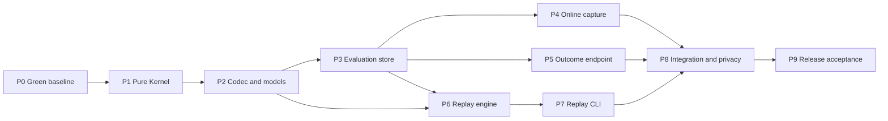

# Coding LLM Router v0.4 Outcome Feedback 与 Offline Replay 执行计划

> 状态：Implemented and verified  
> 版本：v0.4  
> 日期：2026-08-18  
> 设计规格：[v0.4 Outcome Feedback 与 Offline Replay 设计规格](./coding-llm-router-v0.4-outcome-replay-spec.md)

## 1. 目标与边界

在不改变 Anthropic Messages/OpenAI Responses 同协议透明代理、Execution Engine、Commit Point 和 Provider Health 语义的前提下，交付：

1. 可幂等、同步确认、字段有界的 Outcome Event 上报。
2. 可复现历史路由的脱敏 Decision Input 和 Routing Policy Snapshot。
3. 复用生产 RoutingKernel、完全无网络副作用的 Offline Replay CLI。

Outcome Event 在 v0.4 只用于观测，不进入 Kernel，不更新 Session/Health。Replay 只比较 plan/error，不执行 Provider/tool，不把历史 Outcome 赋给 candidate target，也不输出候选成功率、质量、延迟或成本结论。

本计划不实现跨协议转换、Claude Code/task list 适配、shadow policy、ML/bandit/LLM judge、自动策略发布或 Dashboard。

## 2. 当前基线与前置风险

2026-08-18 实测基线：

```text
pytest: 52 passed
ruff:   30 existing diagnostics
mypy:   6 existing errors
```

当前实现的关键现状：

- `RoutingKernel(config, sessions)` 持有完整 RouterConfig，并在 `plan()` 内读取 SessionStateStore。
- `RoutingRequest` 包含 session ID；两套 Feature Extractor 和 Gateway 都依赖该字段。
- Gateway 分别拼装 session/health/Kernel 调用，路由错误只有 503 进入现有 telemetry。
- `RouterError` 位于 `gateway/errors.py`，Kernel 和 Execution Engine 反向依赖 Gateway package。
- `RouterConfig.policy_hash` 覆盖完整 non-secret config，无法表示纯 Routing Policy identity。
- `SQLiteEventStore` 只负责异步 best-effort RouteEvent；Outcome 需要另一种同步持久化语义。
- Console entry point 只有 `llm_router.app:main`，不支持 replay 子命令。
- `request_id()` 接受任意 bounded client string，与 Outcome `request_id: UUID` contract 冲突。
- `ExecutionEngine._json_body()` 的 `response_header_timeout` 参数遮蔽同名错误工厂，首包超时存在运行时 `TypeError`。
- `config.py` 351 行、`health/coordinator.py` 437 行；v0.4 不能继续把新领域对象堆入这些文件。

P0 必须先建立全绿基线。v0.4 不以“这些是既存问题”为理由继续累计静态错误。

## 3. 深层模块与稳定 interface

### 3.1 在线路由 seam

Gateway 只依赖一个应用层 interface：

```python
class RoutingCoordinator:
    def plan(self, invocation: RoutingInvocation) -> ExecutionPlan:
        """Build context, run the Kernel, and queue one sanitized decision record."""
```

`RoutingInvocation` 只在进程内携带 request ID、optional Task ID、瞬时 session key、received time 和 RoutingRequest。Coordinator 内部完成：

1. SessionState -> SessionSnapshot。
2. HealthPort -> AvailabilitySnapshot。
3. `RoutingKernel.plan(request, RoutingContext)`。
4. 对 plan 或预期 RouterError 构造 RouteDecisionInput。
5. best-effort 交给 DecisionRecorder。

Gateway 不直接操作 EvaluationStore，不复制 plan/error capture 分支。Coordinator 不执行 Provider、HTTP render 或 session completion update。

### 3.2 纯策略 seam

```python
policy = compile_routing_policy(router_config)
kernel = RoutingKernel(policy)
plan = kernel.plan(request, context)
```

RoutingPolicy 是 Kernel 唯一配置依赖。Compiler 隐藏 RouterConfig、profile config、canonical snapshot 和 hash 构造；Replay 和在线路径使用相同 compiler/policy，不维护第二套路由算法。

### 3.3 Evaluation 持久化 seam

按调用语义拆成三个 role-specific port：

- `DecisionStorePort`：保存 Policy Snapshot 和 Decision Input。
- `OutcomeStorePort`：原子提交 Outcome，并返回 accepted/duplicate/conflict 与当前 correlation。
- `ReplayStorePort`：按有界查询流式读取 Replay Case 和关联 Outcome。

生产 Adapter 使用同一个 SQLite 文件；测试使用临时 SQLite 或最小 in-memory Adapter。现有 SQLiteEventStore 不扩成同时承担 telemetry、Outcome transaction 和 replay query 的巨型模块。

### 3.4 CLI seam

ReplayEngine 接收已解码的 Replay Case、candidate RoutingPolicy 和 mode，返回 ReplayResult；它不解析 argparse、不打开 SQLite、不渲染表格。CLI Adapter 负责参数、只读 store 和输出。

## 4. 依赖顺序



每个阶段独立提交并通过本阶段验证后再继续。P1-P8 不合并成一次大改动。

## 5. 文件变更地图

### 5.1 新增源码

```text
src/llm_router/errors.py
src/llm_router/routing/context.py
src/llm_router/routing/policy.py
src/llm_router/routing/coordinator.py
src/llm_router/evaluation/__init__.py
src/llm_router/evaluation/models.py
src/llm_router/evaluation/codec.py
src/llm_router/evaluation/port.py
src/llm_router/evaluation/sqlite_store.py
src/llm_router/evaluation/recorder.py
src/llm_router/evaluation/outcomes.py
src/llm_router/evaluation/replay.py
src/llm_router/gateway/outcomes.py
src/llm_router/cli.py
```

### 5.2 修改源码

```text
src/llm_router/domain.py
src/llm_router/config.py
src/llm_router/app.py
src/llm_router/routing/kernel.py
src/llm_router/routing/session.py
src/llm_router/routing/features.py
src/llm_router/routing/openai_features.py
src/llm_router/gateway/auth.py
src/llm_router/gateway/common.py
src/llm_router/gateway/anthropic.py
src/llm_router/gateway/openai.py
src/llm_router/gateway/renderers.py
src/llm_router/execution/*.py
src/llm_router/telemetry/sqlite_store.py
src/llm_router/telemetry/metrics.py
setup.py
router.example.yaml
README.md
```

`gateway/errors.py` 的通用 RouterError/factory 移到 `llm_router/errors.py` 后删除；所有内部 import 一次迁移，不保留长期 pass-through re-export。

### 5.3 新增验证文件

全部使用函数式 pytest，不创建测试 class：

```text
tests/test_routing_context.py
tests/test_routing_policy.py
tests/test_evaluation_codec.py
tests/test_evaluation_store.py
tests/test_decision_capture.py
tests/test_outcome_gateway.py
tests/test_replay_engine.py
tests/test_replay_cli.py
tests/test_v04_privacy.py
```

现有 routing/execution/gateway/config/telemetry tests 按新 interface 更新，但不降低断言。

## 6. P0：修复并冻结工程基线

### 6.1 工作项

- 固定当前 52 个测试名称和结果，禁止用删除/skip/xfailed 消除失败。
- 修复 `_json_body()` timeout 名称遮蔽，并增加首包超时回归测试。
- 使用 Ruff 机械整理 import；对 broad exception 逐项缩窄，确属隔离点时添加具体说明和最小 `noqa`。
- 修复 app 当前类型错误；在 dev extra 增加 `types-PyYAML`，让 mypy 可重复运行。
- 不顺手改变路由、health、fallback 或 stream 行为。

### 6.2 完成条件

```bash
.venv/bin/python -m compileall -q src tests
.venv/bin/python -m pytest -q
.venv/bin/ruff check src tests
.venv/bin/mypy src
```

四条命令必须全绿；该结果成为 P1-P9 的统一回归门槛。

## 7. P1：纯 RoutingKernel 与 Routing Policy

### 7.1 Core error relocation

- 将协议无关 RouterError、RouterError factory 移到 `llm_router/errors.py`。
- Gateway Renderer 继续负责 Anthropic/OpenAI JSON；Core error 不导入 FastAPI。
- Kernel、Execution、Health、Provider 不再 import `llm_router.gateway.*`。

### 7.2 Routing Policy

- 在 `routing/policy.py` 定义 frozen `RoutingPolicy`、TargetChain 和 profile policy value。
- `compile_routing_policy(RouterConfig)` 展开默认值、构建 ModelTarget、校验引用并保留 fallback 顺序。
- Kernel 构造函数只接收 RoutingPolicy，不再接收 RouterConfig/SessionStateStore。
- 保留 ExecutionPlan 的 legacy `policy_version`，同时由 policy 暴露 routing algorithm/version metadata。

### 7.3 Routing Context

- `SessionStateStore` 内部继续维护 mutable `SessionState(last_access)`，`snapshot()` 改为返回无 ID/last_access 的 frozen SessionSnapshot。
- `RoutingContext` 只含 optional SessionSnapshot 和 AvailabilitySnapshot。
- Feature Extractor 删除 `session_id` 参数，RoutingRequest 删除 `session_id` 字段。
- Kernel `plan(request, context)` 只读输入，不读取 store、时钟、锁、SQLite、HTTP 或 Provider Registry。

### 7.4 验证

- 将现有 Kernel fixture 改为显式 policy/context，所有 v0.2/v0.3 行为不变。
- 不同 session key 但相同 SessionSnapshot 必须生成相同 plan。
- 修改 Context 后才允许改变 session escalation；Outcome Store 数据不能影响结果。

## 8. P2：Evaluation 模型与 canonical codec

### 8.1 领域对象

在 `evaluation/models.py` 增加 spec 中的 enum/frozen value：OutcomeEvent、OutcomeReceipt、RouteDecisionInput、RoutingPolicySnapshot、RouterErrorSnapshot、ReplayCase、ReplayResult、ReplayStatus 和 ReplayChange。

所有可持久化字段使用明确类型；不接受 `dict[str, Any]` 穿过 Evaluation module 的外部 interface。

### 8.2 Codec

`evaluation/codec.py` 集中实现 encode/decode/hash：

- key 排序、enum 字符串、set 排序、fallback 保序、UTC RFC3339、显式 null/default。
- RoutingRequest/Session/Availability/Plan/Error/Policy 均使用字段白名单。
- unknown schema、unknown enum、缺字段和多余字段返回 bounded incompatibility，不猜测迁移。
- `MAX_DECISION_INPUT_BYTES = 2 MiB`，`MAX_POLICY_SNAPSHOT_BYTES = 4 MiB`。
- policy hash 为 canonical Policy Snapshot 的完整小写 SHA-256。
- Outcome payload hash 排除 server `received_at`，包含全部 client semantic fields。

### 8.3 Hash compatibility

- `RouterConfig.config_hash` 保留当前完整 non-secret config 语义。
- `policy_hash` 暂作为 `config_hash` 兼容 alias，现有 telemetry 不改历史格式。
- `routing_policy_hash` 独立计算；secret/base URL 改变不影响，target/profile/threshold/order 改变必须影响。

## 9. P3：Evaluation Store 与 additive migration

### 9.1 SQLite Adapter

- `SQLiteEvaluationStore` 使用独立 aiosqlite connection 指向现有 DB，启用 WAL、`synchronous=NORMAL` 和 2000 ms busy timeout。
- Adapter 内部用一个 asyncio lock 包住 transaction，避免 Decision writer 与 Outcome submit 在同一 connection 上交错。
- 创建 `outcome_events`、`route_decision_inputs`、`routing_policy_snapshots` 及 spec 索引/CHECK。
- 为 `route_requests` 幂等增加 nullable `task_id`；不修改/删除既有行和 `route_attempts`。
- Policy insert 先写后读比对 canonical JSON；相同 hash/不同 JSON 作为完整性错误。
- Decision Input 只 INSERT，不使用 REPLACE；重复 request ID 不覆盖历史。

### 9.2 三种写入语义

- Policy Snapshot：Runtime 启动时同步确保存在，失败则 `/ready` 不通过。
- Decision Input：有界 queue + worker，queue 满/编码超限/SQLite 错误只记 `dropped/failed`，不阻断请求。
- Outcome Event：`BEGIN IMMEDIATE` 内完成 event ID/hash 判定与 correlation 查询，commit 后才返回。

### 9.3 Replay read Adapter

- `SQLiteReplayStore` 使用 stdlib sqlite3 URI `mode=ro`，不执行 migration/PRAGMA 写入。
- 按 `recorded_at, request_id` 流式 yield，执行 SQL limit 和 `replay.max_records` 双重限制。
- 临时 SQLite 测试覆盖 v0.3 DB 升级、重复启动、并发幂等和 read-only 不变性。

## 10. P4：Online Routing Coordinator 与 Decision Capture

### 10.1 Request identity

- `request_id()` 始终生成 Router-owned UUID4；client `x-request-id` 不再作为数据库主键或 Outcome correlation ID，客户端使用响应中的 `x-llm-router-request-id`。
- 新增严格 `task_id()` helper，optional header 无效时按入站协议返回 invalid request。
- Task ID 只进入 RoutingInvocation、RouteDecisionInput 和 RouteEvent，不进入 RoutingRequest、RoutingContext、ProtocolEnvelope.safe_headers 或 ProviderRequest。

### 10.2 Coordinator

- 注入 Kernel、SessionStateStore、HealthPort、DecisionRecorder 和 UTC clock。
- `plan(invocation)` 使用一次 clock value 构造 context，记录 plan 或预期 RouterError 后原样返回/重抛。
- unexpected exception 不伪装成 RouterErrorSnapshot，由现有 Gateway 500-safe 路径处理。
- capture disabled 使用 no-op recorder；Gateway 不出现 `if replay.capture_enabled`。

### 10.3 Gateway/completion

- 两套 Gateway 只负责认证、解析、构造 RoutingInvocation、调用 Coordinator、执行/渲染。
- `record_completion()` 从 invocation 获取瞬时 session key 和 Task ID；session 行为保持只接收被动 OutcomeSignal。
- RouteEvent 增加 nullable `task_id`，SQLiteEventStore append/migration 同步更新。
- 规划阶段所有预期 plan/error 都可 capture；现有 RouteEvent telemetry 范围不在本阶段扩大。

## 11. P5：Outcome Service 与 HTTP Adapter

### 11.1 Config 和 service

- 增加 strict `OutcomesConfig`，落实 spec 默认值/上下界。
- OutcomeService 注入 OutcomeStorePort 和 UTC clock；完成时间窗口、canonical hash、submit 和 bounded domain error 映射。
- OutcomeService 不 import FastAPI、SQLite、SessionStateStore、HealthPort、Kernel 或 RouterMetrics。

### 11.2 HTTP

- `gateway/outcomes.py` 先执行现有本地认证，再读取最多 `max_request_bytes`。
- strict Pydantic request model 禁止未知字段/隐式 coercion；返回 spec 的 201/200/409/413/422/503。
- 使用 router-control JSON error shape，不套用 Anthropic/OpenAI error body。
- `outcomes.enabled=false` 时不注册 route，也不构造 OutcomeService。

### 11.3 Correlation

- request presence/Task ID 优先查 Decision Input，缺失时查 RouteEvent，允许 Outcome 先到。
- duplicate 每次重新计算 correlation，不更新原 event 的 received time/payload。
- 双方 Task ID 非空且不同返回 `task_mismatch`；保留但聚合排除。
- actual target 只从完成后的 RouteEvent `final_model` 和对应实际 attempt 推导；无完成/提交结果为 `unassigned`。

## 12. P6：Replay Engine

### 12.1 Compatibility

- 依次校验 schema version、routing algorithm version、历史 policy 存在性和 JSON 完整性。
- Historical mode 对 candidate 可能使用的 target 比较 `(alias, provider, upstream_model, protocol)`。
- 新建/改绑 target 返回 `availability_identity_missing`，不得默认 healthy。
- All-healthy mode 为 candidate 全部 target 构造确定性 snapshot，SessionSnapshot 仍用历史值。

### 12.2 Decision execution 与 diff

- 每个 candidate policy 只构造一个 RoutingKernel，逐条输入复用。
- 捕获预期 RouterError 并转换 RouterErrorSnapshot；unexpected Kernel exception 视为实现错误并中止 replay，不能伪装成 non-replayable。
- 比较执行相关 shape：primary identity 优先；其余 ordered target、attempt limit、timeout/error 差异归 `chain_changed/error_changed`；policy metadata 单独变化不算执行变化。
- 当前 historical policy self-replay 必须和 stored normalized plan/error 完全一致，否则为 `historical_reproduction_mismatch`。

### 12.3 Outcome 规则

- Replay Case 可携带 actual Outcome summary，但 Engine 不把它写入 candidate result。
- conflicting events 保留 conflict 标记，不做投票/last-write-wins。
- 聚合只统计“有 Outcome 且 plan 改变”，不计算 hypothetical success/quality/cost/latency。

## 13. P7：Replay CLI 与报告

### 13.1 Entry point

- Console entry point 改为 `llm_router.cli:main`。
- 保持 `llm-router --config router.yaml` 原启动方式；仅当首参数为 `replay` 时进入 Replay CLI。
- `app.main()` 保留可直接运行的 server adapter，不让 app import replay module。

### 13.2 CLI 行为

- 实现 spec 的 db/config/from/to/mode/format/limit 参数和 UTC 校验。
- Candidate config 使用 `load_config()` + Policy Compiler，绝不调用 `resolve_secrets()` 或 ProviderRegistry。
- 输出 table/json；stdout 只有报告，安全错误写 stderr，日志 message 为英文。
- exit code：0 报告成功；2 参数/配置错误；3 DB/schema/fatal replay 错误。单条 non-replayable 不使整个报告失败。

### 13.3 No-side-effect 验证

- Provider key 环境变量缺失时 Replay 仍可运行。
- 将 ProviderRegistry/HTTP client 构造替换为 fail-fast fake，Replay 不触发。
- 运行前后比较 DB row count 和文件内容状态；Replay 不写数据库、session、health 或 telemetry。

## 14. P8：Metrics、隐私与组合验收

### 14.1 Metrics

- 增加 Outcome received/duplicate/conflict/rejected/store-failure/correlation counter。
- 增加 Decision capture `queued/written/dropped/failed/disabled` counter。
- label 只来自 verdict/evidence/source/correlation/bounded reason；动态 ID 不作 label。
- Replay 统计只在 CLI report，不注册在线 Prometheus collector。

### 14.2 Runtime lifecycle

启动顺序：Telemetry Store -> Evaluation Store/migration -> current Policy Snapshot -> Decision Recorder -> ready。只有 outcomes/capture 至少一个启用时才启动 Evaluation Store；只有 capture 启用时才写 Policy Snapshot 并启动 Recorder。关闭顺序反向，先停止接收，再有界 drain Decision queue；Outcome synchronous write 不得在 close 后确认成功。

### 14.3 Privacy audit

- 对 SQLite 全表、structured log、metrics text、table/json report 扫描 fixture 中的 prompt、source、tool args、session ID、keys、env name、base URL。
- 验证 Decision codec 只读 RoutingRequest/Session/Availability 白名单，不序列化 `__dict__` 或完整 RouterConfig。
- 验证 Task ID 不进入 upstream headers/body，Outcome payload 不能指定 target/provider。

## 15. P9：配置、发布与最终验收

### 15.1 发布文件

- `router.example.yaml` 增加 outcomes/replay block，policy version 改为 `v3`。
- setup/FastAPI/package version 更新为 `0.4.0`，README 增加 Outcome 和 Replay 示例及反事实限制。
- 更新 spec 状态为 Accepted；本计划验收后改为 Implemented and verified。
- 检查所有修改后的源码/文档不超过 500 行；超限按语义拆分，不增加 pass-through wrapper。

### 15.2 全量自动验收

```bash
.venv/bin/python -m compileall -q src tests
.venv/bin/python -m pytest -q
.venv/bin/ruff check src tests
.venv/bin/mypy src
```

### 15.3 固定演练

1. 双协议 JSON/SSE、fallback、health cooldown/probe、state scope 回归不变。
2. 新 Outcome accepted，重试 duplicate，payload 冲突 409，并发只写一行。
3. Outcome 先到为 pending，Decision/RouteEvent 到达后 matched；Task mismatch 不聚合。
4. Capture queue/store 故障不影响主请求，Outcome store 故障返回 503。
5. 当前 policy historical self-replay 100% 一致。
6. 新/改绑 target 在 historical non-replayable，在 all-healthy 可比较且标明模式。
7. Replay 在无 Provider secret、无网络环境完成，DB 无写入。
8. Outcome 只归 actual final target；报告不存在 candidate success/quality/cost/latency 字段。
9. 1000-target policy/availability fixture 低于 codec 上限；超限记录安全失败且不泄漏内容。
10. v0.3 SQLite 可重复执行 additive migration，旧 RouteEvent 可继续读取。

## 16. 回滚与完成定义

运行时功能回滚优先使用：

```yaml
outcomes:
  enabled: false
replay:
  capture_enabled: false
```

SQLite migration 只增表/列/索引，回滚应用版本时不删除用户 Outcome/Decision 数据。每阶段独立提交，P1 Kernel interface 迁移必须和所有调用点在同一提交完成，不能留下双 interface。

只有同时满足以下条件，v0.4 才能标记完成：

- P0-P9 全部通过，四条质量命令全绿。
- Gateway 只通过 RoutingCoordinator 触发在线 plan；Kernel 不读取 mutable store/完整 RouterConfig。
- 在线与 Replay 使用同一 Policy Compiler 和 RoutingKernel。
- Outcome 是同步、原子、幂等写入，且不影响在线 Session/Health/Kernel。
- Decision capture 是有界 best-effort，任何失败不改变客户端结果。
- Historical self-replay 全量一致，不兼容记录明确 non-replayable。
- Replay 无 Provider/HTTP/secret/写数据库路径，报告无反事实质量声明。
- 双协议 passthrough、fallback、SSE Commit Point、health 和 state scope 行为保持不变。
- 所有持久化、日志、metrics 和报告字段均有界且符合隐私白名单。
- 所有新增函数有简短 function-level docstring，源码文件不超过 500 行。
