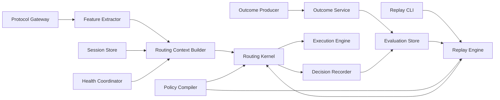

# Coding LLM Router v0.4 Outcome Feedback 与 Offline Replay 设计规格

> 状态：Accepted  
> 版本：v0.4  
> 日期：2026-08-18  
> 前置版本：[v0.3 Provider Reliability 设计规格](./coding-llm-router-v0.3-provider-reliability-spec.md)  
> 本版本目标：建立可验证、无在线副作用的路由反馈与离线回放闭环

## 1. 摘要

v0.4 增加两项能力：接收客户端、IDE、CI 或集成层上报的有限 Outcome Event；保存历史路由的脱敏决策输入，并使用同一个 RoutingKernel 离线回放候选策略。

本版本只建立“采集事实 -> 重放决策 -> 比较计划”的评估基础设施。Outcome Event 不进入在线 RoutingKernel，不修改 Session State 或 Provider Health；Replay 不调用 Provider、不运行工具，也不预测候选模型本来会产生的答案、质量、成本或延迟。

```text
Online request
  -> Gateway -> Feature Extractor
  -> Session/Availability Snapshot -> RoutingKernel
  -> best-effort Decision Recorder -> existing Execution Engine

Outcome producer
  -> POST /v1/router/outcomes -> Outcome Service -> durable Outcome Store

Replay CLI
  -> Replay Store -> candidate Policy Compiler
  -> same RoutingKernel -> Replay Result
```

## 2. 问题、目标与非目标

v0.3 能回答“Provider 现在是否值得调用”，但 HTTP 2xx 不表示代码可编译、测试通过或任务完成。当前系统也无法证明策略修改后历史请求会生成什么计划，或相同输入能否复现当前决策。

v0.4 目标：

1. 提供经过本地认证、字段有界、幂等写入的 Outcome interface。
2. 用可选 Task ID 关联同一编程任务的多次请求，但不理解客户端业务对象。
3. 将 Session Snapshot 和 Availability Snapshot 都变成 RoutingKernel 显式输入。
4. 保存重放决策所需的最小脱敏数据，不保存 prompt、response、源码或 tool 参数。
5. 编译独立、无秘密且有稳定 hash 的 Routing Policy Snapshot。
6. 用生产 RoutingKernel 比较候选策略的 Execution Plan 或 RouterError。
7. 保证同一策略、算法版本和 historical context 可以复现原始决策。

非目标：

- Anthropic/OpenAI 协议转换或新增入站协议。
- 解析 Claude Code task list、主 agent、subagent、spec、plan 或客户端会话结构。
- 自动执行 compile、lint、test、tool 或代码检查。
- 保存自由文本反馈、源码、patch、命令、日志、prompt、response 或 reasoning。
- 用 Outcome 在线修改 tier、fallback、Session State、Provider Health 或配置。
- ML、bandit、reward model、LLM judge、自动调参、shadow execution 或 A/B test。
- Replay 调用 Provider、生成答案、运行工具、修改工作区或预测反事实结果。
- Dashboard、多租户反馈控制面或远程数据同步。

## 3. 核心原则与架构不变量

### 3.1 三类结果严格分离

| 事实 | 来源 | 用途 | v0.4 在线影响 |
|---|---|---|---|
| `OutcomeSignal` | 当前协议请求中的显式 tool result | 现有 session escalation | 保持 v0.3 行为 |
| `AttemptOutcome` | Provider Adapter / Execution Engine | Health、fallback、telemetry | 沿用 v0.3 |
| `OutcomeEvent` | client / IDE / CI / integration | 离线评估 | 无 |

显式 Outcome Event 是 append-only observation。在线路径不得读取 Outcome Store；Outcome 写入不得调用 `SessionStateStore.record()`、`HealthCoordinator.record()` 或修改 Routing Policy。被动 OutcomeSignal 不转换成显式 Outcome Event。

`AttemptOutcome(success)` 只表示上游交换成功；`OutcomeEvent(failure, test)` 只表示测试证据失败，二者可以同时成立。Outcome payload 不允许指定 Provider/Model，实际 target 由 Router 根据历史执行事实推导。

### 3.2 Replay 无副作用且不做反事实声明

ReplayEngine 只依赖 Route Decision Input、Routing Policy Snapshot 和 RoutingKernel。Replay 不得初始化 Provider Registry、解析 API key、创建 HTTP client、执行网络请求，或更新 Session、Health、telemetry、Outcome 和策略数据。

Replay Result 只表达候选策略生成的 plan/error。历史 Outcome 只属于实际执行并向客户端提供结果的 target，绝不能复制给 hypothetical target。

允许报告“100 条有 Outcome 的请求中，候选 primary 改变 28 条”；禁止报告“候选策略成功率提高 8%”。质量结论需要真实执行数据，不属于 v0.4。

### 3.3 客户端和协议无关

Router 不识别 task list、主/子 agent、spec 或 plan。每个经过 `/v1/messages` 或 `/v1/responses` 的请求仍独立进入相同路由流程；Task ID 只是客户端生成的 opaque UUID，不携带描述且不影响路由。

以下约束保持不变：

```text
target.protocol == request.protocol
```

Outcome 和 Replay 不能放宽 same-protocol、capability、state scope、health filtering 或 Commit Point 约束。

## 4. 架构与模块边界



- `RoutingContextBuilder`：读取 session/health，构造不可变快照。
- `RoutingPolicyCompiler`：从 RouterConfig 提取纯路由策略，不解析 secret。
- `RoutingKernel`：只根据 request、context 和已编译 policy 产生决策。
- `DecisionRecorder`：best-effort 保存脱敏输入和原始 plan/error。
- `OutcomeService`：校验、规范化、幂等处理并同步持久化 Outcome。
- `EvaluationStore`：持久化 Outcome、Decision Input 和 Policy Snapshot。
- `ReplayEngine`：检查兼容性、调用同一个 Kernel、比较结果。
- `Replay CLI`：筛选记录并渲染报告，不包含路由算法。

OutcomeService、ReplayEngine、RoutingPolicyCompiler 和 RoutingKernel 不依赖 FastAPI、SQLite 或具体 Provider；HTTP 与 SQLite 是外层 Adapter。

## 5. 领域模型

### 5.1 Outcome Event 与 Task ID

```python
@dataclass(frozen=True)
class OutcomeEvent:
    """Store one bounded observation about a prior routed request."""

    event_id: UUID
    request_id: UUID
    task_id: UUID | None
    verdict: OutcomeVerdict
    evidence: OutcomeEvidence
    source: OutcomeSource
    observed_at: datetime | None
    received_at: datetime
```

```text
OutcomeVerdict  = success | failure | partial
OutcomeEvidence = patch_apply | compile | lint | test | tool | task
OutcomeSource   = client | ide | ci | integration
```

`partial` 只表示证据完成了部分目标，不是数值 reward。一个 request 可以有多个 event；若不同 event 的 verdict 冲突，全部保留并标记 `conflicting`，不得 last-write-wins、投票或猜测来源优先级。

路由请求可携带 `x-llm-router-task-id: <UUID>`。Gateway 只把它传到 telemetry/evaluation 层：不放入 RoutingRequest/RoutingContext、不查 Session State、不发送 Provider、不替代 request ID。缺失 Task ID 不影响路由或 request ID 关联。

### 5.2 Routing Context 与纯 Kernel

```python
@dataclass(frozen=True)
class SessionSnapshot:
    """Expose only session facts used by one routing decision."""

    last_tier: Tier
    last_outcome: OutcomeSignal
    consecutive_failures: int
    requests_since_failure: int


@dataclass(frozen=True)
class RoutingContext:
    """Combine immutable runtime facts used by one routing decision."""

    session: SessionSnapshot | None
    availability: AvailabilitySnapshot


class RoutingKernel:
    def plan(self, request: RoutingRequest, context: RoutingContext) -> ExecutionPlan:
        """Build one deterministic plan without reading mutable stores."""
```

RoutingKernel 构造函数不再接收 SessionStateStore。Gateway 在调用前读取 snapshot；完成后的 session 更新仍由现有完成路径使用瞬时 session key 执行。

SessionSnapshot 不含 session ID 和 `last_access`。`RoutingRequest.session_id` 必须移出 Kernel 决策接口；迁移期即使暂时保留，Kernel 也必须忽略，Decision Recorder 必须删除，发布前完成内部调用迁移。

### 5.3 Route Decision Input

Route Decision Input 是重放一条历史决策的最小记录：

```text
schema_version, request_id, optional task_id, recorded_at
router_version, routing_algorithm_version, routing_policy_hash
sanitized RoutingRequest, optional SessionSnapshot, AvailabilitySnapshot
exactly one of normalized ExecutionPlan / RouterErrorSnapshot
```

RoutingRequest 只保存 protocol、profile、capabilities、token estimate、message/tool-round count、task signal booleans 和 stream 等有限特征。禁止原始 body 和文本片段。

Decision Recorder 在 Kernel 返回或抛出预期 RouterError 后立即构造记录。写入失败增加 metric，但不能导致在线请求失败或改变计划。

### 5.4 Routing Policy Snapshot

Snapshot 只包含 Kernel 依赖的策略：schema/algorithm/policy version、Model Target 路由字段、profiles/ordered chains、auto thresholds、attempt limit、timeouts、capabilities、prices 和 state scope。

允许保留 Provider 名称/类型、upstream model 和 protocol。禁止 API key、`api_key_env`、base URL、client token、原始 body/error，以及 server/storage 等非路由配置。

### 5.5 Replay Result

Replay Result 包含：request ID、replay status、historical/candidate policy hash、actual result、optional candidate result、change class、optional non-replayable reason。

```text
ReplayStatus = replayed | non_replayable
ReplayChange = unchanged | primary_changed | chain_changed | error_changed
               | plan_to_error | error_to_plan
```

不得包含 hypothetical Outcome、quality score、success probability、latency prediction 或 cost prediction。

## 6. Outcome HTTP interface

### 6.1 Endpoint 与请求

新增经过现有本地 client token 认证的 `POST /v1/router/outcomes`：

```json
{
  "event_id": "019d0000-0000-7000-8000-000000000001",
  "request_id": "019d0000-0000-7000-8000-000000000002",
  "task_id": "019d0000-0000-7000-8000-000000000003",
  "verdict": "success",
  "evidence": "test",
  "source": "ci",
  "observed_at": "2026-08-18T10:30:00Z"
}
```

校验规则：body 最大 16 KiB 且必须是 object；strict schema 拒绝未知字段和隐式类型转换；ID 必须是 UUID；`observed_at` 可省略，提供时必须为带时区 RFC3339 并规范化为 UTC；时间不得超过配置的历史/未来窗口。禁止 metadata、message、details、源码、日志、命令和 tool 参数。

### 6.2 响应、幂等与持久性

```json
{
  "event_id": "019d0000-0000-7000-8000-000000000001",
  "status": "accepted",
  "correlation": "matched"
}
```

| HTTP | 条件 |
|---|---|
| `201` | 首次同步持久化成功 |
| `200` | 相同 event ID 和规范化 payload，`status=duplicate` |
| `409` | 相同 event ID 但规范化 payload 不同 |
| `413` | body 超限 |
| `422` | strict schema、UUID、enum 或时间无效 |
| `503` | Outcome Store 不可用，事件未确认 |

服务端对 canonical payload 计算完整 SHA-256；字段顺序无关、时间统一 UTC、缺失 optional 字段使用固定表示，`received_at` 不参与 hash。同一 SQLite transaction 内插入或比较既有 hash，并发相同 event ID 只能产生一行。Outcome endpoint 必须在 transaction commit 后确认，不能采用 RouteEvent 的 best-effort 语义。

### 6.3 关联与归属

Outcome 必须携带 Router 通过 `x-llm-router-request-id` 返回的 UUID，Task ID 不能替代它。该 ID 由 Router 生成，不复用 client `x-request-id`。数据库不设 request foreign key，允许 Outcome 早于 RouteEvent 到达。

```text
request 存在，Task ID 相同或至少一方缺失 -> matched
request 存在，双方非空 Task ID 不同       -> task_mismatch
request 尚不存在                          -> pending
```

`pending` 后续查询时重新计算，不需要后台修复任务；`task_mismatch` 保留但不纳入聚合。同 Task ID、不同 request ID 只表示同组请求，不表示同一次调用。

Outcome 只归属于 RouteEvent 的 actual `final_model`。未向客户端提供 upstream 结果时为 `unassigned`，不得归给 planned primary 或最后一个失败 attempt。有 fallback 时归实际完成请求的 target；candidate target 永远不能继承历史 Outcome。

## 7. Policy identity 与 Decision Capture

当前 `RouterConfig.policy_hash` 覆盖完整 non-secret 配置，不适合作为 replay identity。v0.4 分离：

```text
config_hash         = hash(full non-secret RouterConfig)
routing_policy_hash = hash(canonical RoutingPolicySnapshot)
```

`routing_policy_hash` 使用完整小写 SHA-256 hex。Canonical JSON 固定 key 顺序；enum 用显式字符串；set 排序；fallback 保持语义顺序；缺省值显式展开；不包含 hash 本身。

现有 telemetry `policy_version/effective_policy_version` 保持兼容；Decision Input 新增 `routing_policy_hash`、`routing_algorithm_version`、`router_version`。算法版本只在 Kernel 决策语义变化时递增，不能直接使用 package version。schema、算法或上下文不兼容必须标记 non-replayable，不得猜测补字段。

Policy Snapshot 在 Decision Input 写入前持久化。相同 hash 但 canonical JSON 不同是完整性错误，不能覆盖。

## 8. Offline Replay

### 8.1 CLI 与流程

```bash
llm-router replay \
  --db ~/.llm-router/router.db \
  --candidate-config router-candidate.yaml \
  --from 2026-08-01T00:00:00Z \
  --to 2026-08-18T00:00:00Z \
  --mode historical \
  --format table
```

- `--candidate-config` 必填，只编译 Routing Policy，不解析 secret。
- `--from/--to` 按 Decision Input `recorded_at` 筛选。
- `--mode` 为 `historical | all-healthy`，默认 historical。
- `--format` 为 `table | json`；`--limit` 不超过 `replay.max_records`。
- 数据固定按 `recorded_at, request_id` 排序，数据库只读打开。

流程：有界读取 Decision Input -> 读取 historical Policy Snapshot -> 编译 candidate policy -> 检查兼容性 -> 构造 RoutingContext -> 调用生产 Kernel -> 比较 normalized plan/error -> 输出报告。

同一 historical policy、algorithm、request、Session Snapshot 和 Availability Snapshot 必须复现 `actual_result`；self-replay 是发布门槛。

### 8.2 Historical mode

Historical mode 使用记录时的 Session/Availability Snapshot，回答“只改变策略规则时计划怎样变化”。历史健康只能复用于相同 operational identity：

```text
(target alias, provider, upstream model, protocol)
```

Candidate 新增 target，或将 alias 改绑其他 provider/model/protocol，且该 target 可能参与本次决策时，记录为 `non_replayable: availability_identity_missing`；不得假设 healthy，也不得套用旧健康状态。

删除 target、调整 profile 顺序、threshold、tier、capability 或 attempt limit，可使用仍匹配的 historical target 状态回放。

### 8.3 All-healthy mode 与报告

All-healthy 为 candidate 的全部 target 构造确定性 healthy snapshot，用于隔离 health filtering；它允许新 target，但报告必须标明 `mode=all-healthy`，不能描述为历史现场复现。Session Snapshot 仍使用历史值。

报告至少包含：selected/replayed/non-replayable 数量；各 change class 数量；按 protocol/profile/change class 的有界分组；Outcome 覆盖和 conflicting request 数；有 Outcome 且 candidate plan 改变的请求数。

Outcome 只能按 actual final target、verdict、evidence、source 展示。禁止 candidate success rate、quality delta、latency saving 或 cost saving。

## 9. SQLite schema 与迁移

使用 additive migration：新建三张表，为现有 `route_requests` 增加 nullable `task_id`，`route_attempts` 不变。

### 9.1 `outcome_events`

```text
event_id PK, request_id, nullable task_id
verdict, evidence, source, nullable observed_at, received_at, payload_hash
indexes: request_id; task_id; observed_at
```

枚举由 domain validator 和 CHECK constraint 双重保证；request ID 无 foreign key。

### 9.2 `route_decision_inputs`

```text
request_id PK, nullable task_id, recorded_at, schema_version
router_version, routing_algorithm_version, routing_policy_hash
routing_request_json, nullable session_snapshot_json, availability_snapshot_json
nullable actual_plan_json, nullable actual_error_json
CHECK: plan/error 恰好一个非空
indexes: (recorded_at, request_id); routing_policy_hash; task_id
```

JSON 使用对应 schema version 的 canonical serializer。读取失败或未知 schema 不得静默忽略，必须标记 non-replayable。

### 9.3 `routing_policy_snapshots`

```text
routing_policy_hash PK, policy_version, schema_version
routing_algorithm_version, policy_json, created_at
```

Router 启动时编译当前 snapshot 并 `INSERT OR IGNORE`。Decision Input 写入前必须存在引用的 snapshot。

## 10. 配置、隐私与安全

```yaml
outcomes:
  enabled: true
  max_request_bytes: 16384       # 1024-65536
  max_event_age_seconds: 604800  # 60-2592000
  max_future_skew_seconds: 300   # 0-3600
replay:
  capture_enabled: true
  max_records: 10000             # 1-100000
```

`outcomes.enabled: false` 时 endpoint 返回 404 且不初始化 OutcomeService。`capture_enabled: false` 时不保存新 Decision Input，但不影响在线路由和已有数据查询。无新增 block 的旧配置使用以上默认值；示例 policy version 更新为 `v3`。

允许持久化：有限路由特征/枚举/bucket；target alias、Provider 名称、upstream model、protocol；Session Snapshot 的四个决策字段；有限 health snapshot；Outcome UUID、枚举和时间。

禁止持久化：原始 body、prompt/output、源码、patch、日志、命令、tool 结构/name、session ID、previous response/conversation/tool-call ID、key/token、`api_key_env`、base URL、错误正文、自由文本 metadata。

所有日志 message 使用英文。Metrics label 不能包含 event/request/task/session ID、异常 message 或路径；必要诊断 ID 只能作为结构化日志字段并遵循现有隐私策略。Replay JSON 输出服从同一白名单。

## 11. 错误、指标与性能

新增 bounded error code：`outcome_invalid`、`outcome_event_conflict`、`outcome_store_unavailable`、`replay_schema_incompatible`、`replay_algorithm_incompatible`、`replay_policy_missing`、`replay_context_invalid`。HTTP 不返回 SQLite message、路径、payload hash 或历史 event；CLI 只显示安全 request ID 和 bounded reason。

Metrics 至少覆盖 outcome received/duplicate/conflict/rejected/store failure/correlation，以及 decision capture status。Label 仅使用 verdict、evidence、source、correlation、bounded reason 等有限枚举。Replay 统计由 CLI 输出，不进入在线 metrics。

Decision capture 不增加网络调用，失败不影响主请求；Outcome 持久化失败返回 503。Replay 受时间范围、`max_records` 和有界 batch 限制，内存不随数据库总量无界增长。Outcome、Policy Snapshot、Decision Input 都必须有序列化大小上限，具体上限在实施计划中用现有 fixture 固定并测试。

## 12. 测试与验收

### 12.1 Kernel 与在线回归

1. Kernel 不引用 SessionStateStore、HealthCoordinator、SQLite、时钟、HTTP 或 Provider Registry。
2. 相同 request/context/policy 产生相同 normalized plan/error。
3. v0.3 session、health、protocol、capability、state scope fixture 全部通过。
4. Outcome Store 中的任意数据不改变在线 plan，且不更新 session/health。

### 12.2 Outcome 与隐私

1. 新 event 返回 201；相同 payload 重试返回 200；冲突 payload 返回 409 且原值不变。
2. 并发相同 event ID 只产生一行；Store 失败返回 503。
3. 超限 body、未知字段、无效 UUID/enum/time 被拒绝。
4. Outcome 先到时 pending，RouteEvent 到达后 matched；Task ID 冲突不纳入聚合。
5. 多个冲突 verdict 全部保留并标记 conflicting。
6. DB/日志/report 不含禁止字段，Task ID 不进 Kernel 或 Provider。

### 12.3 Capture 与 Replay

1. plan 和预期 RouterError 都产生 Decision Input，capture 失败不影响请求。
2. Policy hash 稳定；fallback 顺序变化会改变 hash，secret/base URL 变化不会。
3. 当前 policy historical self-replay 与所有原始 normalized result 一致。
4. 候选 threshold/profile/attempt limit 变化产生预期 change class。
5. Historical 遇到新建/改绑 target 标记 availability identity missing；all-healthy 可评估并标明模式。
6. Replay 不读 key、不初始化 Provider Registry、不创建网络、不写任何运行状态或历史数据。
7. Outcome 只显示在 actual target，不赋给 candidate；报告没有反事实质量结论。

## 13. 实施里程碑

### M0：纯 RoutingKernel

- 增加 SessionSnapshot/RoutingContext，将 Store 读取移到 Context Builder。
- 移除 RoutingRequest 的 session ID 决策依赖，完成 v0.3 确定性回归。

### M1：Policy Snapshot 与 Decision Capture

- 实现 Policy Compiler、canonical serializer/hash 和 additive migration。
- 接入 best-effort Decision Recorder，完成字段白名单测试。

### M2：Outcome Feedback

- 实现 Outcome domain/service/store transaction 和 HTTP endpoint。
- 增加 Task ID、out-of-order correlation、冲突及故障测试。

### M3：Offline Replay

- 实现只读 ReplayStore、兼容性检查、两种 context mode 和 CLI report。
- 完成 self-replay、candidate diff 与 no-network 测试。

### M4：发布验收

- 更新示例配置、README、领域词汇和版本号。
- 运行双协议与 Provider Reliability 全量回归，检查 DB/log/metrics/report 隐私。

## 14. 版本边界与后续演进

v0.4 的价值是让策略具备“可复现、可比较、可审计”的离线基础，而不是自动学习。只有 Outcome 覆盖率、冲突率、Decision Input 完整率和 self-replay 一致性稳定后，v0.5 才考虑在线计算但不执行候选计划的 shadow policy；shadow 也不能把历史 Outcome 归给未执行 target。

ML、bandit、质量 judge、自动发布和跨协议转换仍需独立立项。v0.4 的成功标准是：不改变现有在线路由和协议透明性的前提下，安全接收有限编程结果证据，复现历史决策，并诚实说明候选策略改变了什么、哪些结论仍无法得到。
