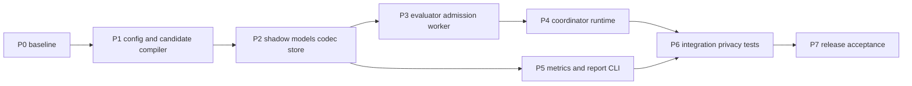

# Coding LLM Router v0.5 Shadow Policy 在线影子策略评估执行计划

> 状态：Implemented and verified  
> 版本：v0.5  
> 日期：2026-08-19  
> 设计规格：[v0.5 Shadow Policy 在线影子策略评估设计规格](./coding-llm-router-v0.5-shadow-policy-spec.md)  
> 前置版本：[v0.4 Outcome Feedback 与 Offline Replay 执行计划](./coding-llm-router-v0.4-outcome-replay-implementation-plan.md)

## 1. 目标与边界

本计划把 v0.5 spec 落成可验收的在线旁路：主策略先产生 actual `ExecutionPlan` 或 `RouterErrorSnapshot`，ShadowEvaluator 使用同一份 `RouteDecisionInput` 异步计算一个固定 Candidate Policy，并把结构差异写入 `shadow_decisions`。

交付后必须同时满足：

1. v0.4 的 Anthropic Messages/OpenAI Responses passthrough、fallback、health、session、SSE Commit Point 和 Provider 执行行为不变。
2. `shadow.enabled` 默认关闭；开启时仍只允许一个启动时固定的 candidate。
3. shadow admission 非阻塞；queue 满、candidate 失败、计算超时、写入失败都 fail-open。
4. Candidate 只使用 secret-free `RoutingPolicy` 和当前请求已有的 immutable context，不创建 Provider/HTTP client，不产生网络调用。
5. ShadowDecision 只描述 actual/candidate plan/error 和有限差异，不携带 Outcome，不输出候选质量、成功率、成本或延迟结论。

本计划不实现跨协议转换、Claude Code/task list 适配、Provider 双写、A/B 流量分配、自动 promote、ML/bandit、LLM judge、热更新或 Dashboard。

## 2. 当前基线与风险

### 2.1 代码基线

当前 v0.4 的关键入口：

| 位置 | 当前职责 | v0.5 处理 |
|---|---|---|
| `routing/coordinator.py` | 构造 context、调用 current Kernel、capture actual decision | 增加一个非阻塞 ShadowEvaluator seam |
| `routing/kernel.py` | 根据 `RoutingPolicy + RoutingContext` 生成 plan | 不改路由算法；candidate 复用它 |
| `routing/policy.py` | 编译 secret-free policy、计算 routing hash | current/candidate 都调用同一 compiler |
| `evaluation/replay.py` | 复现 actual、计算 candidate diff | Shadow worker 复用 `ReplayEngine(HISTORICAL)` |
| `evaluation/models.py` | v0.4 Outcome/Replay domain models | 增加 ShadowStatus/ShadowDecision |
| `evaluation/port.py` | Decision/Outcome/Replay store ports | 增加 ShadowStorePort |
| `evaluation/sqlite_store.py` | evaluation schema、异步写入、只读 replay | additive 增加 shadow 表和读写操作 |
| `app.py` | Runtime 组装、lifespan、`/metrics` | 加载 candidate、启动/关闭 shadow worker |
| `telemetry/metrics.py` | bounded Prometheus metrics | 增加 shadow admission/evaluation/persistence metrics |
| `cli.py` | server/replay 命令分发 | 增加只读 `shadow-report` |

当前 package/app 版本为 `0.4.0`。开始 P1 前必须重新运行质量命令并保存基线输出；v0.4 交接记录的基线是 52 个测试通过，同时存在既有 Ruff/mypy 诊断，不能直接把旧数字当作 v0.5 验收结果。

### 2.2 主要风险与处理

| 风险 | 处理原则 |
|---|---|
| 候选配置触发 secret resolution | Candidate 只走 `load_config` 和 `compile_routing_policy`，禁止 `resolve_secrets`/ProviderRegistry |
| shadow 改变 actual 路径 | Coordinator 先完成 actual，再独立调用 non-throwing `submit()`；ExecutionEngine 不接触 shadow 类型 |
| replay 读取新的 mutable context | `RouteDecisionInput` 捕获一次 context；worker 不读 Session/Health/Outcome/clock |
| SQLite 文件和写入 worker 复杂度上升 | 使用已有 evaluation connection/lock/transaction 语义，必要时抽取私有 helper，任何源码文件保持不超过 500 行 |
| 计算 deadline 无法中断同步 Kernel | 纯 replay 通过受控 worker thread 执行；超时只放弃 shadow result，线程不得持有可变运行状态或 I/O 依赖 |
| 新 candidate target 没有健康事实 | 复用 ReplayEngine 的 operational identity 检查，返回 `availability_identity_missing`，不假设 healthy |
| 低基数指标被动态值污染 | label 仅使用固定 status/change/reason enum，不使用 request/profile/hash |

## 3. 稳定 interface 与依赖顺序

### 3.1 外部 seam

Coordinator 只依赖一个小 interface：

```python
class ShadowEvaluatorPort(Protocol):
    """Accept one immutable actual decision without blocking the request."""

    def submit(self, decision: RouteDecisionInput) -> None:
        """Apply admission rules and enqueue one shadow evaluation best-effort."""
```

`submit()` 的 interface 包含这些不变量：不等待、不执行 SQLite、不访问 Provider/HTTP、不抛 candidate 异常；调用者只提供已规范化的 `RouteDecisionInput`。`start()`/`close(grace_seconds)` 是 Runtime 生命周期接口，不暴露给 Gateway。

持久化 seam 独立为：

```python
class ShadowStorePort(Protocol):
    """Persist and read bounded shadow comparisons."""

    async def append_shadow(self, decision: ShadowDecision) -> None:
        """Insert one immutable comparison idempotently."""

    def iter_shadow(...):
        """Yield bounded rows in stable recorded-time order, read-only."""
```

测试从这两个 interface 进入；不让测试依赖 worker 私有队列、SQL 语句或 FastAPI handler。生产使用 SQLite Adapter，测试使用最小 in-memory/fake Adapter。

### 3.2 依赖图



每个阶段完成后先执行本阶段测试和静态检查，再进入下一个阶段。P3/P4 之前不允许把 shadow 代码接入实际 Gateway。

## 4. 文件变更地图

### 4.1 新增源码

```text
src/llm_router/evaluation/shadow.py
```

`evaluation/shadow.py` 只承载 `ShadowEvaluator`、采样、队列 worker、ReplayResult 转换和 bounded 异常隔离；不放配置模型、SQLite SQL 或 CLI 渲染。

### 4.2 修改源码

```text
src/llm_router/config.py
src/llm_router/domain.py                  # 仅在类型复用需要时修改
src/llm_router/evaluation/models.py
src/llm_router/evaluation/port.py
src/llm_router/evaluation/codec.py
src/llm_router/evaluation/sqlite_store.py
src/llm_router/routing/coordinator.py
src/llm_router/app.py
src/llm_router/telemetry/metrics.py
src/llm_router/cli.py
src/llm_router/__init__.py
setup.py
router.example.yaml
README.md
```

不修改 Provider Adapter、Gateway 协议解析、ExecutionEngine 的调用 contract 或 HealthCoordinator 的状态机。若 `sqlite_store.py` 接近 500 行，将 shadow SQL/row codec 提取为私有 `evaluation/shadow_sqlite.py`，保持 `SQLiteEvaluationStore` 作为外部 Adapter，不新增 pass-through public API。

### 4.3 新增测试

全部使用函数式 pytest，不创建 autonomous test class：

```text
tests/test_v05_shadow_config.py
tests/test_v05_shadow_evaluator.py
tests/test_v05_shadow_store.py
tests/test_v05_shadow_integration.py
tests/test_v05_shadow_cli.py
```

现有 `tests/test_v04_evaluation.py`、双协议 gateway、health、execution 和 regression fixtures 必须继续通过；不通过删除或 skip 规避。

## 5. P0：冻结基线与实现契约

### 5.1 工作项

1. 在未修改代码前运行 `compileall`、pytest、Ruff、mypy，并保存输出和测试数量。
2. 确认 `RoutingCoordinator.plan()` 的 plan/预期 `RouterError` 两条分支都能构造 exactly-one actual result。
3. 确认 `make_policy_snapshot()`、`ReplayEngine(…, HISTORICAL)`、`encode_plan/encode_error` 可以在不初始化 Provider 的情况下使用。
4. 确认 candidate `RouterConfig` 加载不需要 `resolve_secrets()`；缺失 candidate env 的 fixture 必须能够编译 policy。
5. 锁定 v0.5 domain enum、SQLite schema version、reason/status/change 字符串，后续不在实现阶段临时扩展语义。

### 5.2 阶段验证

```bash
.venv/bin/python -m compileall -q src tests
.venv/bin/python -m pytest -q
.venv/bin/ruff check src tests
.venv/bin/mypy src
```

若基线已有失败，先记录并单独修复；修复不得改变在线路由语义。P0 通过条件是：基线结果可复现，且 v0.5 的新增接口不再依赖未确认的旧行为。

## 6. P1：ShadowConfig 与 Candidate Policy 启动加载

### 6.1 配置模型

在 `config.py` 增加严格 `ShadowConfig` 并挂到 `RouterConfig.shadow`：

```text
enabled=false
candidate_config_path=null
sample_rate=0.0
protocols=()
profiles=()
queue_capacity=256
evaluation_timeout_ms=25
```

实现以下校验：sample rate `0..1` 且最多四位小数；queue `1..10000`；timeout `1..1000ms`；enabled 时 path 非空。路径只允许本地文件语义，拒绝 URL scheme、命令和递归 candidate shadow block。路径存在性和内容合法性在 Runtime bootstrap 中处理，不让 Pydantic 启动校验阻塞 actual 服务。

协议 filter 使用 `Protocol` enum；profile filter 使用现有 alias 约束。空 tuple 表示不过滤。

### 6.2 Candidate bootstrap

在 `app.py` 或新建私有 bootstrap helper 中实现：

1. 以主配置目录解析 candidate path。
2. 调用 `load_config()`，不调用 `resolve_secrets()`。
3. 调用同一个 `compile_routing_policy()`，生成 candidate hash。
4. 比较 candidate/current algorithm version；不兼容时状态为 unavailable。
5. 在 evaluation store 中确保 current/candidate policy snapshot，候选 snapshot 不包含 secret/base URL。
6. 构造固定的 `ReplayEngine(candidate_policy, ReplayMode.HISTORICAL)`。

Candidate 文件不存在、YAML 无效、policy 不兼容或 snapshot 失败时，只记录 `shadow_candidate_invalid`/`shadow_unavailable`，不让 `/ready` 或 actual route 失败。`shadow.enabled=false` 时不加载 candidate、不创建 shadow worker。

### 6.3 测试与完成条件

- 默认配置与现有 YAML 完全兼容，candidate block 缺失时 shadow disabled。
- 候选缺少 API key 环境变量仍可成功编译 policy。
- candidate 新增/改绑 target 不在 bootstrap 阶段直接报错，留给 per-invocation compatibility 判断。
- 候选加载失败不影响 app 创建、`/health`、`/ready` 和主路由 fixture。
- current/candidate policy snapshot 的 canonical hash 稳定；同 hash 不同 JSON 会被拒绝。

## 7. P2：Shadow Domain、Codec 与 SQLite Migration

### 7.1 Domain models

在 `evaluation/models.py` 增加 `ShadowStatus` 和 frozen `ShadowDecision`，复用既有 `ExecutionPlan`、`RouterErrorSnapshot`、`Protocol`、`ReplayChange`。实现 exactly-one 约束：

- actual plan/error 恰好一个；
- `EVALUATED` 时 candidate plan/error 恰好一个；
- `NON_REPLAYABLE`/`EVALUATION_FAILED` 时 candidate 结果和 change 均为空；
- reason 只接受 bounded enum 字符串，不保存异常 message。

在 `evaluation/port.py` 增加 `ShadowStorePort`，保持 Decision/Outcome/Replay ports 的职责不混合。

### 7.2 Codec

在 `evaluation/codec.py` 增加 shadow canonical encoder/decoder 和 payload size check：

1. 字段白名单、key 排序、enum 字符串、UTC 时间统一。
2. plan/error 继续调用 v0.4 的 `encode_plan`/`encode_error`，不复制序列化逻辑。
3. schema、status、change、protocol、reason 未知时返回 bounded `CodecError`。
4. Shadow row payload 使用稳定 hash 做 duplicate/integrity 检查；不把 `evaluated_at` 以外的运行自由文本写入数据库。
5. 单行建议上限 `64 KiB`；超限只增加 persistence failed，不抛给 actual 请求。

### 7.3 SQLite migration

在 `_SCHEMA` 中 additive 增加 `shadow_decisions`、CHECK 和索引：

```text
PRIMARY KEY (request_id, candidate_policy_hash)
CHECK ((actual_plan_json IS NULL) <> (actual_error_json IS NULL))
```

`append_shadow()` 在已有 evaluation lock 下执行幂等 insert：相同 key/canonical payload 为 duplicate；相同 key/不同 payload 为 integrity failure；禁止 REPLACE。`iter_shadow()` 使用 read-only connection、稳定 `recorded_at,candidate_policy_hash` 排序和 SQL limit。

迁移必须可重复执行，不修改 v0.4 表中已有行。Policy snapshot 必须先存在，shadow row 才可写。

### 7.4 阶段验证

- 临时 SQLite 首次启动、重复启动、v0.3/v0.4 数据库升级均通过。
- shadow row 的 domain 和 SQLite exactly-one 约束均覆盖。
- 同 key 相同 payload 不覆盖原值；冲突不会改变原值。
- read-only report 前后数据库文件内容和 row count 不变。
- 测试中检查 DB 不含 prompt、response、session ID、API key、base URL 或异常 message。

## 8. P3：ShadowEvaluator Admission 与 Worker

### 8.1 Admission

在 `evaluation/shadow.py` 实现 `ShadowEvaluator`：

1. `start()` 创建一个 worker；`close()` 先停止 admission，再按最多 5 秒 drain。
2. `submit()` 依次执行 enabled/candidate availability、protocol filter、profile filter、deterministic sample。
3. profile filter 使用 actual plan.profile；actual error 使用 requested profile，空值回退 current default profile。
4. 使用 `sha256(request_id + candidate_policy_hash)` 的固定 0..9999 bucket；0/1 的边界必须准确。
5. 用 `put_nowait()` 入队，queue full 采用 drop-newest。
6. `submit()` 不做 JSON 序列化、不访问 SQLite、不调用 Kernel、不等待 worker，并对内部意外异常 fail-open。

### 8.2 Worker

Worker 取出 immutable `RouteDecisionInput` 后：

1. 构造内存 `ReplayCase(decision, current_policy_snapshot, ())`。
2. 调用固定 `ReplayEngine.replay()`，复用 v0.4 actual reproduction、candidate compatibility 和 `ReplayChange`。
3. 将 ReplayResult 转为 ShadowDecision；non-replayable reason 原样限制在 bounded reason 集合内。
4. 通过 `ShadowStorePort.append_shadow()` 持久化；SQLite/codec 异常只计数和英文日志。
5. 计算 duration metric；不更新 Session、Health、Outcome、Telemetry RouteEvent 或 actual plan。

候选 replay 是同步纯计算时，使用单独受控 worker thread 配合 `asyncio.wait_for` 实现 deadline；超时只标记 `timeout` 并丢弃结果。线程不得接触 Provider、HTTP、SQLite 或可变 Runtime 状态。

### 8.3 阶段验证

- fake provider/HTTP transport 一旦被调用立即失败；所有 shadow 测试仍通过。
- 同一 decision 在 enabled/disabled、sample hit/miss、queue full 下 actual 结果完全相同。
- candidate plan、candidate error、ReplayFatalError、store failure、timeout 都不穿透到调用方。
- worker close 后不接受新任务，队列不会无限等待。
- current policy self-comparison 全部 `UNCHANGED`。

## 9. P4：Coordinator 与 Runtime 集成

### 9.1 Coordinator

修改 `RoutingCoordinator`：

1. 构造函数新增可选 `ShadowEvaluatorPort`，默认 `NoopShadowEvaluator`，保持 v0.4 测试和调用方兼容。
2. `_capture()` 只构造一次 `RouteDecisionInput`，把同一对象分别交给 `DecisionRecorder` 和 ShadowEvaluator。
3. plan 和预期 `RouterError` 都允许 shadow admission；unexpected exception 不伪装成 actual error。
4. Shadow `submit()` 即使违反 contract 抛异常，也必须被 coordinator 隔离并记录英文日志，不能改变 actual 返回/重抛行为。

Gateway 不新增 candidate 分支，不传 candidate config，不改变 protocol extractor、provider envelope 或 completion/session update。

### 9.2 Runtime lifecycle

调整 `app.py`：

1. evaluation store 在 outcomes、replay capture 或 shadow 任一开启时启动。
2. 先确保 current/candidate policy snapshot，再启动 DecisionRecorder/ShadowEvaluator。
3. `Runtime` 持有 shadow evaluator 状态，但 `/ready` 只依赖主 Runtime；candidate unavailable 不能使 actual 不 ready。
4. shutdown 顺序为停止 shadow admission -> bounded drain -> 关闭 DecisionRecorder/evaluation/telemetry/providers。
5. `/metrics` 媒体类型和 version 更新为 `0.5.0`，不改变既有 metric 名称和 label 语义。

### 9.3 阶段验证

- shadow disabled 的旧配置和旧 app lifecycle 回归完全一致。
- candidate 文件不存在或 candidate secret 缺失时 app 仍能启动并处理主请求。
- coordinator 对 plan/error 的 actual result 和现有 capture 行为不变。
- ShadowDecision 可以在 DecisionRecorder 丢弃时独立写入，但 report 会标示 decision capture gap。

## 10. P5：Metrics 与 Shadow Report CLI

### 10.1 Metrics

在 `RouterMetrics` 增加固定 label 的 counters/gauge/histogram：

```text
shadow_admission_total{status}
shadow_evaluation_total{status}
shadow_change_total{change}
shadow_persistence_total{status}
shadow_queue_depth
shadow_evaluation_duration_seconds
```

只允许 spec 中的枚举值；禁止 candidate hash、request ID、task ID、动态 profile 或异常 message 作为 label。所有 shadow 日志 message 使用英文。

### 10.2 CLI

在 `cli.py` 增加 `shadow-report` 分支，参数为 `--db`、`--from`、`--to`、`--candidate-hash`、`--format`、`--limit`：

1. 只读打开 SQLite，不加载 YAML、不解析 secret、不初始化 Provider。
2. 按 `recorded_at` 左闭右开筛选和 SQL limit，稳定输出 table/json。
3. 输出 status/change/reason、protocol/profile 有界分组和 actual Outcome 覆盖，不输出 candidate success/quality/cost/latency。
4. 参数/日期错误 exit 2，DB/schema/fatal error exit 3；单条 non-replayable 不使整体报告失败。

### 10.3 阶段验证

- CLI 在没有 Provider env、网络被禁用时仍可运行。
- table/json 输出只包含白名单字段；stdout 没有日志，错误写 stderr。
- report 前后 DB 字节/row count 不变；超过 limit 不会无界加载。
- metrics 文本不包含 request/task/session ID、prompt、secret、路径或异常自由文本。

## 11. P6：集成、隐私与回归验收

### 11.1 新增测试覆盖

1. `test_v05_shadow_config.py`：默认值、边界、严格字段、path/filter、candidate block 禁止递归。
2. `test_v05_shadow_evaluator.py`：确定性采样、过滤、queue drop、timeout、close、self-comparison、fail-open。
3. `test_v05_shadow_store.py`：migration、CHECK、duplicate/conflict、size limit、read-only iterator。
4. `test_v05_shadow_integration.py`：FastAPI lifecycle、actual plan 不变、actual error 分支、candidate 无 secret、fake provider no-call。
5. `test_v05_shadow_cli.py`：参数、table/json、bounded report、exit codes、无写入。

### 11.2 隐私审计

对以下输出逐项扫描 fixture sentinel：

```text
shadow_decisions SQLite rows
structured logs
Prometheus metrics
shadow-report table/json
```

必须确认不出现 prompt、response、source、patch、command、tool argument、session ID、client token、provider API key、`api_key_env`、base URL、异常 message 或 candidate answer。Outcome 只能标记 actual request evidence，不能进入 candidate target。

### 11.3 全量回归

```bash
.venv/bin/python -m compileall -q src tests
.venv/bin/python -m pytest -q
.venv/bin/python -m ruff check src tests
.venv/bin/python -m mypy src
```

额外执行：

```bash
pytest -q tests/test_v02_regression.py tests/test_health_gateway.py tests/test_health_execution.py
```

P6 未全绿前不更新版本号、不宣称 v0.5 完成。

## 12. P7：发布演练与验收

### 12.1 固定演练

1. 使用 `shadow.enabled=false` 启动旧配置，验证双协议请求和全部 v0.4 fixture。
2. 使用 `sample_rate=1` 和 current policy 作为 candidate，验证所有已入队记录为 `UNCHANGED`。
3. 使用只调整 primary/fallback/threshold/timeout 的 candidate，验证每个 `ReplayChange`。
4. 使用新增或改绑 target 的 candidate，验证 `NON_REPLAYABLE: availability_identity_missing`。
5. 让 queue 满、store 抛错、candidate 无效、worker 超时，验证 actual 请求仍完成且响应字节不变。
6. 删除 candidate secret 环境变量并禁用网络，验证 shadow policy compile/report 仍成功。
7. 对 1000-target fixture 测量 `submit()` p95，确认不等待 SQLite/Provider 且满足 spec 的 `1 ms` 目标。
8. 执行 report 后比较数据库文件、行数和 v0.4 表内容，确认无写入。

### 12.2 发布文件

- `src/llm_router/__init__.py` 和 `setup.py` 更新为 `0.5.0`。
- `router.example.yaml` 增加 disabled-by-default `shadow` block 和 candidate 示例。
- README 增加 shadow 启用、回滚、report 命令和“不是候选质量评估”的说明。
- 本计划状态改为 `Implemented and verified`，v0.5 spec 状态改为 `Accepted`，必须在所有验收完成后执行。

## 13. 提交顺序与回滚

建议每个阶段独立提交，提交前后保持测试可运行：

```text
P0 baseline/contract notes
P1 shadow config and candidate bootstrap
P2 shadow models/codec/store migration
P3 ShadowEvaluator admission/worker
P4 coordinator/runtime integration
P5 metrics and shadow-report CLI
P6 tests/privacy/regression
P7 version/docs/release acceptance
```

功能回滚只需将主配置设为：

```yaml
shadow:
  enabled: false
```

然后重启；不删除 `shadow_decisions` 或 policy snapshots，不回滚 SQLite additive migration，不修改 provider 配置。Candidate 文件损坏或删除时，运行时自动保持 unavailable，actual 路径不需要切换。

## 14. 完成定义

v0.5 只有同时满足以下条件才能标记完成：

- P0-P7 全部通过，质量命令和现有 v0.4/health/execution 回归全绿。
- Shadow disabled 与 enabled 的 actual plan/error、Provider execute 入参、响应和 Session/Health 状态一致。
- Candidate policy 启动时固定、无 secret resolution、无 Provider/HTTP/工具调用。
- deterministic sampling、bounded queue、worker deadline、shutdown drain 和 fail-open 行为有测试证据。
- current policy self-comparison 全部 `UNCHANGED`；candidate compatibility 和所有 change class 有测试证据。
- `shadow_decisions` additive migration 可重复、幂等、冲突安全、read-only report 无写入。
- metrics、日志、数据库和 report 遵守隐私白名单，所有日志 message 使用英文。
- 报告没有 candidate success rate、quality delta、cost saving、latency saving 或 candidate Outcome 归属。
- 所有新增函数包含简短 function-level docstring；源码文件不超过 500 行；没有为测试引入 autonomous test class。
