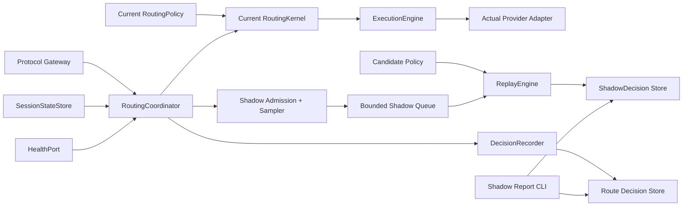

# Coding LLM Router v0.5 Shadow Policy 在线影子策略评估设计规格

> 状态：Accepted  
> 版本：v0.5  
> 日期：2026-08-18  
> 前置版本：[v0.4 Outcome Feedback 与 Offline Replay 设计规格](./coding-llm-router-v0.4-outcome-replay-spec.md)  
> 本版本目标：在不改变在线实际路由和 Provider 执行的前提下，评估一个候选路由策略

## 1. 摘要

v0.4 已经可以用历史 `RouteDecisionInput` 离线回放候选策略，但策略发布前仍缺少真实在线上下文的覆盖验证。v0.5 增加一个固定的 Candidate Policy，并对请求做确定性采样：主策略先生成实际 `ExecutionPlan` 或 `RouterError`，随后把同一份脱敏请求和不可变上下文送入影子队列，由后台使用候选策略生成计划并比较差异。

```text
Inbound request
  -> Gateway -> RoutingCoordinator
  -> one RoutingContext snapshot
  -> current RoutingKernel -> actual plan/error -> ExecutionEngine
  -> ShadowEvaluator.submit (non-blocking)
       -> bounded worker -> ReplayEngine(HISTORICAL)
       -> ShadowDecision Store
```

影子路径只计算，不执行：不初始化候选 Provider、不读取 Provider secret、不创建 HTTP client、不发送网络请求、不运行工具、不生成答案。候选结果永远不会参与当前请求的 primary、fallback、attempt、timeout、响应或 Session/Health 更新。

v0.5 不是自动调参、A/B test、canary 或策略发布系统。它只回答“在这一次真实请求的同一 routing context 下，候选策略会生成怎样的 plan/error，以及哪些请求发生了执行形状变化”。

## 2. 背景、目标与非目标

### 2.1 v0.4 到 v0.5 的问题

v0.4 的 Replay CLI 依赖已持久化的历史快照，适合发布前批量比较，但无法确认候选差异是否覆盖当前真实协议、profile、health/session state，也无法观察候选计算的在线兼容性、性能和采样覆盖。

### 2.2 目标

v0.5 要在真实请求上以有界、可关闭、可审计的方式计算一个候选策略，并使用与 actual plan 完全相同的 `RoutingRequest`、`SessionSnapshot` 和 `AvailabilitySnapshot`。实现复用 v0.4 的 `RoutingKernel`、`RoutingPolicy`、`ReplayEngine` 和 `ReplayChange`，不复制路由算法。

确定性采样、固定 Candidate Policy 和有界队列保证结果可复现、资源可控；持久化只包含 candidate plan/error 和有限差异。候选不兼容、超时、队列满或写入失败时必须 fail-open，主请求仍按 actual 路径完成。

### 2.3 非目标

- 不解析或绑定 Claude Code、Cursor、IDE、主/subagent、spec、plan 或 task list；每个 HTTP 请求仍是独立路由输入。
- 不做 Anthropic 与 OpenAI 的跨协议转换；仍保持 `target.protocol == request.protocol`。
- 不初始化或调用候选 Provider，不解析候选 `api_key_env`，不读取候选 API key/base URL，不运行工具或生成答案。
- 不把实际 Outcome 复制给 candidate target，不计算候选成功率、质量提升、成本节省或延迟节省。
- 不做随机在线实验、流量分叉、双写 Provider、自动 fallback/promote/rollback。
- v0.5 只允许一个 Candidate Policy；多候选并行比较、权重编排和策略市场留到后续版本。
- 不做远程策略拉取、热更新、多租户控制面或 Dashboard。

## 3. 核心原则与不变量

### 3.1 Actual Commit Point 优先

一次请求的实际路由顺序固定为：

```text
context snapshot -> actual Kernel.plan -> actual plan/error committed
                           |
                           +-> best-effort shadow admission
```

只有 actual `ExecutionPlan` 或规范化 `RouterErrorSnapshot` 已经生成后，才允许提交 Shadow Invocation。影子计算不能先于 actual 计划，也不能回写或替换 actual 计划。

主路径唯一使用的对象是 `actual_plan`。Provider Adapter 和 Execution Engine 完全不知道 candidate policy、shadow queue 或 shadow result。

### 3.2 同一上下文、纯函数计算

Shadow Invocation 必须携带 coordinator 已经读取的同一份不可变事实：

```text
RoutingRequest
SessionSnapshot | None
AvailabilitySnapshot
actual ExecutionPlan | RouterErrorSnapshot
actual routing_policy_hash
```

Shadow worker 不得再次读取 `SessionStateStore`、`HealthPort`、`OutcomeStore`、系统时钟来补充路由事实，也不得在计算期间读取可变配置。Candidate `RoutingKernel` 只接受该 invocation 中的值。

### 3.3 失败隔离和 fail-open

sampling/filter 未命中、queue 满、Candidate Policy 不兼容、计算超时或异常、序列化/SQLite/shutdown drain 失败，以及 ShadowEvaluator 未启动或已停止，都只能增加有界 metric 和英文日志；不得让当前 HTTP 请求失败、改变响应或改变 actual execution。

主配置错误仍遵循现有启动校验。Candidate 配置加载失败时，v0.5 旁路进入 `unavailable` 状态并记录错误；主 Router 继续提供 actual 路由，不能因为候选文件或候选 secret 不可用而拒绝主请求。

### 3.4 不能产生反事实质量结论

Shadow Result 只表示 candidate 生成的 plan/error 与 actual 的结构差异。它不表示 candidate 曾经执行，也不表示 candidate 会成功、失败、耗时多少或花费多少。

`OutcomeEvent` 只属于实际向客户端提供结果的 target。ShadowDecision 不携带 Outcome，报告如果显示 Outcome，只能明确标注为 actual request 的历史证据。

### 3.5 协议和能力约束不放宽

Shadow 仍必须遵守 v0.4 的所有 Kernel 约束：target protocol 与 request protocol 相同、required capabilities 是 target capabilities 子集、token 不超过 target capacity、response state 保持同一 state scope，并且 health filtering 只能使用给定 AvailabilitySnapshot。

Candidate 不得通过跨协议转换、隐式 capability、未知健康状态或 fallback 猜测绕过这些约束。

## 4. 架构与模块边界



### 4.1 模块职责

| 模块 | 责任 | 明确不负责 |
|---|---|---|
| `RoutingCoordinator` | 构造一次 context、生成 actual 结果、构造 `RouteDecisionInput`、best-effort 提交影子 invocation | 候选比较、Provider 执行 |
| `ShadowEvaluator` | 采样、过滤、入队、后台调用 ReplayEngine、写 ShadowDecision、隔离异常 | 读取可变运行状态、执行 Provider |
| `RoutingPolicyCompiler` | 把 candidate YAML 编译成 secret-free immutable `RoutingPolicy` | 解析 API key、创建 Provider |
| `ReplayEngine` | 用历史 context 校验 actual 并生成 candidate plan/error、分类 `ReplayChange` | 网络、工具、Outcome 推断 |
| `ShadowStorePort` | 持久化和只读读取 ShadowDecision | 路由计算、策略修改 |
| `SQLiteEvaluationStore` | 实现 shadow 表的 additive migration、幂等写入、只读迭代 | 触发 shadow 计算 |
| `Shadow Report CLI` | 查询有界记录、展示差异和覆盖状态 | 在线路由、自动发布、质量结论 |

`ShadowEvaluator` 是 v0.5 的深模块：调用方只需要提交一个已规范化的 `RouteDecisionInput`，队列容量、采样、兼容性、worker deadline、ReplayEngine 和持久化错误都隐藏在模块内部。它的外部 interface 不暴露 Provider、HTTP、SQLite 细节。

### 4.2 接口草案

```python
class ShadowEvaluatorPort(Protocol):
    """Accept one immutable actual decision without blocking the request."""

    def submit(self, decision: RouteDecisionInput) -> None:
        """Apply admission rules and enqueue one shadow evaluation best-effort."""
```

生命周期只由 Runtime 管理：`start()` 创建有界 worker，`close(grace_seconds)` 在有限时间内 drain；`submit()` 不等待 worker、不执行 SQLite I/O、不抛出候选错误。`DecisionRecorderPort` 与 `ShadowEvaluatorPort` 是两个独立的 seam，任一旁路故障不能阻塞另一旁路。

## 5. 领域模型

### 5.1 Shadow Policy Config

```python
class ShadowConfig(StrictModel):
    """Bounded online shadow policy settings."""

    enabled: bool = False
    candidate_config_path: str | None = None
    sample_rate: float = 0.0
    protocols: tuple[Protocol, ...] = ()
    profiles: tuple[str, ...] = ()
    queue_capacity: int = 256
    evaluation_timeout_ms: int = 25
```

约束：

- `sample_rate` 范围为 `0.0..1.0`，保留最多 4 位小数；`0` 表示不提交，`1` 表示所有满足 filter 的请求都提交。
- `enabled=true` 时 `candidate_config_path` 必须存在且只能是本地文件路径；不支持 URL、命令、环境变量展开或运行时热更新。
- `protocols=()` 和 `profiles=()` 表示不过滤；非空时只允许配置中已知的枚举/名称格式。
- `queue_capacity` 范围为 `1..10000`；v0.5 固定一个 worker，不提供无限队列或 worker 数配置。
- `evaluation_timeout_ms` 范围为 `1..1000`，默认 `25`；超时结果为 `evaluation_timeout`，不得重试当前请求。
- candidate 文件中的 `shadow` block 被忽略，不能递归加载 candidate-of-candidate。

示例：

```yaml
shadow:
  enabled: true
  candidate_config_path: ./router-candidate.yaml
  sample_rate: 0.10
  protocols: [anthropic_messages, openai_responses]
  profiles: []
  queue_capacity: 256
  evaluation_timeout_ms: 25
```

### 5.2 Shadow Invocation

v0.5 不新增一套 request 特征模型。`RouteDecisionInput` 即是 Shadow Invocation 的载体：它已经包含当前请求、Session Snapshot、Availability Snapshot 和 exactly-one actual result。coordinator 必须只构造一次该对象，再同时交给 `DecisionRecorder` 和 `ShadowEvaluator`。

### 5.3 Shadow Status 与 Shadow Decision

```python
class ShadowStatus(StrEnum):
    """Bounded outcome of one admitted shadow evaluation."""

    EVALUATED = "evaluated"
    NON_REPLAYABLE = "non_replayable"
    EVALUATION_FAILED = "evaluation_failed"


@dataclass(frozen=True, slots=True)
class ShadowDecision:
    """Persist one safe comparison between actual and candidate routing."""

    request_id: UUID
    recorded_at: datetime
    evaluated_at: datetime
    protocol: Protocol
    requested_profile: str
    actual_policy_hash: str
    candidate_policy_hash: str
    candidate_algorithm_version: str
    actual_plan: ExecutionPlan | None
    actual_error: RouterErrorSnapshot | None
    candidate_plan: ExecutionPlan | None
    candidate_error: RouterErrorSnapshot | None
    status: ShadowStatus
    change: ReplayChange | None = None
    reason: str | None = None
    schema_version: int = 1
```

`ReplayChange` 直接复用 v0.4 的枚举：`unchanged`、`primary_changed`、`chain_changed`、`error_changed`、`plan_to_error`、`error_to_plan`。`NON_REPLAYABLE` 或 `EVALUATION_FAILED` 不填 candidate result 和 `change`。

`ShadowDecision` 不包含 `OutcomeEvent`、prompt、response、源码、patch、命令、tool 参数、session ID、conversation ID、provider key、`api_key_env`、base URL 或异常自由文本。

## 6. Candidate Policy 生命周期与兼容性

### 6.1 启动时加载一次

Runtime 启动时按以下顺序处理 candidate：

1. 以主配置文件所在目录解析 `candidate_config_path`。
2. 使用现有严格 YAML loader 校验完整候选配置。
3. 只调用 `compile_routing_policy(candidate_config)`，不调用 `resolve_secrets()`，不创建 Provider Registry 或 HTTP client。
4. 检查 candidate 的 `routing_algorithm_version` 与当前支持版本一致，并生成 `routing_policy_hash`。
5. 将 current/candidate policy snapshot 写入 `routing_policy_snapshots`；相同 hash 的 canonical JSON 不一致时视为完整性错误。
6. 创建一个固定的 `ReplayEngine(candidate_policy, ReplayMode.HISTORICAL)`。

Candidate Policy、hash 和 ReplayEngine 在进程生命周期内固定。配置修改只有重启后生效；v0.5 不支持热更新、按请求选择 candidate 或远程版本。

Candidate 加载或编译失败时，记录 `shadow_candidate_invalid` metric 和英文错误日志，ShadowEvaluator 置为 `unavailable`；主 Runtime、`/ready`、actual plan 和 Provider 执行保持可用。

### 6.2 在线可回放条件

在线 shadow 只使用当前 AvailabilitySnapshot，不提供 v0.4 CLI 的 `all-healthy` mode。Candidate 中可能参与本次请求的 target 必须与 current policy 有相同的 operational identity：

```text
(alias, provider, upstream_model, protocol)
```

如果 candidate 新增 target、改变 alias 绑定、改变 provider/upstream model/protocol，且该 target 可能参与当前 request，则写入 `NON_REPLAYABLE`，reason 为 `availability_identity_missing`。不得假设新 target healthy，也不得把其他 alias 的 health 状态复制过去。

Candidate 仅删除 target、调整现有 profile 顺序、tier、threshold、capability、attempt limit 或 timeout 时，只要本次候选可能参与的 target identity 均可在当前 snapshot 中解释，就允许评估。

Candidate algorithm/schema/context 不兼容时分别使用 bounded reason：

```text
shadow_algorithm_incompatible
shadow_schema_incompatible
shadow_context_invalid
```

兼容性检查和历史 actual reproduction 继续由 v0.4 `ReplayEngine` 负责，v0.5 不另写一套路由比较算法。

## 7. 在线执行流程

### 7.1 正常请求

1. Gateway 按现有 `/v1/messages` 或 `/v1/responses` 流程提取 `RoutingRequest` 和 request ID。
2. `RoutingCoordinator` 只读取一次 Session/Health snapshot，构造 `RoutingContext`。
3. current `RoutingKernel.plan(request, context)` 先生成 actual plan。
4. coordinator 构造 `RouteDecisionInput`，将其分别提交给现有 `DecisionRecorder` 和 `ShadowEvaluator`；两个 `submit()` 都是 best-effort、非阻塞。
5. coordinator 立即把 actual plan 返回 Gateway；Gateway 只把它交给现有 `ExecutionEngine`。
6. Shadow worker 从队列取出 immutable decision，构造内存中的 `ReplayCase(decision, current_policy_snapshot, ())`，调用复用的 `ReplayEngine.replay()`。
7. Replay Result 转成 `ShadowDecision` 并异步写入 store。写入完成不通知当前客户端。

### 7.2 Actual RouterError

预期的 `RouterError` 同样构造 exactly-one `actual_error` 的 `RouteDecisionInput`，并允许 shadow evaluation。候选可得到 `ERROR_TO_PLAN`、`ERROR_CHANGED` 或规范化 error 相同的 `UNCHANGED`；`PLAN_TO_ERROR` 只可能出现在 actual 已生成 plan 的正常分支。

非预期 Python exception 没有规范化 actual result，不提交 Shadow Invocation；只沿用现有错误处理和 metric 语义。

### 7.3 明确禁止的流程

禁止 candidate plan 触发 Provider request、candidate error 触发 actual fallback、candidate outcome 更新 session、candidate health observation，以及 candidate response/body reconstruction。

## 8. 采样与有界队列

### 8.1 Deterministic Sampling

不使用进程随机数、时间或 worker 顺序。对每个 candidate 使用：

```text
digest = SHA-256("<request_uuid>:<candidate_policy_hash>")
bucket = first_8_bytes(digest) mod 10000
threshold = round(sample_rate * 10000)
sampled = bucket < threshold
```

同一个 request ID、同一个 candidate hash 和同一个 sample rate 必须得到相同结果。candidate hash 改变时允许重新采样；这使不同策略的采样身份可独立审计。

### 8.2 Admission 顺序

ShadowEvaluator 在 `submit()` 中依次检查 enabled/candidate availability、protocol/profile filter，计算 deterministic sample，再使用 `put_nowait()` 入队。profile 使用 actual effective profile：有 actual plan 时取 `plan.profile`；actual error 时取 requested profile，空值回退 current default profile。该方法只更新 bounded metrics，不执行 policy plan、不序列化 JSON、不访问 SQLite。

Queue 满时采用 drop-newest，记录 `queue_dropped`。不等待、不阻塞、不反压 Gateway；丢弃不影响 actual `ExecutionPlan`。

### 8.3 Worker deadline

Worker 使用独立的单 worker 执行上下文，调用纯 `ReplayEngine`，并以 `evaluation_timeout_ms` 为 deadline。超时只丢弃 candidate 结果并记录 `evaluation_timeout`；不得取消、重试或影响 actual Provider 请求。实现可使用受控线程执行纯计算，但不得让候选代码访问网络或共享可变运行状态。

## 9. Shadow Decision 持久化

### 9.1 SQLite additive migration

在现有 evaluation SQLite 中新增 `shadow_decisions`，不改写 v0.4 既有行：

```text
request_id TEXT NOT NULL
candidate_policy_hash TEXT NOT NULL
recorded_at TEXT NOT NULL
evaluated_at TEXT NOT NULL
protocol TEXT NOT NULL
requested_profile TEXT NOT NULL
actual_policy_hash TEXT NOT NULL
candidate_algorithm_version TEXT NOT NULL
schema_version INTEGER NOT NULL
status TEXT NOT NULL
change TEXT
reason TEXT
actual_plan_json TEXT
actual_error_json TEXT
candidate_plan_json TEXT
candidate_error_json TEXT
PRIMARY KEY (request_id, candidate_policy_hash)
```

约束：

- `protocol`、`status`、`change` 使用 domain validator 和 SQLite `CHECK` 双重约束。
- actual plan/error 必须 exactly one；`EVALUATED` 时 candidate plan/error 必须 exactly one；其他状态 candidate 两者均为空。
- `(request_id, candidate_policy_hash)` 冲突时不得覆盖原行；相同 canonical payload 视为 duplicate，冲突视为 integrity failure。
- 添加 `(recorded_at, candidate_policy_hash)`、`protocol`、`status`、`change` 索引，所有 report 查询必须带 limit。
- `request_id` 不设 foreign key，允许 ShadowDecision 与 RouteDecisionInput 因两个 best-effort worker 的完成顺序暂时不一致。

### 9.2 Store interface

```python
class ShadowStorePort(Protocol):
    """Persist and read bounded shadow comparisons."""

    async def append_shadow(self, decision: ShadowDecision) -> None:
        """Insert one immutable comparison idempotently."""

    def iter_shadow(
        self,
        start: datetime | None,
        end: datetime | None,
        candidate_policy_hash: str | None,
        limit: int,
    ) -> Iterator[ShadowDecision]:
        """Yield shadow rows in stable recorded-time order, read-only."""
```

`SQLiteEvaluationStore` 继续作为 production Adapter；单元测试使用 in-memory fake adapter。Shadow worker 只能通过这个 interface 写入，不能直接拼接 SQL 或持有 request body。

### 9.3 Policy snapshot 与 actual decision 的关系

Candidate policy snapshot 必须先于第一条 ShadowDecision 写入。ShadowDecision 保存 actual/candidate hash 和完整 candidate algorithm version，但不复制完整 policy JSON。完整 policy 仍从不可变 `routing_policy_snapshots` 读取。

ShadowEvaluator 不要求 DecisionRecorder 成功才能完成 candidate comparison；如果 actual decision capture 被禁用或队列丢弃，ShadowDecision 仍可保留自身的 actual/candidate plan/error，但 report 必须把缺失的 RouteDecisionInput 计为 `decision_capture_gap`，不能伪造上下文复现成功。

## 10. 报告、CLI 与指标

### 10.1 Shadow Report CLI

新增只读命令：

```bash
llm-router shadow-report \
  --db ~/.llm-router/router.db \
  --from 2026-08-18T00:00:00Z \
  --to 2026-08-19T00:00:00Z \
  --candidate-hash <sha256> \
  --format table \
  --limit 10000
```

`--candidate-hash` 可选；不提供时按 candidate hash 分组。`--from/--to` 使用 recorded_at 的左闭右开范围，`--limit` 默认并受 `replay.max_records` 上限约束。CLI 以 read-only SQLite 打开，不加载 YAML、不解析 secret、不初始化 Provider。

报告允许输出：持久化 ShadowDecision 及各 status/change/reason 数量、按 protocol/profile 的有界分组、已持久化记录中的状态覆盖，以及 actual request 是否有 v0.4 Outcome 和“有 actual Outcome 且 plan 改变”的请求数。

报告禁止输出或推断：candidate success rate、candidate quality delta、candidate latency saving、candidate cost saving、candidate expected answer 或 candidate Outcome。`OutcomeEvent` 只按 actual target 归属；candidate 永远不是 Outcome target。

### 10.2 Metrics

至少增加以下低基数指标，label 只能使用固定 enum：

```text
shadow_admission_total{status=disabled|filtered|unsampled|enqueued|queue_dropped|unavailable}
shadow_evaluation_total{status=evaluated|non_replayable|failed|timeout}
shadow_change_total{change=unchanged|primary_changed|chain_changed|error_changed|plan_to_error|error_to_plan}
shadow_persistence_total{status=written|duplicate|failed}
shadow_queue_depth
shadow_evaluation_duration_seconds
```

不允许用 request ID、task ID、session ID、prompt、异常 message、候选路径或动态 profile 名称作为 label。Candidate hash 如需诊断，只能作为单一当前 candidate 的 bounded info 字段，不作为无界 label。

所有日志 message 使用英文；日志可带 request ID 和 candidate hash 作为结构化字段，但不得带 request body、secret、SQLite message 或错误自由文本。

## 11. 配置与 Runtime 集成

`RouterConfig` 增加可选 `shadow: ShadowConfig = Field(default_factory=ShadowConfig)`，旧配置不加 block 时行为完全不变。

`create_app()` 的组装顺序调整为：

1. 加载主配置、解析主 client/provider secrets、创建 actual Provider Registry。
2. 编译 current `RoutingPolicy` 和 current `RoutingKernel`。
3. 若 shadow enabled，加载 candidate 配置并只编译 candidate policy；失败则 ShadowEvaluator 为 unavailable。
4. 当 outcomes、replay capture 或 shadow 任一启用时，启动 `SQLiteEvaluationStore`。
5. 启动 DecisionRecorder 和 ShadowEvaluator；确保 current/candidate policy snapshots。
6. 构造 `RoutingCoordinator(kernel, sessions, health, recorder, shadow_evaluator)`。
7. shutdown 时先停止接收新 shadow invocation，再按 bounded grace drain，最后关闭 evaluation store。

`/health` 仍只表示进程存活，`/ready` 仍只依赖主 Runtime 和既有 telemetry/evaluation 初始化；candidate unavailable 不应让 actual 服务不可用。Shadow 状态通过 metrics 和英文日志观察。

## 12. 隐私、安全与资源预算

### 12.1 数据白名单

允许写入：request UUID、时间、protocol、bounded profile、current/candidate policy hash、algorithm/schema version、经过 v0.4 codec 的 plan/error、有限 change/reason enum。

禁止写入：原始 HTTP body、prompt、response、源码、patch、命令、tool name/argument、conversation ID、session ID、client token、Provider API key、`api_key_env`、base URL、异常 message、候选答案和 Outcome payload。

Candidate config 可以包含 Provider 字段以通过现有严格配置校验，但这些字段只在内存中参与 policy compile；不能进入 ShadowDecision，不能触发 secret resolution。

### 12.2 性能与容量

- `submit()` 只做有限 enum/filter/hash/队列操作；主请求额外 p95 目标不超过 `1 ms`，且绝不等待 SQLite 或 worker。
- 默认 queue 为 256 条、单 worker、candidate evaluation deadline 为 25 ms；所有上限可配置但必须有硬边界。
- ShadowDecision 单行序列化大小复用 v0.4 plan/error codec 限制，建议不超过 `64 KiB`；超限标记 persistence failed，不重试当前请求。
- worker shutdown drain 默认最多 5 秒；到期后丢弃剩余候选任务并记录 `shadow_drain_timeout`。
- 影子计算不增加任何 Provider 并发、连接、retry、health lease 或 session capacity。

## 13. 测试与验收标准

测试采用现有 pytest 函数式风格，不引入 autonomous test class。

### 13.1 Actual 路径不变

1. Shadow disabled/enabled 使用相同 request、session snapshot、availability snapshot 时，actual plan/error 的 canonical encoding 完全一致。
2. candidate primary、fallback、timeout、错误或持久化结果都不能改变 `ExecutionEngine.execute()` 的入参。
3. Shadow worker 不调用 Provider Registry、Provider Adapter、HTTP transport、SessionStateStore 或 HealthPort。
4. candidate 不解析或要求任何 provider/client secret；缺失候选 env 仍可计算 policy。

### 13.2 采样与隔离

1. 同一 request UUID、candidate hash、sample rate 的 sampling 结果可重复；边界 `0` 和 `1` 正确。
2. protocol/profile filter、queue full、disabled、candidate unavailable 都只产生 bounded metric，不阻塞 actual。
3. candidate evaluation timeout、ReplayEngine exception、ShadowStore exception 不会让主请求抛出候选错误。
4. close 在 grace deadline 内停止接收新任务；剩余队列不会无限等待。

### 13.3 Replay 与差异

1. current policy 作为 candidate 的 self-comparison 在相同 context 下全部为 `UNCHANGED`。
2. candidate 仅调整 primary、fallback、attempt limit、timeout 时产生对应 `ReplayChange`。
3. actual plan/error 与 candidate error/plan 的四种转换分类正确。
4. candidate 新增或改绑可能参与的 target 时为 `NON_REPLAYABLE: availability_identity_missing`。
5. candidate 与 request 协议不匹配时不跨协议转换；Kernel 只返回 same-protocol 结果或 bounded error。

### 13.4 持久化与隐私

1. `shadow_decisions` additive migration 可重复执行，旧数据库内容不变。
2. 相同 `(request_id, candidate_policy_hash)` canonical payload 不覆盖原行；冲突报告 integrity failure。
3. actual/candidate plan/error exactly-one 约束在 domain 和 SQLite 两层生效。
4. Shadow report、日志、数据库不含 prompt、response、源码、tool 参数、secret、base URL 或异常自由文本。
5. 报告不出现 candidate success/quality/cost/latency 结论；actual Outcome 不会出现在 candidate target 上。

## 14. 版本、回滚与后续演进

### 14.1 版本发布

package/app version 更新为 `0.5.0`；`ShadowDecision.schema_version=1`。`routing_algorithm_version` 继续沿用 v0.4 的 Kernel 算法版本，只有决策语义变化才递增；v0.4 的 Outcome endpoint、Offline Replay CLI、协议路由和 Provider Reliability 行为保持兼容。

### 14.2 回滚

1. 将主配置 `shadow.enabled` 改为 `false` 并重启，立即停止新 shadow admission。
2. 不删除 `shadow_decisions` 或 policy snapshots；保留历史审计数据，报告仍可只读查询。
3. Candidate 文件删除或不可用时，ShadowEvaluator 自动进入 unavailable；actual 路径无需切换配置、不需要 Provider 变更。

### 14.3 v0.6 候选方向

只有 v0.5 的实际覆盖、队列丢弃率、兼容性失败率和 self-comparison 稳定后，才讨论人工审核的 canary/promotion 流程。v0.6 仍应先保持“人工选择、可回滚、无自动质量推断”；多候选、真实流量分配、策略自动提升、ML/bandit 和跨协议转换需要独立设计评审。

v0.5 的成功标准不是候选策略“更好”，而是在不改变线上 actual 行为和协议透明性的前提下，可重复、可限流、可审计地回答 candidate 改变了哪些计划、哪些请求无法安全比较，以及影子旁路覆盖了多少。任何无法由同一 `RoutingRequest + RoutingContext + RoutingPolicy` 证明的质量结论，都不属于本版本。
