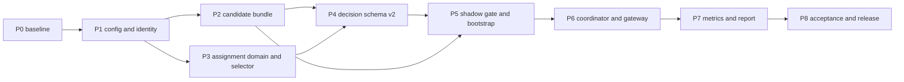

# Coding LLM Router v0.6 Controlled Canary Routing 执行计划

> 状态：Implemented and verified | 版本：v0.6 | 日期：2026-08-19
>
> 设计规格：[v0.6 Controlled Canary Routing 设计规格](./coding-llm-router-v0.6-controlled-canary-spec.md)
>
> 前置版本：[v0.5 Shadow Policy 在线影子策略评估执行计划](./coding-llm-router-v0.5-shadow-policy-implementation-plan.md)

## 1. 目标与边界

本计划把 v0.6 spec 落成一条受控的真实流量路径：Router 在请求进入 `RoutingKernel` 前，通过确定性 Selector 选择 Current 或 Candidate Kernel，随后只生成一个 actual plan/error，并且最多调用一次现有 `ExecutionEngine`。

交付后必须同时满足：

1. 每个请求只选择一个 policy、一个 Kernel 和一条 Provider attempt chain，不做 Shadow 双执行。
2. Candidate 只能引用 Current Runtime 已有且身份完全一致的 Provider/Target Catalog。
3. Canary 控制设施故障 fail-open 到 Control；已选中 Candidate 后的路由和执行失败不得切回 Current。
4. 显式 protocol/profile segment、稳定 affinity、HMAC 分桶和 traffic threshold 在启动后固定。
5. `RouteDecisionInput` v2 保存脱敏 assignment，v1/v2 都能 replay。
6. Shadow gate、Canary Report、metrics 和日志只表达真实观测，不自动调流量、晋级或宣称因果提升。
7. v0.5 的协议原生转发、fallback、Health、Session、SSE Commit Point、Outcome 和 Shadow 行为继续成立。

本计划不实现跨协议转换、Claude Code/task list 适配、客户端选 cohort、新 Provider/Model Canary、多 Candidate、分布式 assignment、热更新、Dashboard、自动 rollback/promote、ML/bandit 或 LLM Judge。

## 2. 当前基线与主要风险

### 2.1 代码基线

当前基线 commit 为 `3c23af7`，package/app 版本为 `0.5.0`。关键位置如下：

| 位置 | 当前职责 | v0.6 处理 |
|---|---|---|
| `routing/coordinator.py` | snapshot context、调用单一 Kernel、capture decision | 改为 Selector + `RoutingResolution` |
| `routing/kernel.py` | 纯路由计划 | 不修改算法；Current/Candidate 共用 |
| `app.py` | Runtime 组装、candidate/shadow bootstrap、lifespan | 只保留组装，Candidate/Canary 逻辑外移 |
| `config.py` | 全部严格配置模型和 candidate loader | 只接入新配置类型，避免继续膨胀 |
| `evaluation/models.py` | Decision/Outcome/Shadow domain | Canary domain 放独立文件 |
| `evaluation/codec.py` | v0.4 Decision/Policy codec | Assignment codec 放独立文件 |
| `evaluation/sqlite_store.py` | evaluation schema 与读写 | additive column，helper 外移 |
| `evaluation/shadow.py` | 固定 candidate 的异步 replay | Candidate actual 时跳过 Shadow |
| `telemetry/sqlite_store.py` | actual RouteEvent/attempt | schema 不变，Report 只读关联 |
| `gateway/anthropic.py`、`gateway/openai.py` | 调用 Coordinator 后执行 plan | 消费 exactly-one resolution |

当前 `config.py` 429 行、`app.py` 381 行、`evaluation/codec.py` 478 行、`evaluation/sqlite_store.py` 462 行，禁止把 v0.6 主体继续追加到这些文件。实现中任何源码文件不得超过 500 行。

### 2.2 主要风险与处理

| 风险 | 处理原则 |
|---|---|
| Candidate 改绑 Provider 或 credential | 启动时逐字段比较 Catalog，任何差异使 Canary inactive |
| Selector 故障影响主请求 | `select()` non-throwing，所有意外异常映射为 Control/`selector_failure` |
| Candidate 失败后偷偷回退 Current | policy selection 固定到 request；只允许 Candidate plan 内 fallback |
| stateful 会话在 cohort 间漂移 | response-state 请求无 session/task affinity 时强制 Control |
| traffic rate 浮点误差 | 配置使用 `Decimal`，精确转换为 `0..2500` threshold |
| v2 capture 破坏旧 replay | additive nullable column；v1 解码为 assignment null，Replay 接受 v1/v2 |
| Gate 被错误 profile 污染 | 关联 Decision 和历史 Current Snapshot 推导 effective profile |
| Report 把相关性写成因果 | 只输出 observed facts、denominator、coverage 和 gap |
| app/config/sqlite 热点继续膨胀 | Candidate、Canary、codec、reader/report 全部放入新模块 |
| affinity 或 salt 泄露 | 只持久化 kind/bucket/threshold，不记录 raw value、digest 或 salt |

## 3. 稳定 interface 与依赖顺序

### 3.1 Policy selection seam

Coordinator 只依赖一个小 interface：

```python
class PolicySelectorPort(Protocol):
    """Choose one immutable routing policy for an invocation."""

    def select(self, invocation: RoutingInvocation) -> PolicySelection:
        """Return a non-throwing selection with bounded audit metadata."""
```

生产使用 `CurrentPolicySelector` 或 `CanaryPolicySelector` Adapter；Coordinator 测试使用 deterministic fake Adapter。Selector 隐藏 runtime state、segment、affinity、HMAC 和 threshold，Gateway 不学习这些细节。

Coordinator 的单一返回 interface 为：

```python
@dataclass(frozen=True, slots=True)
class RoutingResolution:
    """Return one planning result with selected policy metadata."""

    plan: ExecutionPlan | None
    error: RouterError | None
    routing_policy_hash: str
    policy_version: str
    assignment: CanaryAssignment | None
```

`RoutingResolution` 在 `__post_init__` 中要求 plan/error 恰好一个。v0.6 完成后删除 Coordinator 旧 `plan()` interface，不长期维护两套入口。

### 3.2 依赖图



每个阶段先通过本阶段测试和静态检查再进入下一阶段。P6 之前不得让 Candidate 进入真实 Provider 执行路径。

## 4. 文件变更地图

### 4.1 新增源码

`src/llm_router/canary_config.py`、`routing/candidate.py`、`routing/canary.py`、`routing/canary_runtime.py`、`evaluation/canary_models.py`、`evaluation/canary_codec.py`、`evaluation/canary_sqlite.py`、`evaluation/canary_report.py`。

- `canary_config.py`：严格配置模型，不包含运行时选择逻辑。
- `routing/candidate.py`：Candidate 加载、hash 与 Catalog compatibility，产出 immutable bundle。
- `routing/canary.py`：Selector interface、Adapters、eligibility 和 HMAC 分桶。
- `routing/canary_runtime.py`：启动 Gate 与 selector 组装，避免扩张 `app.py`。
- `canary_models.py`：只放可持久化的 assignment、reason、role 和 report domain。
- `canary_codec.py`：assignment canonical JSON、v1/v2 decision row helper。
- `canary_sqlite.py`：additive migration、Shadow gate reader、只读 Canary reader。
- `canary_report.py`：有界聚合和 table/json 渲染，不打开写连接。

### 4.2 修改源码

```text
src/llm_router/config.py
src/llm_router/gateway/auth.py
src/llm_router/gateway/anthropic.py
src/llm_router/gateway/openai.py
src/llm_router/gateway/common.py
src/llm_router/gateway/renderers.py
src/llm_router/routing/coordinator.py
src/llm_router/evaluation/replay.py
src/llm_router/evaluation/shadow.py
src/llm_router/evaluation/sqlite_store.py
src/llm_router/app.py
src/llm_router/telemetry/metrics.py
src/llm_router/cli.py
src/llm_router/__init__.py
setup.py
router.example.yaml
README.md
```

不修改 `RoutingKernel` 算法、`ExecutionEngine` contract、Provider Adapter、Health 状态机、Session 更新规则或协议 body rewrite。

### 4.3 新增测试

全部使用函数式 pytest，不创建测试 class：

新增 `tests/test_v06_canary_config.py`、`test_v06_candidate.py`、`test_v06_selector.py`、`test_v06_canary_store.py`、`test_v06_canary_integration.py` 和 `test_v06_canary_report.py`。

复用现有 fixtures；单个测试文件接近 500 行时继续按职责拆分，不把内部实现暴露成测试 interface。

## 5. P0：冻结基线与实现契约

### 5.1 工作项

1. 在修改源码前运行 compileall、pytest、Ruff、mypy，记录通过数量和既有诊断。
2. 固定 current policy hash、algorithm version、Decision schema v1 和 v0.5 Shadow fixture 结果。
3. 确认 Anthropic/OpenAI Gateway 都只在 route stage 调用 Coordinator 一次。
4. 确认 `RouteEvent`、`route_attempts`、`OutcomeEvent` 可通过 request ID 与 Decision 关联。
5. 锁定 `PolicyRole`、`AffinityKind`、`CanaryReason` 和 runtime state 的字符串集合。
6. 用 fixture 证明 current/candidate policy 均可在不 `resolve_secrets()` 的情况下编译。

### 5.2 阶段验证

```bash
.venv/bin/python -m compileall -q src tests
.venv/bin/python -m pytest -q
.venv/bin/python -m ruff check src tests
.venv/bin/python -m mypy src
```

若基线已有失败，先记录并单独处理，不用删除、skip 或放宽规则掩盖。P0 通过条件是基线可重复，且新 domain enum 不再在实现中临时扩展。

## 6. P1：Canary 配置与 affinity 输入

### 6.1 配置模型

在 `canary_config.py` 实现：

```text
CandidatePolicyConfig(config_path, optional expected_policy_hash)
CanarySegmentConfig(protocol, profile)
CanaryConfig(enabled, traffic_rate, assignment_salt_env,
             segments, minimum_shadow_evaluated,
             shadow_gate_lookback_seconds)
```

实现 spec 中全部边界：rate `0.0001..0.25`、最多四位小数；salt env 名合法；segment 数 `1..32` 且 pair 唯一；hash 为 64 位小写 SHA-256；gate count/window 有界。Canary disabled 时不读取 salt；只有 Shadow/Canary 都 disabled 时才不加载 Candidate。

`RouterConfig` 引入 `candidate_policy` 和 `canary`，并规范化旧 `shadow.candidate_config_path` alias：

1. 新旧 path 同时存在时，以主配置目录解析并比较规范化路径。
2. path 不同直接拒绝主配置，不能静默选择其一。
3. Shadow 或 Canary 启用时必须有 candidate source。
4. Canary 启用时要求 expected hash 和 `replay.capture_enabled=true`；后者不让配置失败，而是在 bootstrap 形成 inactive/`capture_required`。
5. `load_candidate_config()` 删除 candidate 自身的 `candidate_policy`、`shadow`、`canary` block。

### 6.2 Session affinity

在 `gateway/auth.py` 增加 `session_id()`：仅接受 `1..256` UTF-8 bytes 且不含 C0/C1 控制字符，返回原 opaque 字符串，不转发上游。Anthropic/OpenAI Gateway 统一调用该函数；Task ID 和 request ID contract 不变。

### 6.3 完成条件

- 旧 v0.5 YAML 无修改即可加载，Canary 默认 disabled。
- path alias、hash、rate 精度、重复 segment 和边界值都有函数式测试。
- invalid session header 按入站协议返回 invalid request。
- safe upstream headers、日志和配置 dump 不包含 session value 或 salt value。

## 7. P2：Candidate Bundle 与 Catalog Compatibility

### 7.1 Candidate loader

在 `routing/candidate.py` 实现 `CandidatePolicyLoader.load()`，产出 immutable `CandidateBundle`：candidate config、compiled policy、Kernel、snapshot、expected/actual hash 和 compatibility result。

加载顺序固定为：

1. 相对主配置目录解析本地 path。
2. `load_candidate_config()`，禁止 `resolve_secrets()`。
3. 复用 `compile_routing_policy()` 和 `make_policy_snapshot()`。
4. 比较 expected/actual hash 和 routing schema/algorithm version。
5. 比较 Current/Candidate Provider 与 Target Catalog。
6. 校验每个 segment 在两侧 profile/protocol 都可路由。

### 7.2 Catalog 比较

对 Candidate 引用的每个 target 比较 alias、provider、upstream model、protocol、tier、capabilities、max input、prices、state scope；对 Provider 比较 type、base URL、auth scheme、API key env、extension headers 和 concurrency。Candidate 可以少用 target，但不能新增、改绑或改变身份字段。

比较失败只返回 bounded `CanaryReason`，日志不得携带 base URL、env value 或异常 message。Candidate loader 不创建 ProviderRegistry、HTTP client 或第二套 HealthPort。

### 7.3 完成条件

- 只修改 profile 顺序、threshold、attempt limit、timeout 或 policy version 的 Candidate 兼容。
- 新增/改绑 target、Provider connection/state scope 改动均 incompatible。
- hash mismatch 时保留 expected/actual hash；文件无法编译时 actual hash 为 null。
- Shadow/Canary 都 disabled 时不读取 Candidate；仅 Shadow enabled 时仍加载并复用 bundle。

## 8. P3：Assignment Domain 与确定性 Selector

### 8.1 Domain

在 `canary_models.py` 实现 frozen/slotted：

`canary_models.py` 包括 `PolicyRole(control|canary)`、`AffinityKind(none|session|task|request)`、spec 固定的 `CanaryReason` 和 `CanaryAssignment`。运行期 `PolicySelection`、`CanaryRuntimeState` 放在 `routing/canary.py`，`RoutingResolution` 放在 `routing/coordinator.py`，避免 evaluation 模块反向依赖 `RoutingKernel`。

`CanaryAssignment` 校验 role/reason、expected/actual hash、bucket `0..9999`、threshold `0..2500` 的合法组合。inactive assignment 的 actual candidate hash 仅在成功编译时存在。

### 8.2 Selector

在 `routing/canary.py` 实现：

1. `CurrentPolicySelector` 始终返回 Current Kernel 和 null assignment。
2. `CanaryPolicySelector` 依次判断 runtime active、segment、stateful affinity、count-only、affinity priority 和 bucket。
3. affinity 顺序固定为 session -> task -> request。
4. message 使用 canonical JSON `[candidate_hash, affinity_kind, affinity_value]`。
5. 使用 `HMAC-SHA256`，取前 8 bytes big-endian 后 `% 10000`。
6. threshold 由 Decimal 精确乘 `10000`，提高 rate 时 cohort 单调扩张。
7. `select()` 捕获内部意外异常，返回 Current/`selector_failure`，不抛给 Coordinator。

### 8.3 完成条件

- 固定向量测试验证 HMAC/bucket，重启后结果一致。
- rate 从 1% 增至 5% 时原 Canary affinity 不回到 Control。
- response-state 无 session/task、count-only、未声明 segment 始终 Control。
- fake header/body 不能控制 role；assignment 不进入 Provider envelope。
- selector p95 在本地 10,000 次 fixture 中低于 1 ms。

## 9. P4：Decision schema v2、Codec 与 Replay

### 9.1 Codec 与 migration

`RouteDecisionInput` 增加 optional `canary_assignment`，默认 schema version 改为 2。Canary 类型和 JSON 逻辑放在独立模块，禁止继续扩张 `evaluation/codec.py`。

在 `canary_codec.py` 实现字段白名单和 canonical JSON；禁止 raw affinity、digest、salt、prompt、body。`canary_sqlite.py` 提供可重复 migration：

```sql
ALTER TABLE route_decision_inputs ADD COLUMN canary_assignment_json TEXT;
```

实现前先通过 `PRAGMA table_info` 判断，避免重复 ALTER。`append_decision()` 写 assignment JSON；row decoder 接受：

- schema v1：assignment 必须视为 null；
- schema v2：严格解码 optional assignment；
- 未知 schema：继续 `CodecError`/non-replayable。

如果 `sqlite_store.py` 因修改接近 500 行，把 decision value/decode helper 移到 `canary_codec.py`，而不是突破文件限制。

### 9.2 Replay 与 Shadow

修改 `ReplayEngine.replay()` 接受 schema `{1, 2}`，忽略 assignment 后使用既有 request/session/availability replay。历史 policy snapshot 仍按 `decision.routing_policy_hash` 查找，因此 Control 和 Canary actual 都能自复现。

ShadowEvaluator 在 admission 最前面检查 assignment role：`role=canary` 时跳过并记录 `actual_is_candidate`，不写伪 ShadowDecision；policy hash 不同只作防御性跳过，不能代替 role，因为 Candidate 可以与 Current 同 hash。

### 9.3 完成条件

- v1 fixture 解码、self replay 和 Shadow 行为不变。
- v2 assignment canonical round-trip，unknown key/schema 被拒绝。
- migration 对空 DB、v0.4/v0.5 DB 和重复启动都幂等。
- Current/Candidate Policy Snapshot 在 Decision 入队前已存在。
- DB 与日志扫描不出现 raw session/task affinity、digest 或 salt。

## 10. P5：Shadow Gate 与 Runtime Bootstrap

### 10.1 Gate reader

在 `canary_sqlite.py` 实现只读、流式 `SQLiteCanaryGateReader`。启动窗口按 UTC clock 固定，筛选相同 current/candidate hash 和 `recorded_at` 左闭右开范围。

每条 Shadow 记录的 segment 推导顺序：

1. protocol 取 `ShadowDecision.protocol`；
2. profile 优先取 Decision actual plan profile；
3. 其次取 request 显式 profile；
4. 最后取历史 Current Policy Snapshot default profile；
5. Decision capture gap 或无法推导时不计入 evaluated。

每个声明 segment 独立统计 evaluated、non-replayable、evaluation-failed；所有 segment 同时满足门槛才 active。使用 cursor streaming/SQL filter，不把窗口内全部记录一次加载到内存。

### 10.2 Bootstrap

在 `routing/canary_runtime.py` 实现 Runtime bootstrap，`app.py` 只调用其单一组装函数。顺序固定为：

1. 启动 evaluation store 并完成 additive migration。
2. ensure Current Policy Snapshot。
3. 加载 shared Candidate bundle；成功时 ensure Candidate Snapshot。
4. 校验 expected hash、Catalog、capture、salt 和 Shadow gate。
5. 构造 `CurrentPolicySelector` 或 active/inactive `CanaryPolicySelector`。
6. 启动 DecisionRecorder 和可用的 ShadowEvaluator。
7. 最后设置 Router ready。

`Runtime.coordinator` 在 lifespan bootstrap 完成前为 null，Gate 完成后一次性绑定包含 fixed Selector 的 Coordinator，再设置 ready；Gateway 不持有早期 Coordinator 副本。Candidate、salt 或 gate 失败不使 `/ready` 失败；runtime 保存 disabled/active/inactive state 和单一 bounded reason。配置和 selector 启动后不热更新。

### 10.3 完成条件

- 一个 segment 的高流量不能补足另一个 segment。
- 窗口外、其他 hash、capture gap 和错误 default profile 不计入。
- 任一 relevant non-replayable/evaluation-failed 使整体 inactive。
- 新 Shadow 样本不会在线激活 Canary，只有人工重启重新 Gate。
- salt 缺失/过短映射 `assignment_salt_invalid`，Gate/DB 读取异常映射既定 bounded reason，全部选择 Control。

## 11. P6：Coordinator、Gateway 与单次真实执行

### 11.1 Coordinator

将 `RoutingCoordinator.plan()` 替换为 `resolve()`：

1. 调用 Selector 得到 fixed selection。
2. 读取一次 Session Snapshot 和一次 Availability Snapshot。
3. 只调用 selected Kernel 一次。
4. expected `RouterError` 转为 resolution.error，并 capture actual selected policy/assignment。
5. plan 分支 capture 后返回 resolution.plan。
6. unexpected Candidate Kernel exception 只记录 bounded role metric/英文日志并走 safe 500，不调用 Current Kernel。

Decision 的 `routing_policy_hash`、algorithm version、policy version 和 actual plan 必须全部来自 selected Kernel。Shadow submission 继续 best-effort。

### 11.2 Gateway

Anthropic/OpenAI Gateway 消费同一 resolution：error 分支按原协议 renderer 返回，plan 分支只调用一次 `ExecutionEngine.execute()`。在 `errors.py` 增加 bounded `internal_error()`（`router_internal_error`/500），route-stage unexpected exception 使用它，不沿用当前 generic invalid-request/400；响应不得暴露异常文本。route-stage error response 可以携带已有安全的 `x-llm-router-policy-version`，但不得暴露 role、bucket 或 candidate hash。

`record_route_failure()` 接收 resolution 的实际 policy version；Health revision 继续取 plan/error 的 bounded 字段。认证、JSON 解析等 selection 前错误没有 assignment，也不伪造 policy metadata。

### 11.3 完成条件

- fake Selector/Kernel/Engine 计数证明每请求一次 selection、一次 Kernel、最多一次 Engine。
- Candidate RouterError、no target、Provider failure、fallback exhausted 均不调用 Current Kernel。
- Candidate Kernel unexpected exception 返回协议兼容的 safe 500，并且日志只有 bounded role/hash/type。
- Control canonical plan/error 与 v0.5 完全一致。
- 两种协议的 JSON/SSE、headers、Session/Health completion 回归通过。
- response-state 请求在同一 session/task 中保持同一 cohort 和 state scope。

## 12. P7：Metrics 与 Canary Report

### 12.1 Metrics 和日志

在 `RouterMetrics` 增加：

```text
canary_runtime_state{state}
canary_assignment_total{role,reason}
canary_routing_total{role,result}
canary_fail_open_total{reason}
canary_decision_capture_gap_total
```

label 只接受固定 enum，不使用 hash、request/task/session ID、profile、bucket、path 或异常 message。启动日志可记录 expected/actual policy hash 和 state；所有 message 使用英文，禁止 affinity/salt/base URL/secret/free-form exception message。

DecisionRecorder 的 `record()` 需要返回或暴露 bounded accepted/dropped 结果，才能准确增加 Canary capture gap；不要通过读取私有 queue 推断。若修改该 interface，Noop/Fake/生产 Adapter 同步更新。

### 12.2 Read-only Report

`SQLiteCanaryReader` 用一个 read-only connection 关联：

```text
route_decision_inputs
route_requests
route_attempts
outcome_events
```

按 expected candidate hash、时间范围和 SQL limit 读取。`canary_report.py` 聚合 segment/reason/role、plan/error、target/fallback、latency/token/cost、Outcome coverage/conflict 和 capture/completion gap；p50/p95 只对 limit 内真实值计算。

同 request 的 matched Outcome verdict 一致时计一次；冲突时标记 conflicting 并排除 rate denominator。所有 observed rate 同时输出 numerator、denominator 和 coverage，不输出 uplift、显著性、置信区间或发布建议。

CLI 增加 `canary-report`：参数错误 exit 2，DB/schema/fatal error exit 3；stdout 只输出 table/json，stderr 输出 bounded error。CLI 不加载 YAML/salt/secret，不创建 ProviderRegistry，不联网。

### 12.3 完成条件

- inactive assignment 的 expected/actual hash 语义正确，active Canary actual hash 必须匹配 CLI hash。
- report 前后 DB 文件内容和 row count 不变。
- missing Decision、RouteEvent 或 Outcome 分别进入明确 gap，不伪造 Control/Canary。
- table/json 都显示 denominator/coverage，且没有因果或自动发布措辞。
- metrics/report/log 扫描不出现禁止字段。

## 13. P8：集成、隐私、性能与发布验收

### 13.1 固定演练

1. `canary.enabled=false` 启动 v0.5 配置，验证双协议和全量回归。
2. Candidate 等于 Current、Gate 满足、rate 1%，验证 selected cohort 但 canonical plan 不变。
3. Candidate 只调整 target order/threshold/timeout，验证 Canary 真实 plan 和 fallback。
4. Candidate hash mismatch、Catalog 改绑、salt 缺失、Gate 未满足，验证全量 Control 且 ready。
5. Candidate Kernel/Provider/fallback 失败，验证失败保持在 Canary，不跨 policy fallback。
6. 从 1% 提升到 5% 重启，验证已有 affinity cohort 单调、配置不热更新。
7. 构造 Decision capture queue full/SQLite 故障，验证 actual 请求继续并记录 gap。
8. 禁用网络和 Provider env 后运行 `canary-report`，验证只读且可完成。

### 13.2 全量质量命令

```bash
.venv/bin/python -m compileall -q src tests
.venv/bin/python -m pytest -q
.venv/bin/python -m ruff check src tests
.venv/bin/python -m mypy src
```

额外执行核心在线回归：

```bash
.venv/bin/python -m pytest -q \
  tests/test_v02_regression.py \
  tests/test_health_gateway.py \
  tests/test_health_execution.py \
  tests/test_v04_evaluation.py \
  tests/test_v05_shadow.py
```

### 13.3 发布文件

- `src/llm_router/__init__.py`、`setup.py` 和 FastAPI/metrics version 更新为 `0.6.0`。
- `router.example.yaml` 增加 disabled-by-default candidate/canary 示例。
- README 增加 Shadow -> Canary -> 人工晋级/回滚流程和风险说明。
- 全部验收后将 v0.6 spec 改为 `Accepted`，本计划改为 `Implemented and verified`。

## 14. 提交顺序与回滚

建议阶段独立提交，任一提交点都保持测试可运行：

```text
P0 baseline and frozen contracts
P1 canary config and affinity validation
P2 candidate bundle and catalog compatibility
P3 assignment domain and deterministic selector
P4 decision schema v2 and replay compatibility
P5 shadow gate and runtime bootstrap
P6 coordinator and gateway single execution
P7 metrics and read-only canary report
P8 regression, docs, and v0.6 release
```

运行时回滚只修改：

```yaml
canary:
  enabled: false
```

然后重启。保留 additive column、Decision、Shadow、RouteEvent 和 Outcome 历史，不删除 SQLite 数据、不修改 Provider 配置。若 Candidate 已触发共享 Health cooldown，重启按现有进程内 Health 语义重置。

## 15. 完成定义

v0.6 只有同时满足以下条件才能标记完成：

- P0-P8 全部完成，质量命令和 v0.1-v0.5/health/execution 回归全绿。
- 每个请求只有一个 selected policy、一个 Kernel result 和最多一次 ExecutionEngine 调用。
- Candidate 只能使用 Current 可执行 Catalog，不解析 secret、不创建 Provider/Health/HTTP runtime。
- Selector HMAC、segment、affinity、threshold 和 fail-open 有固定向量与集成测试证据。
- Candidate 被选中后的 RouterError/Provider failure 不切回 Current。
- Decision v1/v2、additive migration、Replay、Shadow skip 和 Policy Snapshot 一致性通过。
- 每个 segment 的 Shadow Gate 独立、窗口准确、capture gap 不冒充样本。
- Report 只读、有界，所有 observed rate 带 denominator/coverage，不声明因果提升。
- DB、metrics、日志和 report 不包含 raw affinity、salt/digest、prompt/response、源码/patch、tool 参数、secret 或 base URL。
- 所有新增函数含简短 function-level docstring；日志 message 使用英文；源码文件不超过 500 行；测试不使用 class。
