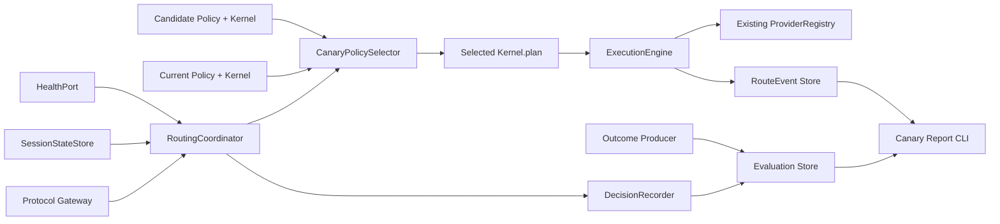

# Coding LLM Router v0.6 Controlled Canary Routing 设计规格

> 状态：Accepted | 版本：v0.6 | 日期：2026-08-19
>
> 前置版本：[v0.5 Shadow Policy 在线影子策略评估设计规格](./coding-llm-router-v0.5-shadow-policy-spec.md)
>
> 本版本目标：让经过 Shadow 验证的 Candidate Policy 在小比例真实请求上受控执行，并保持人工晋级与快速回滚

## 1. 摘要

v0.5 可以在真实上下文中计算 Candidate Policy，但候选计划从不执行，因此只能证明“路由结构发生了什么变化”，不能观察候选计划真实的 Provider、fallback、延迟或 Outcome。v0.6 增加 Controlled Canary Routing：对符合条件的请求做确定性分组，由 Current Policy 或 Candidate Policy 二选一生成 actual plan，然后仍只调用一次现有 ExecutionEngine。

```text
Inbound request
  -> Canary eligibility + deterministic assignment
  -> CONTROL: Current RoutingKernel ----+
  -> CANARY: Candidate RoutingKernel ---+-> one actual ExecutionPlan
                                          -> existing ExecutionEngine
                                          -> one Provider execution chain
                                          -> actual RouteEvent / Outcome
```

Canary 不是 Shadow 双请求。一个请求只有一个 actual policy、一个 plan 和一条 Provider attempt chain，不产生第二份模型回答或双倍调用。Candidate 被选中后，其 RouterError、fallback 和 Provider 结果都是真实结果。

v0.6 只做小流量、静态配置、人工决策的灰度。它不自动提升策略、不自动扩大流量、不用 Outcome 在线改权重，也不声明因果质量提升。

## 2. 问题、目标与非目标

### 2.1 v0.5 之后缺少什么

Shadow Result 无法回答以下问题：Candidate 的 Provider 是否真实可用、fallback 是否在真实交换中生效、任务 Outcome 覆盖如何、真实延迟和 token 使用如何，以及 Candidate RouterError 是否会影响用户。继续增加 Shadow 报告字段不能突破这个信息上限。

### 2.2 v0.6 目标

1. 对经过启动检查和历史 Shadow gate 的单一 Candidate Policy 开放最多 25% 的真实流量。
2. 对显式 protocol/profile segment 使用 opaque affinity 做确定性分组；同一 candidate、salt、rate 和 affinity 得到相同 cohort。
3. 保证每个请求只执行 Current 或 Candidate 之一，不双写 Provider。
4. 复用现有 `RoutingKernel`、`ExecutionEngine`、HealthPort、Provider Adapter 和 Commit Point。
5. 保存实际选中的 policy hash、cohort、分组依据类别和有限原因，以便关联 RouteEvent 与 Outcome。
6. 提供只读 Canary Report，分别展示 Control/Canary 的真实执行事实和 Outcome 覆盖。
7. Candidate bootstrap、preflight 或 selector 故障时安全回到 Control；人工可通过配置和重启关闭 Canary。

### 2.3 非目标

- 不解析 Claude Code/Cursor/IDE 的 task list、主 agent、subagent、spec 或 plan。
- 不允许客户端通过 body/header 强制选择 Control、Canary、Provider 或 target。
- 不做 Anthropic/OpenAI 跨协议转换，仍要求 `target.protocol == request.protocol`。
- 不同时执行两个模型，不生成候选答案对，不做 LLM Judge、reward model 或 response diff。
- 不让 Candidate 引入新 Provider、base URL、credential、model identity 或 state scope。
- 不做跨进程分布式 cohort、远程配置、热更新、Dashboard 或多 Candidate 实验。
- 不自动 increase/decrease traffic、不自动 promote、不自动修改 YAML、不根据 Outcome 在线学习。
- 不对观测差异做因果推断或输出“质量提升 X%”。

## 3. 核心原则与架构不变量

### 3.1 单次真实执行

```text
one request -> one selected policy -> one plan/error -> one execution chain
```

Control 使用 Current Policy；Canary 使用 Candidate Policy。ExecutionEngine 只接收选中 policy 的 plan，不知道 cohort，也不增加 Provider 调用。Provider Adapter、协议 body rewrite、stream relay 和 pre-commit fallback 逻辑保持 v0.5 行为。

### 3.2 Policy selection 在 Kernel 之前

Canary 只决定“本次使用哪个已经编译好的 RoutingKernel”，不参与 Kernel 内部 tier、capability、health、state scope 或 fallback 算法。Current/Candidate 都使用同一份 request `RoutingContext`：一次 Session Snapshot 和一次 Availability Snapshot。

```text
RoutingInvocation -> CanaryPolicySelector -> PolicySelection
RoutingContext + PolicySelection.kernel -> ExecutionPlan | RouterError
```

Selector 不读取 prompt/body，不访问 Outcome，不调用 Provider，不修改 Session/Health。RoutingKernel 的 `routing_algorithm_version` 在 v0.6 不因 cohort 选择而递增。

### 3.3 两种故障语义严格分开

以下属于 Canary 控制设施故障，必须 fail-open 到 Control：

- Candidate 文件缺失或无法编译；
- expected policy hash 不匹配；
- Provider/Target Catalog compatibility 不通过；
- Shadow preflight gate 不通过；
- assignment salt 缺失；
- Selector 内部非预期异常。

以下属于已选中 Canary 的真实路由/执行结果，禁止切回 Current Policy：

- Candidate Kernel 返回 `RouterError`；
- Candidate Kernel 发生非预期实现异常；
- Candidate plan 没有可用 target；
- Candidate primary Provider 失败；
- Candidate fallback chain 耗尽；
- stream 在 Commit Point 前后失败。

后一类只遵循 Candidate plan 自身的 fallback 和现有 ExecutionEngine 语义。跨 policy fallback 会掩盖风险并污染 cohort 数据，因此不允许。

### 3.4 Outcome 只归实际执行

Canary request 的 Outcome 可以归属其 actual final target，因为 Candidate 确实执行过；Control Outcome 同理。v0.5 Shadow target 仍不能继承 actual Outcome。

`OutcomeEvent` 不进入 Selector/Kernel，不触发自动流量调整或策略晋级。Canary Report 可以展示实际 observed count/rate，但必须同时展示 denominator、Outcome coverage 和 conflicting 数量。

### 3.5 客户端和协议无关

Canary 使用 Router 已有的 opaque `session_key`、optional Task ID 或 Router request ID 作为 affinity，不理解这些 ID 背后的业务对象。优先顺序固定为：

```text
session key -> task ID -> request ID
```

只有客户端显式提供同一个 session/task ID 时才能保证跨请求粘性；request ID fallback 只保证单请求确定性。Router 不从 prompt、tool call、OpenAI response ID 或 Anthropic message 内容推断会话。

`x-llm-router-session-id` 必须规范化为 `1..256` UTF-8 bytes 且不含控制字符；无效值按入站协议返回 invalid request。Session key 不持久化、不转发上游。Task ID 和 request ID 继续使用 UUID contract。

## 4. 架构与深层模块



### 4.1 模块职责

| 模块 | 责任 | 明确不负责 |
|---|---|---|
| `CandidatePolicyLoader` | 解析共享 candidate、校验 hash/catalog、产出 immutable bundle | Provider 创建、流量选择 |
| `CanaryGate` | 用配置和历史 Shadow summary 判断是否可激活 | 自动调参、质量判定 |
| `CanaryPolicySelector` | eligibility、HMAC 分桶、选择已编译 Kernel、返回 metadata | Kernel 算法、Provider 执行、持久化 |
| `RoutingCoordinator` | snapshot context、调用 selected Kernel、捕获 actual decision | cohort 算法、报告 |
| `DecisionRecorder` | best-effort 持久化含 Canary metadata 的 actual decision | 选择 policy |
| `CanaryReport` | 只读关联 Decision、RouteEvent、Outcome 并渲染事实 | 自动 promote/rollback |

`CanaryPolicySelector` 是 v0.6 的深模块。它隐藏 candidate availability、segment、affinity、HMAC、threshold 和 fail-open；Coordinator 只学习一个 interface：

```python
class PolicySelectorPort(Protocol):
    """Choose one immutable routing policy for an invocation."""

    def select(self, invocation: RoutingInvocation) -> PolicySelection:
        """Return a non-throwing policy selection and bounded audit metadata."""
```

Disabled Canary 使用 `CurrentPolicySelector` Adapter；启用后使用 `CanaryPolicySelector`。这是一个真实 seam，测试可用 deterministic fake selector 替代，不需要 mock Gateway 或 Provider。

### 4.2 文件拆分约束

v0.5 的 `config.py`、`app.py`、`evaluation/sqlite_store.py` 已接近 500 行。v0.6 应新增 `routing/canary.py`、`routing/candidate.py`、`evaluation/canary_models.py`、`evaluation/canary_codec.py`、`evaluation/canary_sqlite.py` 和 `evaluation/canary_report.py`，而不是继续扩张上述文件。外层文件只保留组装和 delegation，不建立 pass-through public interface。

## 5. Candidate Policy 与可执行 Catalog

### 5.1 Shared Candidate Policy

v0.5 将 candidate path 放在 `shadow` block。v0.6 把 Candidate 提升为 Shadow/Canary 共用的运行时概念：

```yaml
candidate_policy:
  config_path: ./router-candidate.yaml
  expected_policy_hash: "<64-char-lowercase-sha256>"
```

兼容规则：旧 `shadow.candidate_config_path` 在 v0.6 继续作为 deprecated alias；新旧同时存在时，规范化后的本地路径必须相同，否则主配置无效。Shadow 或 Canary 任一启用时必须存在 candidate source；Canary 启用时必须提供 expected hash。

Candidate loader 必须删除 candidate 文件里的 `candidate_policy`、`shadow` 和 `canary` block，防止递归控制。它只编译 RoutingPolicy，不调用 candidate `resolve_secrets()`，不创建第二个 ProviderRegistry。

### 5.2 Catalog compatibility

v0.6 Candidate 只能使用 Current Runtime 已经可执行的 Provider/Model Target：

1. Candidate target alias 必须存在于 Current Config。
2. 对每个 Candidate target，provider、upstream model、protocol、tier、capabilities、max input、prices 和 state scope 必须与 Current target 完全相同。
3. Candidate 引用的 Provider type、base URL、auth scheme、API key env、extension headers 和 concurrency 必须与 Current Provider 相同。
4. Candidate target 集可以是 Current target 集的子集，不能新增或改绑 target。
5. Candidate 与 Current 的 routing algorithm/schema version 必须兼容。
6. 每个 Canary segment 的 profile 必须同时存在于 Current/Candidate，并且两侧都能为该 protocol 路由；未声明 segment 永远不进入 Canary。

Candidate 允许改变：profile mode/target order、default profile、auto thresholds、failure escalation threshold、attempt limit、timeouts 和 human policy version。

Catalog 不兼容时 Shadow 仍可按 v0.5 规则报告 non-replayable，但 Canary 必须保持 inactive。新 Provider/Model Canary 需要先把 Provider Catalog 从 Routing Policy 中独立出来，不属于 v0.6。

## 6. Canary 配置与启动 Gate

### 6.1 配置

```yaml
canary:
  enabled: false
  traffic_rate: 0.01
  assignment_salt_env: LLM_ROUTER_CANARY_SALT
  segments:
    - protocol: anthropic_messages
      profile: code/auto
  minimum_shadow_evaluated: 100
  shadow_gate_lookback_seconds: 86400
```

约束：

- `traffic_rate` 在启用时为 `0.0001..0.25`，最多四位小数；v0.6 不允许 100% Canary。
- assignment salt 环境变量值至少 32 bytes，只用于 HMAC，不记录、不发送 Provider。
- 启用时必须声明 `1..32` 个唯一 `{protocol, profile}` segment，不提供“全部流量”简写；每个 pair 必须能由 Current/Candidate 路由。
- `minimum_shadow_evaluated` 范围 `1..100000`，默认 100。
- `shadow_gate_lookback_seconds` 范围 `3600..604800`，默认最近 24 小时，使用启动时 UTC clock 固定窗口。
- 配置、candidate、rate、segment 和 salt 启动后固定；不热更新。
- Canary 启用要求 `replay.capture_enabled=true`，否则保持 inactive 并记录 bounded reason。

### 6.2 Shadow preflight gate

Runtime 启动 evaluation store 后，对每个声明的 Canary segment 分别只读统计 gate lookback 窗口内、相同 `(current_policy_hash, candidate_policy_hash)` 的 ShadowDecision：

```text
evaluated_in_each_segment >= minimum_shadow_evaluated
non_replayable == 0
evaluation_failed == 0
```

Gate 不要求 `UNCHANGED`，因为 Candidate 本来就应产生计划差异。segment protocol 取 `ShadowDecision.protocol`；profile 关联 RouteDecisionInput 后依次取 actual plan profile、请求显式 profile、历史 Current Policy Snapshot 的 default profile，不能直接信任旧 ShadowDecision 的 defaulted `requested_profile`。统计窗口使用 `recorded_at`；capture gap 和无法确定 current effective profile 的记录不计入。其他 current/candidate hash、窗口外或未声明 segment 也不得计入，某个 segment 的高流量不能补足另一个 segment 的样本。

Gate 只证明窗口内已持久化样本没有已知兼容性/实现错误，不证明 Shadow queue 没有 drop/timeout，也不证明 Outcome 质量。操作方启用前仍必须检查 v0.5 metrics；启动 Gate 不读取历史 Prometheus 数据或伪造缺失样本。

Gate 未通过时 Router 仍 ready，全部请求进入 Control；metric/log 显示 `shadow_gate_not_met`。v0.6 不在进程运行中自动重新检查，新增 Shadow 样本后需要人工重启。

## 7. Policy Selection 与粘性分组

### 7.1 Eligibility 顺序

Selector 按以下顺序决定 eligibility：

1. Canary runtime state 必须 active。
2. request 的 `(protocol, current effective profile)` 必须命中显式 segment；effective profile 为空时使用 Current default profile。
3. `response_state_requested=true` 时必须有 session key 或 Task ID；否则强制 Control，reason=`affinity_required`。
4. `count_only=true` 在 v0.6 强制 Control，reason=`count_only_excluded`。
5. 选取 session/task/request affinity，进行 HMAC 分桶。

任何客户端提供的 `model` 仍只表示 profile，不表示 cohort。未知/伪造 cohort header 不进入 safe upstream headers，也不改变 selection。

### 7.2 Deterministic assignment

```text
message = canonical_json([candidate_policy_hash, affinity_kind, affinity_value])
digest = HMAC-SHA256(assignment_salt, UTF8(message))
bucket = first_8_bytes(digest) mod 10000
threshold = exact_decimal(traffic_rate) * 10000
cohort = CANARY if bucket < threshold else CONTROL
```

相同 candidate/salt/rate/affinity 在重启后保持相同 cohort；提高 rate 时 cohort 单调扩张。Selector 不保存 raw affinity、digest 或 salt。只持久化 `affinity_kind`、bucket 和 threshold。

request ID fallback 对每个请求独立分配，不保证同一客户端会话粘性；报告必须按 affinity kind 展示数量。对需要 Provider response state 的请求禁止使用 request fallback。

### 7.3 Selection 结果

```python
class PolicyRole(StrEnum):
    """Identify the actual policy cohort for one request."""

    CONTROL = "control"
    CANARY = "canary"


@dataclass(frozen=True, slots=True)
class CanaryAssignment:
    """Record bounded selection metadata without the affinity value."""

    role: PolicyRole
    reason: CanaryReason
    expected_candidate_policy_hash: str
    candidate_policy_hash: str | None
    affinity_kind: AffinityKind
    bucket: int | None
    threshold: int


@dataclass(frozen=True, slots=True)
class PolicySelection:
    """Bind one immutable Kernel to its auditable assignment."""

    kernel: RoutingKernel
    assignment: CanaryAssignment | None
```

`AffinityKind` 为 `none | session | task | request`。`CanaryReason` 为有限枚举：`canary_bucket`、`control_bucket`、`segment_filtered`、`affinity_required`、`count_only_excluded`、`candidate_unavailable`、`policy_hash_mismatch`、`catalog_incompatible`、`shadow_gate_not_met`、`capture_required`、`assignment_salt_invalid`、`selector_failure`。

Canary 未配置时 assignment 为 null；配置已启用但未激活时选择 Control，并保存具体 bounded reason。

`expected_candidate_policy_hash` 始终取启动配置；`candidate_policy_hash` 在 Candidate 成功编译后取实际 hash，包括 hash mismatch 和其他 inactive 状态，仅在 Candidate 无法读取/编译时为 null。这样报告可以区分“期望谁”和“实际加载了谁”，又不把不匹配 Candidate 误记为可执行。

## 8. 在线执行与 v0.5 Shadow 共存

### 8.1 Coordinator 流程

1. Gateway 构造已有 `RoutingInvocation`，不增加客户端 Canary 参数。
2. Coordinator 调用 Selector 得到 fixed `PolicySelection`。
3. Coordinator 读取一次 Session/Availability Snapshot。
4. Selected Kernel 使用该 context 生成 actual plan/error。
5. `RouteDecisionInput` 记录 selected policy hash 和 optional CanaryAssignment。
6. Coordinator 返回 exactly-one `RoutingResolution(plan | RouterError)`，同时携带 selected policy hash/version 和 assignment；它替代旧 `plan()` interface，不保留两套长期调用方式。
7. Gateway 对 planning error 使用 resolution 中的实际 policy metadata 记录/渲染；对 plan 只调用一次 ExecutionEngine。
8. Completion、Health、Session 和 Outcome 都按实际执行结果更新。

```python
@dataclass(frozen=True, slots=True)
class RoutingResolution:
    """Return one actual planning result with its selected policy metadata."""

    plan: ExecutionPlan | None
    error: RouterError | None
    routing_policy_hash: str
    policy_version: str
    assignment: CanaryAssignment | None
```

RoutingResolution 必须保证 plan/error 恰好一个。它只规范化 Kernel 的预期 RouterError；非预期 Candidate Kernel exception 走现有 safe 500 路径、记录 Canary role，仍不得重试 Current Kernel。

Selector failure 在第 2 步转换成 Control assignment；Candidate Kernel 在第 4 步产生的 RouterError 不转换成 Control。

### 8.2 Shadow 共存

Control request 可以继续由 v0.5 ShadowEvaluator 比较 Candidate。Canary request 的 actual policy 已是 Candidate，不再对同一个 Candidate 做 Shadow；ShadowEvaluator 以 `decision.canary_assignment.role == canary` 识别并跳过，记录 `actual_is_candidate` admission status。policy hash 不同只作为防御性跳过条件，不能作为主判据，因为 Candidate 可以与 Current 同 hash。

ShadowDecision 的 Outcome 规则不变。Canary Report 只使用 RouteDecisionInput 中的 actual assignment、实际 RouteEvent 和实际 Outcome，不把 ShadowResult 当真实执行。

### 8.3 Health 与 Session

Control/Canary 共用当前 HealthPort，因为 Catalog identity 相同，真实 target 健康是全局运行事实。Canary 失败可能使共享 target 进入 cooldown，这是小流量灰度的真实风险；v0.6 不伪造 cohort 隔离健康状态。

Session escalation 继续按实际完成请求更新。固定 candidate/salt/rate 下，显式 session/task affinity 保持 policy 粘性。`response_state_requested` 没有稳定 affinity 时不会进入 Canary；Candidate plan 仍必须满足既有 state scope 约束。

## 9. Decision Capture 与 schema 演进

### 9.1 RouteDecisionInput v2

`RouteDecisionInput` 增加 optional `canary_assignment`，schema version 升为 2。其他 request/session/availability/actual plan/error 字段不变。

SQLite 对 `route_decision_inputs` additive 增加 nullable `canary_assignment_json`。Canonical JSON 只包含 role、reason、expected/actual candidate hash、affinity kind、bucket、threshold；不包含 raw session/task/request affinity、HMAC digest 或 salt。

读取规则：

- schema v1 解码为 `canary_assignment=None`；
- schema v2 严格校验 CanaryAssignment；
- ReplayEngine 接受 v1/v2，并忽略 Canary metadata 进行 Kernel replay；
- 未知 schema 继续 non-replayable，不猜测字段。

`routing_policy_hash` 必须是本次 actual selected policy：Control 为 Current hash，Canary 为 Candidate hash。Current/Candidate Policy Snapshot 都必须在 Decision Input 写入前存在。

### 9.2 Capture gap

Canary 要求 Decision capture enabled，但 recorder 仍是 bounded best-effort；queue 满或 SQLite 故障不能阻塞 actual request。Metrics 必须记录 capture gap，Canary Report 只能对已捕获记录做统计，并明确显示无法归组的 RouteEvent/Outcome 数量。

不新增持久化 raw cohort identity 表，不让长期伪匿名 session graph 成为 v0.6 的数据资产。

## 10. Canary Report

### 10.1 CLI

```bash
llm-router canary-report \
  --db ~/.llm-router/router.db \
  --candidate-hash <sha256> \
  --from 2026-08-19T00:00:00Z \
  --to 2026-08-20T00:00:00Z \
  --format table \
  --limit 10000
```

Candidate hash 必填并匹配 assignment 的 expected hash；active 记录的 actual hash必须与之相同。CLI 以 read-only SQLite 打开，不加载 Router/candidate YAML、不读取 assignment salt/Provider secret、不创建 ProviderRegistry。

### 10.2 允许输出的真实事实

- segment、eligibility/assignment reason、Control/Canary 数量、bucket 和 affinity kind 分布；
- actual plan/error、primary/final target、attempt/fallback、Provider status/error code；
- actual latency、token 和已记录 estimated cost 的 count/p50/p95；
- Outcome coverage、pending/task mismatch/conflicting 数量；
- 按 cohort/evidence/source 的 actual verdict count；
- 对 non-conflicting matched Outcome request 计算 observed verdict rate，同时显示 denominator；
- Decision capture gap 和 RouteEvent completion gap。

Report 可以写“Canary 组 80 个有匹配 Outcome 的请求中 60 个 success”，不能写“Candidate 导致质量提升 8%”。分组不是随机双盲实验，client/session mix、Outcome 上报和时间窗口都可能偏置；v0.6 不输出 uplift、显著性、置信区间或发布建议。

### 10.3 Outcome 聚合

同一 request 的多个 matched Outcome verdict 相同时按一个 request 计入 verdict denominator；存在不同 verdict 时标记 conflicting 并从 rate denominator 排除，但保留 evidence/source count。pending、task mismatch 和 unassigned 不归入 cohort quality rate。

## 11. Metrics、日志与运行状态

新增低基数指标：

```text
canary_runtime_state{state=disabled|active|inactive}
canary_assignment_total{role=control|canary,reason=<bounded>}
canary_routing_total{role=control|canary,result=plan|error}
canary_fail_open_total{reason=<bounded>}
canary_decision_capture_gap_total
```

不使用 candidate hash、request/task/session ID、profile、bucket、path 或异常 message 作为 label。Runtime state 只为当前单一 candidate；hash 可作为启动日志结构化字段，不作 Prometheus label。

所有日志 message 使用英文。允许记录 request ID、selected role 和 policy hash；禁止 affinity value/digest、assignment salt、prompt、body、Outcome payload、secret、base URL 和异常自由文本。Selector 的外部 error 只映射 bounded reason。

`/health` 和 `/ready` 继续表示 actual Router 可服务；Canary inactive 不使主服务 unready。操作方通过 metrics 和启动日志确认 Canary 是否 active。

## 12. 隐私、安全与性能

### 12.1 数据白名单

允许持久化：request/task UUID、policy hash、role/reason、affinity kind、bucket/threshold、现有脱敏 routing context/plan/error、RouteEvent 和 bounded Outcome。

禁止持久化：session key、raw affinity、HMAC digest/salt、prompt/response、源码/patch、命令/tool 参数、Provider key、client token、candidate answer、跨请求内容特征。

Task ID 继续遵循 v0.4 contract；Canary 不扩大其用途，只在进程内作为可选 affinity 并在既有 Decision/Outcome 记录中保存 UUID。

### 12.2 性能预算

- Selector 仅执行有限 segment match、一次 HMAC 和内存引用选择，p95 目标小于 `1 ms`。
- 不增加网络请求、Provider client、连接池、worker queue 或模型 token。
- Candidate/Current Kernel 在启动时各构造一次，请求中不重新编译 policy。
- Decision capture 继续异步；Canary Report 受时间范围和 limit 限制，不无界加载。
- Candidate bootstrap/gate 只在启动执行，不在请求路径查询 SQLite。

## 13. 测试与验收标准

测试继续使用函数式 pytest，不创建 autonomous test class。

### 13.1 Selector 与分组

1. 相同 candidate/salt/rate/affinity 的 role/bucket 可重复，rate 增大时 cohort 单调扩张。
2. session、task、request affinity 优先级正确；session header 有界，持久化和日志不出现 raw affinity/digest/salt。
3. 显式 segment、stateful affinity、count-only 和 inactive reason 正确，未声明 segment 永远为 Control。
4. client body/header 不能强制 Canary；cohort metadata 不发送上游。
5. Selector 内部异常返回 Control/`selector_failure`，不影响 actual request。

### 13.2 Candidate 与 Gate

1. expected hash、algorithm/schema、Provider/Target Catalog 全部严格校验。
2. Candidate 不解析自己的 secret，不创建第二个 ProviderRegistry。
3. 相同 current/candidate hash 的每个声明 segment 都达到 Shadow 门槛才 active；其他 hash/segment 不计入。
4. gate 窗口内任一声明 segment 出现 Shadow non-replayable/evaluation-failed 时 inactive。
5. Candidate 新增/改绑 Provider/target/state scope 时 Canary inactive，Control 正常服务。

### 13.3 在线执行

1. 每个请求只有一个 selected Kernel 和一次 ExecutionEngine 调用，不产生双 Provider 请求。
2. Control 行为与 v0.5 canonical plan/error 完全一致。
3. Canary plan 只包含 Current Runtime 可执行 target，Provider Adapter/stream semantics 不变。
4. Candidate Kernel RouterError 不回退 Current；Provider 失败只走 Candidate plan fallback。
5. actual policy hash/assignment 与 RouteDecisionInput、Policy Snapshot、plan policy version 一致。
6. response-state request 无稳定 affinity 时保持 Control；已有 state scope 回归全部通过。

### 13.4 Capture、Report 与隐私

1. v1 Decision Input 继续 replay；v2 Canary metadata canonical round-trip。
2. additive migration 可重复，旧 Decision/Shadow/Outcome/RouteEvent 不被修改。
3. Report 只读、limit 生效，Control/Canary 关联 actual RouteEvent/Outcome 正确。
4. conflicting/pending/task mismatch denominator 规则正确，所有 observed rate 显示样本数和 coverage。
5. DB/log/metrics/report 不含禁止字段，报告不输出 uplift、显著性或自动发布建议。

## 14. 发布、晋级与回滚

### 14.1 建议上线顺序

1. 保持 `canary.enabled=false` 发布 v0.6，验证 v0.5 全量回归。
2. 配置 shared candidate 和 expected hash，继续积累匹配 current/candidate 的 Shadow 样本。
3. Gate 满足后以 `traffic_rate=0.01` 重启，确认 runtime state 为 active。
4. 人工查看至少一个完整工作周期的 Canary Report，再决定是否提高到 5%、10%、最多 25%。
5. 每次 rate/segment/candidate 变化都必须重启并形成新的操作记录。

### 14.2 人工晋级

v0.6 不提供写配置的 `promote` 命令。操作方确认报告后，将 Candidate 路由规则及其 policy version 原样合并为主配置，关闭 Canary 并重启；不能在合并时额外修改 policy version。新 Current Policy hash 必须等于原 Candidate hash；不相等表示内容发生变化，需要重新 Shadow/Canary。

### 14.3 回滚

设置 `canary.enabled=false` 并重启后，所有请求只使用 Current Policy；保留 Decision、Shadow、RouteEvent 和 Outcome 历史。若 Canary 已触发共享 target cooldown，重启会按现有 v0.5 语义重置进程内 Health；不删除 SQLite 数据或修改 Provider 配置。

## 15. 后续版本边界

v0.6 的 Candidate 仍受 Current 可执行 Catalog 限制。后续若需要灰度新 Provider/模型，应先把 Provider/Model Catalog 从 Routing Policy 生命周期中独立出来，并设计双 Catalog 的 credential、health、capacity 和 state scope 管理；不能简单解除 compatibility check。

自动流量调节、自动 rollback、策略晋级审批、统计实验、多进程一致 assignment、远程控制面和跨协议转换继续独立立项。v0.6 的成功标准是：用最小真实流量获得诚实、可关联的 actual facts，同时让任何 Canary 控制设施故障都退回 Control，并让每个已分配 Canary 的真实失败保持可见。
