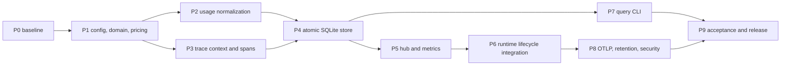

# Coding LLM Router v0.7 Cost、Trace and Metrics 可观测性执行计划

> 状态：Implemented and verified | 版本：v0.7 | 日期：2026-08-19
>
> 设计规格：[v0.7 Cost、Trace and Metrics 可观测性设计规格](./coding-llm-router-v0.7-observability-spec.md)
>
> 前置版本：[v0.6 Controlled Canary Routing 执行计划](./coding-llm-router-v0.6-controlled-canary-implementation-plan.md)

## 1. 目标与边界

本计划把 v0.7 Spec 落成一条统一的观测路径：每个模型请求产生一个 immutable terminal `RouteObservation`，随后由 `ObservationHub` 独立更新 Metrics、异步写 SQLite，并按配置构造/导出 Trace。

交付后必须同时满足：

1. 每个进入模型端点的请求都在进程内形成恰好一个 terminal observation，包括 auth、validation、routing、pre-commit、post-commit、cancelled 和 shutdown-abandoned。
2. Anthropic Messages 与 OpenAI Responses 的 JSON/SSE usage 规范化成同一分类，不从正文或 tokenizer 猜测 token。
3. 已知 usage 和配置价格时，用 Decimal 与整数纳币计算 known estimated cost；未知 usage、缺价格和失败 attempt 不能按 0 处理。
4. request ID、task ID、trace ID 能关联 actual profile、policy、primary/final model、attempt、fallback、latency、usage 和 cost coverage。
5. 本地固定 span tree 可查询；OTLP 可选启用且不成为 readiness 依赖。
6. Metrics、SQLite 和 OTLP 三个 sink 互相隔离，任一失败不改变 RoutingKernel、ExecutionEngine、Provider 请求或客户端响应。
7. `routes`、`trace`、`cost` CLI 只读、有界，不加载 Router YAML、secret 或 Provider runtime。
8. v0.1-v0.6 SQLite 数据继续可读；Replay、Outcome、Shadow、Canary 和 Health 行为不变。

本计划不实现 Dashboard、Budget Policy、Provider invoice 对账、跨币种换汇、多机汇总、跨协议转换、客户端业务任务分类、在线学习或自动调流量。

## 2. 当前基线与主要风险

### 2.1 代码基线

当前代码基线 commit 为 `fb0c935`，package/app 版本为 `0.6.0`。v0.7 Spec 是当前工作区新增设计文档，不属于代码基线。

| 位置 | v0.6 当前职责 | v0.7 处理 |
|---|---|---|
| `domain.py` | `AttemptEvent`、`ExecutionStats`、`RouteEvent` | 保留执行事实，最终删除 `RouteEvent` |
| `gateway/common.py` | success/no-target 两条遥测路径 | 改为统一 lifecycle completion |
| `gateway/anthropic.py` | 请求处理、局部 usage parser | 接入 lifecycle，删除局部 parser |
| `gateway/openai.py` | 请求处理、局部 usage parser | 接入 lifecycle，删除局部 parser |
| `execution/engine.py` | attempt、fallback、commit point | 补充失败 facts、attempt timing/span correlation |
| `execution/streaming.py` | SSE relay、terminal usage tuple | 输出统一 `UsageBreakdown` |
| `routing/coordinator.py` | actual policy resolution | 增加 bounded routing timing metadata |
| `telemetry/recorder.py` | 一个 queue 串行写 Store 后更新 Metrics | 由 `ObservationHub` 取代 |
| `telemetry/sqlite_store.py` | `route_requests`/`route_attempts` | 由 atomic Observation Store 取代 |
| `telemetry/metrics.py` | Route/Health/Outcome/Shadow/Canary Metrics | 移入 observability 并扩展 |
| `evaluation/canary_sqlite.py` | 读取 RouteEvent 成本/延迟 | 适配 v0.7 known cost/coverage |
| `app.py` | 组装 v0.6 runtime | 只组装 Observability 深模块 |
| `cli.py` | server/replay/shadow/canary 分派 | 只增加命令分派，查询实现外移 |

现有 `config.py` 452 行、`app.py` 360 行、`execution/engine.py` 391 行、`cli.py` 334 行、`telemetry/metrics.py` 308 行。新增主体必须放到 `observability/`，源码文件不得超过 500 行。

### 2.2 已确认的实现缺口

1. `estimated_cost` 字段存在，但 `record_completion()` 从未赋值。
2. Gateway 的 `_usage()` 和 SSE `extract_usage()` 只有 input/output tuple，cache/reasoning 和 coverage 不可表达。
3. `TelemetryRecorder._run()` 先写 SQLite，再更新 Metrics；写库失败会同时丢指标。
4. auth/validation/多数 routing/execution error 不写 `route_requests`。
5. ExecutionEngine 最终抛错时，Gateway 通常拿不到完整失败 attempts。
6. request ID 只有响应/SQLite 关联，没有 Trace Context 和阶段时间线。
7. CLI 没有通用 Route/Trace/Cost 查询入口。
8. `INSERT OR REPLACE` 可能覆盖同 request ID 的首个终态，不符合 immutable fact。

### 2.3 风险与处理

| 风险 | 处理原则 |
|---|---|
| lifecycle 重复 finish | 单一 mutable lifecycle + lock/closed flag；只接受首个 terminal fact |
| SSE header 提前算成功 | completion 绑定 terminal event/cancel，不在 `StreamingResponse` 构造时结束 |
| fallback 低估成本 | 已调用但无 usage 的失败 attempt 标记 billing unknown |
| 新 pricing 改变 Canary hash | 新 pricing 从 routing policy identity 排除；legacy price 保持 v0.6 语义 |
| SQLite 表约束无法写早期失败 | 使用固定 `unknown`/`none` legacy projection，不伪造 model/profile |
| Metrics 高基数 | labels 仅来自 enum/config catalog；ID/hash/message 禁止作为 label |
| OTLP 泄露内容或阻塞 | whitelist span + 独立 bounded queue + finite timeout + fail-open |
| Observation 与 Decision capture 不一致 | Route 保持独立事实；查询明确显示 decision/capture gap |
| 多 SQLite writer 竞争 | 单 Observation writer、WAL、bounded busy timeout、短事务 |
| 旧查询/Canary Report 误算成本 | 统一 known amount + coverage；legacy row 显示 unknown |
| `telemetry/` 与 `observability/` 双轨长期存在 | 仅在中间阶段共存，P6 完成后删除旧 request telemetry 路径 |

## 3. 稳定 Interface 与依赖顺序

### 3.1 Observation seam

请求路径只依赖一个小 interface：

```python
class ObservationPort(Protocol):
    """Accept one immutable terminal observation without affecting execution."""

    def record(self, event: RouteObservation) -> None:
        """Update live metrics and enqueue durable observation best-effort."""
```

生产使用 `ObservationHub` Adapter；关闭时使用 `NoopObservationHub`。Gateway 不学习 SQLite、Prometheus、OTLP、pricing line item 或 retention 细节。

持久化与导出分别使用：

```python
class ObservationStorePort(Protocol):
    """Persist immutable observation bundles atomically."""

    async def start(self) -> None: ...
    async def append(self, bundle: ObservationBundle) -> None: ...
    async def close(self) -> None: ...


class TraceExporterPort(Protocol):
    """Accept bounded spans without blocking request completion."""

    async def start(self) -> None: ...
    def record(self, spans: tuple[TraceSpan, ...]) -> None: ...
    async def close(self) -> None: ...
```

`ObservationBundle` 是 Hub 内部 immutable value，包含 terminal observation、cost estimate 和 optional spans。它不暴露给 Gateway 或 RoutingKernel。

### 3.2 Exactly-once lifecycle

`RequestObservation` 隐藏请求中的可变采集状态，向 Gateway 提供少量阶段方法：

```python
class RequestObservation:
    """Collect bounded request facts and emit the first terminal state once."""

    def routed(self, facts: RoutingObservation) -> None: ...
    def executing(self, facts: ExecutionObservation) -> None: ...
    def finish(self, status: RequestStatus, stage: TerminalStage, error_code: str | None) -> bool: ...
```

实现可有 internal methods，但 Gateway 不直接构造 `RouteObservation`。`finish()` 返回是否接受首个终态，便于测试 duplicate completion；调用方不根据返回值改变客户端响应。

### 3.3 阶段依赖图



P6 之前不得替换 v0.6 actual telemetry。P6 切换必须是一次完整 vertical slice：success、early error、pre-commit、post-commit 和 cancellation 同时覆盖，不能只迁移成功请求。

## 4. 文件变更地图

### 4.1 新增源码

```text
src/llm_router/observability/__init__.py
src/llm_router/observability/config.py
src/llm_router/observability/models.py
src/llm_router/observability/port.py
src/llm_router/observability/lifecycle.py
src/llm_router/observability/usage.py
src/llm_router/observability/pricing.py
src/llm_router/observability/tracing.py
src/llm_router/observability/metrics.py
src/llm_router/observability/hub.py
src/llm_router/observability/sqlite_store.py
src/llm_router/observability/query.py
src/llm_router/observability/renderers.py
src/llm_router/observability/cli.py
src/llm_router/observability/otlp.py
src/llm_router/observability/retention.py
```

- `config.py`：strict Pydantic config，仅配置和校验。
- `models.py`：frozen/slotted observation、usage、cost、trace values。
- `port.py`：三个稳定 interface 与 Noop Adapter。
- `lifecycle.py`：阶段采集和 first-terminal-wins。
- `usage.py`：协议 normalizer 和 SSE accumulator。
- `pricing.py`：PricingCatalog、Decimal calculator、coverage。
- `tracing.py`：W3C parse、ID、sampling、fixed span tree 和 whitelist encoder。
- `metrics.py`：迁移现有 RouterMetrics 并加入 v0.7 指标。
- `hub.py`：同步 enrich/metrics + durable/export fan-out。
- `sqlite_store.py`：schema migration 与 atomic append。
- `query.py`：read-only SQL filters/aggregation。
- `renderers.py`：table/json，不包含 SQL。
- `cli.py`：routes/trace/cost parsers 和 exit code。
- `otlp.py`：OpenTelemetry SDK Adapter，不手写 OTLP wire format。
- `retention.py`：定时、分批、短事务清理。

若 `sqlite_store.py` 或 `query.py` 接近 500 行，按 schema migration/read model 拆成 `sqlite_schema.py` 或 `readers.py`；不通过删除 docstring 或压缩语义规避限制。

### 4.2 修改源码

```text
src/llm_router/config.py
src/llm_router/domain.py
src/llm_router/app.py
src/llm_router/gateway/auth.py
src/llm_router/gateway/common.py
src/llm_router/gateway/anthropic.py
src/llm_router/gateway/openai.py
src/llm_router/gateway/renderers.py
src/llm_router/routing/coordinator.py
src/llm_router/routing/policy.py
src/llm_router/routing/candidate.py
src/llm_router/execution/engine.py
src/llm_router/execution/stream_semantics.py
src/llm_router/execution/streaming.py
src/llm_router/providers/port.py
src/llm_router/providers/anthropic.py
src/llm_router/providers/openai.py
src/llm_router/evaluation/canary_sqlite.py
src/llm_router/evaluation/canary_report.py
src/llm_router/evaluation/recorder.py
src/llm_router/evaluation/outcomes.py
src/llm_router/evaluation/shadow.py
src/llm_router/routing/canary_runtime.py
src/llm_router/cli.py
src/llm_router/__init__.py
setup.py
router.example.yaml
README.md
```

修改 evaluation 文件仅用于更新 `RouterMetrics` import 或 cost coverage 读取，不改变 Outcome、Replay、Shadow、Canary 算法。

### 4.3 最终删除

P6 切换完成后删除：

```text
src/llm_router/telemetry/port.py
src/llm_router/telemetry/recorder.py
src/llm_router/telemetry/sqlite_store.py
src/llm_router/telemetry/metrics.py
```

如果 package `telemetry/__init__.py` 没有其他用途，也一并删除。禁止保留 `from observability import *` 形式的长期兼容壳；仓库内部调用点在同一版本统一迁移。

### 4.4 新增测试

全部使用函数式 pytest，不创建测试 class：

```text
tests/test_v07_observability_config.py
tests/test_v07_pricing.py
tests/test_v07_usage.py
tests/test_v07_trace.py
tests/test_v07_observation_store.py
tests/test_v07_metrics_hub.py
tests/test_v07_lifecycle.py
tests/test_v07_gateway_integration.py
tests/test_v07_query_cli.py
tests/test_v07_otlp_retention.py
tests/test_v07_privacy.py
```

优先复用 `conftest.py` 的 Provider fixtures。需要 sink fake 时使用函数闭包、`SimpleNamespace` 或现有 fixture，不新增 autonomous test class。

## 5. P0：冻结 v0.6 基线与观测契约

### 5.1 工作项

1. 在修改源码前运行 compileall、pytest、Ruff、mypy，记录通过数量和既有诊断。
2. 保存一份 v0.6 SQLite fixture，包含 success、fallback、route error、stream、Canary assignment 和 Outcome。
3. 固定以下 canonical 行为：
   - Anthropic/OpenAI JSON unknown-field passthrough；
   - SSE first-event/terminal/commit-point；
   - Health cooldown、pre-commit fallback；
   - Session update；
   - Decision v1/v2 replay；
   - Shadow/Canary report denominators。
4. 固定当前 Metrics 名称和 label 集合，标记 v0.7 保留/废弃项。
5. 记录当前 `route_requests`、`route_attempts`、evaluation tables 的 `PRAGMA table_info`。
6. 生成隐私 canary strings fixture，用于后续扫描 prompt、secret、session、tool arguments 是否泄露。
7. 固定 Pricing/Trace/Usage 枚举和值域，不允许在后续阶段临时扩展字符串。

### 5.2 阶段验证

```bash
.venv/bin/python -m compileall -q src tests
.venv/bin/python -m pytest -q
.venv/bin/python -m ruff check src tests
.venv/bin/python -m mypy src
```

若基线存在失败，先记录并单独解决，不通过 skip、删除测试或放宽规则掩盖。P0 通过条件是 v0.6 行为和旧 DB fixture 可重复。

## 6. P1：配置、领域模型与 Pricing

### 6.1 Strict 配置

在 `observability/config.py` 实现：

```text
PricingConfig
OtlpConfig
TracingConfig
MetricsConfig
ObservabilityConfig
```

`config.py` 只导入这些类型，并在 `RouterConfig`/`ModelConfig` 增加字段。校验全部遵循 Spec：

- Decimal rate 必须是字符串、非负、位数和最大值有界；
- currency 为三位大写；
- pricing version 非空且长度有界；
- legacy/new price 不能同时配置；
- sample rate 为 0..1 且最多四位小数；
- queue、batch、timeout、retention 有上下界；
- remote listener 必须 `metrics.require_auth=true`；
- non-loopback HTTP OTLP 要求 explicit `allow_insecure=true`；
- OTLP headers 只声明 env name，不解析/打印 value。

`capture_enabled` 只控制 durable Route/Usage/Cost store；`metrics.enabled` 和 `tracing.enabled` 独立。三项全关闭时使用 Noop Hub，但仍返回 router-owned request ID。

### 6.2 Policy identity 与 Candidate compatibility

1. 新 `pricing` block 不进入 `canonical_policy_json()`、Routing Policy hash 或 Candidate target identity。
2. legacy `input_price_per_million`/`output_price_per_million` 继续维持 v0.6 hash/compatibility 行为。
3. 从 legacy 迁移到 new pricing 视为显式配置变化，需要重新形成 Candidate/Shadow/Canary 证据。
4. `observability`、OTLP 和 `propagate_trace_context` 不由 Candidate Policy 控制，Current Runtime 配置是唯一执行来源。
5. 只修改 new pricing 或 trace export 配置不能改变 actual route plan。

### 6.3 领域值与 PricingCatalog

在 `observability/models.py` 实现 frozen/slotted enum/dataclass：

```text
EndpointKind, TerminalStage, RequestStatus
UsageStatus, UsageBreakdown
CostStatus, CostLineItem, CostEstimate
TraceContext, TraceSpan
RoutingObservation, ExecutionObservation, RouteObservation
ObservationBundle
```

所有构造器执行 bounded invariant 校验：ID 格式、UTC timestamp、非负 duration/token/nanos、reason enum、attempt sequence、reasoning <= output、cached <= input。

在 `pricing.py` 实现：

- `PricingCatalog.from_config()`：按 model alias 编译 immutable pricing snapshot；
- `pricing_id()`：canonical JSON + SHA-256；
- `CostCalculator.estimate()`：纯函数、Decimal、ROUND_HALF_EVEN；
- incomplete usage/price/failed attempt 的 CostStatus；
- currency 分离，不提供汇率或跨币种 sum。

### 6.4 完成条件

- 旧 v0.6 YAML 无修改可加载，Observability 使用安全默认值。
- new/legacy pricing、Decimal edge、OTLP URL、remote metrics auth 均有函数式测试。
- 固定向量验证 amount nanos 和 pricing ID。
- 修改 new pricing 后 `compile_routing_policy()` hash/plan 不变。
- legacy pricing 行为与 v0.6 fixture 一致。
- 所有模型字段不包含 prompt/response/tool/session。

## 7. P2：Usage Normalization

### 7.1 Protocol normalizers

在 `usage.py` 实现两个纯入口：

```python
def normalize_anthropic_usage(payload: Mapping[str, object]) -> UsageBreakdown:
    """Normalize one Anthropic terminal usage payload."""


def normalize_openai_usage(payload: Mapping[str, object]) -> UsageBreakdown:
    """Normalize one OpenAI Responses terminal usage payload."""
```

函数只读取协议白名单路径，不保留 payload。拒绝 bool、负数、float、numeric string 和 cached > total 等非法关系。

Anthropic 分类：input、cache read input、cache creation/write input、output。OpenAI 分类：total input - cached、cached input、output、reasoning output；未提供 cache write 保持 null。

### 7.2 JSON 与 SSE 共用规则

1. 非流响应先解析 bounded JSON object，再调用同一 normalizer。
2. `StreamSemantics.extract_usage()` 不再返回 tuple，改为返回 optional bounded usage fragment。
3. `SSEUsageTracker` 重命名/重构为 protocol-neutral `SSEUsageAccumulator`，合并完整事件中的 fragments。
4. terminal event 结束时产出 `UsageBreakdown`；无 terminal、parser overflow、部分字段分别映射 missing/partial/invalid。
5. 4 MiB 单事件 buffer 限制保持；overflow 只影响 usage coverage，不改变透传字节。
6. reasoning token 是 output 子集，不加入第二份 output cost。
7. count-tokens endpoint 的响应数量不是 generation usage，CostStatus 固定 not-applicable。

### 7.3 完成条件

- Anthropic/OpenAI JSON 与 SSE golden fixture 输出相同 normalized usage。
- cache hit、cache write、reasoning、missing、partial、invalid、overflow 全覆盖。
- unknown JSON/SSE 字段保持透传，不进入 UsageBreakdown。
- stream terminal/failure/cancel 的原有 Health 和 client bytes 行为不变。
- normalizer 不读取 request prompt 或调用 tokenizer。

## 8. P3：Trace Context、Sampling 与 Span Builder

### 8.1 W3C Trace Context

在 `tracing.py` 实现：

1. 生成非全零 128-bit lowercase trace ID 和 64-bit span ID。
2. 严格解析 W3C version 00 `traceparent`；非法长度、字符、version、zero ID 忽略。
3. 入站 sampled flag 不控制本地 Route/Cost capture，也不能强制 span sampling。
4. 不接收、不保存、不转发 tracestate/baggage。
5. 记录 trace source=`generated|remote_parent`，不保存 raw traceparent。
6. `x-llm-router-trace-id` 只返回规范化 trace ID。

### 8.2 Deterministic sampler

采样只由本地配置决定：对 trace ID 做稳定 hash，比较 0..10000 threshold。相同 trace ID/config 重启后结果一致，rate 增大时 cohort 单调扩张。sample rate 只影响 spans；Route/Usage/Cost capture 不受影响。

### 8.3 Fixed span tree

`TraceBuilder.build(bundle)` 只从 bounded facts 构建：

```text
llm_router.request
├── llm_router.route
└── llm_router.execute
    ├── llm_router.provider.attempt
    ├── llm_router.provider.attempt
    └── llm_router.stream
```

实现 whitelist attribute encoder，最大 8 KiB。span IDs 在阶段开始时生成并随 facts 保存；TraceBuilder 不靠时间或顺序重新猜 ID。auth/validation/routing/no-attempt/stream 分支遵循 Spec。

### 8.4 Provider propagation contract

为后续 P6 预留 neutral 字段：

- `AttemptEvent` 增加 optional `span_id` 和 `upstream_invoked`；
- `ProviderRequest` 增加 optional normalized `traceparent`；
- Provider Adapter 仅在 Current Runtime `propagate_trace_context=true` 时注入；
- 不把 traceparent 放进 generic `safe_headers`，避免客户端绕过策略。

P3 只完成 pure trace contract，不修改实际 Provider 请求；真实传播在 P6 集成验收。

### 8.5 完成条件

- W3C valid/invalid 固定向量通过。
- trace/span ID 永不全零，parent tree 和 timestamp/duration 有效。
- sampling deterministic、monotonic，不受入站 flag 控制。
- whitelist encoder 拒绝 task/session/header/message 等禁止字段。
- sampled=false 仍有 response trace ID，但不生成 local/OTLP spans。

## 9. P4：Atomic SQLite Observation Store

### 9.1 Additive migration

在 `observability/sqlite_store.py` 实现 migration，先通过 `PRAGMA table_info` 检查。`route_requests` 增加 Spec 字段，并补充 RouteObservation 实际需要的 nullable audit columns：

```text
observation_schema_version
trace_id, root_span_id, trace_source, trace_captured
completed_at, endpoint_kind, terminal_stage, routing_duration_ms
routing_policy_hash, policy_role, policy_assignment_reason
usage_status, cost_status, cost_currency
known_cost_nanos, pricing_id, unknown_cost_attempts
```

`route_attempts` 增加 `upstream_invoked` 和 optional `span_id`。新建 `route_usage`、`route_cost_items`、`route_spans` 及 Spec indexes。

额外规则：

- migration 在 transaction 内执行且幂等；
- old rows 不回填虚构 trace/usage/cost；
- old `health_skipped` 在 reader 中映射 upstream_invoked=false；
- migration failure 使启动 not-ready；
- v0.6 reader 能忽略新表/列。

### 9.2 Legacy projection

现有 `route_requests` 有 NOT NULL legacy columns。Store 必须用一个集中 `legacy_projection()` 映射：

- 早期 protocol/profile=`unknown`；
- 未产生 plan 时 primary/final model=`none`；
- feature summary 使用固定 canonical unknown/zero shape；
- route reason 使用 bounded terminal reason；
- 未调用 upstream 时 attempt count=0；
- unknown cost 为 null，不能写 0。

该 projection 只满足旧 schema，不改变 v0.7 typed columns 的真实语义。Query 优先读 v0.7 columns。

### 9.3 Atomic append

一次 append transaction 固定顺序：

1. `INSERT` route request；duplicate PK 保留首条并返回 `duplicate`。
2. batch insert ordered attempts。
3. insert non-null usage kinds。
4. insert priced cost line items 和 rate snapshot。
5. 若 sampled/local enabled，insert fixed spans。
6. commit；任一步失败 rollback 全部。

禁止 `INSERT OR REPLACE`。Store 使用一个 aiosqlite writer、WAL、`synchronous=NORMAL` 和 bounded busy timeout。DB error 映射 fixed reason，不输出 SQL/exception message。

### 9.4 Read compatibility

添加 read-only schema inspector，区分：

- v0.7 complete row；
- v0.7 capture gap；
- v0.1-v0.6 `legacy_unknown`；
- unknown future schema error。

Evaluation tables 不由 Observation Store migrate 或重写。Outcome/Decision/Shadow/Canary 与 route table 仍通过 request ID 关联。

### 9.5 完成条件

- empty/v0.1/v0.3/v0.4/v0.6 DB 和重复启动 migration 全通过。
- request/attempt/usage/cost/span 原子 commit/rollback。
- duplicate request 不覆盖首个终态。
- early auth/validation error 可写且保留 unknown 语义。
- write failure 不产生部分 children。
- DB privacy scan 不含 prompt/response/session/tool/secret。

## 10. P5：ObservationHub 与完整 Metrics

### 10.1 Hub fan-out

`ObservationHub.record()` 的同步路径：

1. 校验 terminal observation 已封闭。
2. 用 PricingCatalog/CostCalculator 生成 CostEstimate。
3. 按采样决定构建 optional spans。
4. 形成 immutable ObservationBundle。
5. 独立更新 live Metrics。
6. capture enabled 时 non-blocking enqueue durable bundle。
7. OTLP enabled 时调用 exporter 的 non-blocking `record(spans)`。

SQLite queue 和 OTLP queue 不共享 worker。Metrics、cost enrichment、trace build、durable admission 分别 catch bounded failures；任何异常不向 Gateway 传播。

若出现内部 enrichment bug，Route observation 仍可入库，但 cost/trace 标记为 capture gap/null，并增加 `sink_failures{sink="enrichment"}`；禁止映射成 0 成本或 complete coverage。

### 10.2 Durable worker

- queue 默认 2048，满时 drop-newest；
- worker 只调用 Store interface；
- write/duplicate/drop 分别计数；
- shutdown bounded drain 5 秒；
- timeout 后统计剩余 drop，不无限等待；
- log message 全部固定英文。

### 10.3 Metrics 迁移

把现有 `RouterMetrics` 移到 `observability/metrics.py`，保持 Health、Outcome、Decision、Shadow、Canary methods。新增 Spec 指标：

```text
requests, request duration, routing duration
inflight requests, active streams, fallback
attempts, attempt duration
tokens, usage coverage
known estimated cost, cost coverage
observation queue/drop/sink failure
trace export, observation DB size
```

约束：

- duration 新指标统一 seconds；旧 `_ms` 保留到 v0.8；
- model/provider/profile 先向 configured catalog 注册，运行时 unknown 使用固定 `unknown`；
- currency 只接受 validated catalog 或 fixed `unknown`；
- request/task/trace ID、hash、message、path 不作 label；
- DB size 由低频 worker/retention refresh，不在每请求执行 filesystem stat。

P5 暂不切 Gateway。现有 telemetry 继续服务 v0.6 请求，新的 Hub 通过纯 fixture 验证；P6 一次性切换并删除旧路径。

### 10.4 完成条件

- SQLite failure 时 live request/latency/error Metrics 仍更新。
- OTLP queue failure 不影响 durable queue，反向亦然。
- queue full 不阻塞 `record()`，drop metric 准确。
- Hub 同步路径本地 10,000 次 fixture p95 <1 ms。
- 每个 metric label 集合有白名单测试。
- shutdown drain/timeout 可重复且无 pending task warning。

## 11. P6：Runtime、Gateway 与 Execution 全链路切换

### 11.1 Runtime bootstrap

`app.py` 只组装：validated config -> PricingCatalog -> Store -> Metrics -> TraceBuilder/Exporter -> ObservationHub。lifespan 顺序：

1. Observation Store migration/start。
2. Metrics catalog initialization。
3. Hub durable worker start。
4. OTLP exporter/retention start（失败时 inactive/fail-open）。
5. Evaluation/Canary/Shadow 继续按 v0.6 顺序启动。
6. Coordinator 完成后设置 ready。

shutdown 反序关闭 intake、active lifecycle、retention、Hub、OTLP、Store、evaluation 和 providers。Runtime 保存 `observations`/`metrics`，不再保存旧 `telemetry`。

### 11.2 Gateway lifecycle

Anthropic/OpenAI Gateway 在读取 body 和认证前：

1. 记录 `received_at`；
2. 创建 router request ID；
3. 解析/生成 TraceContext；
4. 创建 RequestObservation；
5. inflight +1。

之后每个 stage 只向 lifecycle 提交 bounded facts。所有 expected/unexpected error 都调用 finish；error renderer 返回后补：

```text
x-llm-router-request-id
x-llm-router-trace-id
```

success headers 继续保留 model/profile/policy/reason/attempt count。`gateway/common.py` 删除 `record_route_failure()` 和构造 `RouteEvent` 的旧代码；session update 从遥测函数拆成独立 completion observer，不能因观测失败而停止更新。

### 11.3 Routing timing

`RoutingResolution` 增加 immutable `RoutingTiming` 或等价字段：wall-clock start、monotonic duration、actual selected policy metadata。Coordinator 不写 observability store，只返回 actual facts。

Current/Canary policy role、hash、assignment reason 必须来自本次 resolution；route error 也保留 actual selected policy。DecisionRecorder capture gap 不阻止 RouteObservation。

### 11.4 Execution failure facts

为避免最终 `RouterError` 丢 attempts，在 core domain 增加 bounded `ExecutionFailureSnapshot`，由 ExecutionEngine 在抛出最终 error 前附加：

```text
started/completed timing
attempts
upstream attempt count
health skipped count
committed=false
terminal error code
```

保持对外异常仍是 `RouterError`，协议 renderer 和现有调用方无需学习新异常层。Snapshot 不包含 exception message/body/header。Cancellation/pre-commit exhaustion/no-available-target 都必须附加；route-stage RouterError 不附加 execution snapshot。

每个 attempt 在开始时取得 span ID，并设置 `upstream_invoked`：health skip=false；进入 ProviderPort 前=true。ProviderRequest 携带 normalized traceparent；Adapter 仅按 Current Runtime config 决定是否注入。

### 11.5 Streaming completion

1. `ExecutionStats` 改为携带 `UsageBreakdown`，删除分散 input/output optional fields。
2. 非流响应在 bounded payload normalizer 后完成 lifecycle。
3. SSE lifecycle 绑定 completion Future，在 terminal、post-commit error、cancel/generator close 后结束。
4. `active_streams` 从创建 relay 到 finally 精确 +1/-1。
5. 客户端断开保持 Health neutral 的既有 contract，并记录 request status=cancelled。
6. completion task 的任何观测异常只记录 fixed English message，不影响已提交流。

### 11.6 切换与清理

完成所有分支后：

- 更新 Health/Evaluation/Canary/Shadow import 到新 RouterMetrics；
- 删除 `RouteEvent` 和旧 request telemetry modules；
- 删除 Gateway 私有 `_usage()`；
- 保留同名 SQLite tables 和旧 metrics 兼容输出；
- 不保留双写开关，避免同 request 两条 terminal records。

### 11.7 完成条件

- auth、validation、route plan/error、pre-commit fallback/exhaustion、non-stream、stream success/error/cancel 都恰好 finish 一次。
- duplicate completion 保留首个终态并有内部 counter。
- fallback attempts、final model、route reason、policy role/hash 与 actual execution 一致。
- error/success response 都有 request ID 和 trace ID。
- Provider trace propagation 默认关闭，开启后只发送 generated normalized traceparent。
- Observation 全关闭时 v0.6 response bytes、headers（除新增 trace ID）、plan、fallback 和 Provider count 不变。
- 旧 telemetry request path 已删除，无双写。

## 12. P7：Read-only Routes、Trace 与 Cost CLI

### 12.1 Query 模块

`ObservationQuery` 通过 SQLite URI `mode=ro` 打开，启动时只检查 schema，不执行 PRAGMA write/migration。SQL 层实现组合 filter：request/task/trace/time/status/model/provider/profile/role。

规则：

- `--limit` 默认 1000，上限 10000；
- detail rows 使用 SQL limit；aggregation 在 SQL 中完成；
- UTC RFC3339，时间窗口左闭右开；
- v0.6 rows 显示 `legacy_unknown`；
- role/hash 优先使用 atomic route columns，缺失时可只读关联 Decision table并显示 capture source；
- 不根据当前 YAML 猜历史价格、policy 或 model；
- 多 currency 永远分组，不提供 combined total。

### 12.2 `routes`

支持 Spec 参数，table 显示 time、request/task、protocol/profile/role、primary/final、reason、attempts、status/stage、latency、tokens、known cost、coverage、trace ID。`--request` 展开 ordered attempts。

### 12.3 `trace`

按 request/trace/task 查询。tree 使用 persisted parent IDs 和 start time，不靠 name 顺序猜 parent。未采样、capture drop、legacy row 分别显示明确 gap；禁止伪造 span。

### 12.4 `cost`

支持 day/provider/model/profile/task/request group。每组同时输出：request count、usage/cost status denominators、token kinds、known amount by currency、fallback request、unknown invoked attempts。

Canary Report 同步改用 `known_cost_nanos` 和 cost coverage；legacy `estimated_cost` 只能标记 legacy estimate，不能混入 v0.7 complete amount。

### 12.5 CLI 组装

将 parser/SQL/renderer 放在 observability package，根 `cli.py` 只 dispatch：

```text
routes | trace | cost | replay | shadow-report | canary-report | server
```

exit code：0 success、2 argument、3 DB/schema/fatal。stdout 只输出 table/json，stderr 只输出 bounded error。JSON 顶层包含 schema version、filters、coverage 和 rows/groups。

### 12.6 完成条件

- 组合 filters、limit、UTC 边界和 stable order 通过。
- CLI 执行前后 DB hash/row count 不变。
- 无 Router YAML/API key/Provider env 时仍可运行。
- Cost known amount 与 raw line item SQL 独立复算一致。
- Trace tree parent/order/duration 正确；gap 不冒充 empty trace。
- table/json 不含禁止字段或因果/账单声明。

## 13. P8：OTLP、Retention 与安全收口

### 13.1 OpenTelemetry Adapter

在 `setup.py` 增加经验证的 OpenTelemetry SDK 与 OTLP HTTP exporter 依赖，保持同 major 上界。`otlp.py` 使用 SDK `ReadableSpan`/exporter interface 映射 neutral `TraceSpan`，不手写 protobuf 或 HTTP serialization。

Adapter：

- 有独立 bounded queue、batch size 和 timeout；
- preserve trace/span/parent IDs 和 timestamps；
- Resource 只包含 fixed service name/version/instance-safe metadata；
- headers 从 env 解析但不记录；
- export failure 映射 fixed reason；
- disabled 使用 Noop Adapter；
- runtime collector failure不使 Router unready。

使用 fake exporter callback 验证 payload，不要求测试联网或启动 Collector。

### 13.2 Retention

`RetentionWorker` 每日按 UTC cutoff 运行：

1. select 最多 1000 个 expired request IDs；
2. 同一短 transaction 删除 spans/cost/usage/attempts/requests；
3. commit 后更新 deleted count/DB size；
4. 若还有数据，下个 bounded tick 继续，不长时间持锁；
5. Outcome/Decision/Shadow/Canary 不删除；
6. report/query 将悬空关联显示为 retention/capture gap。

`retention_days=null` 不启动 worker。Store lock/error 只影响本批并 fail-open。

### 13.3 Metrics endpoint 与日志

- loopback + `require_auth=false` 保持本地易用；
- remote listener 配置强制 auth，endpoint 复用 client bearer；
- auth failure 按固定错误返回，不记录 token；
- 所有新增 log message 使用英文；
- 不使用 `logger.exception` 输出未经审查的第三方异常正文；
- allowed fields 仅 request ID、bounded stage/reason/sink/status、policy role/hash。

### 13.4 完成条件

- OTLP disabled/active/unavailable 三种状态均可启动实际 Router。
- exporter payload span tree/attributes 与 local SQLite 一致。
- exporter headers、prompt/session/task/tool/secret 不在 payload/log。
- retention batch size/transaction/delete scope/gap semantics 正确。
- remote `/metrics` 未授权被拒绝，loopback 默认行为兼容。
- exporter/retention shutdown 无泄漏 task。

## 14. P9：集成、隐私、性能与发布验收

### 14.1 固定演练

1. v0.6 YAML 无 observability block 启动，验证默认 local capture/trace 和双协议回归。
2. Anthropic/OpenAI 各执行 JSON 与 SSE success，验证 usage/cost/span 一致。
3. 执行 primary 503 -> fallback success，验证 unknown failed attempt 与 partial cost。
4. 执行 health skip、no capable model、no available target，验证 upstream_invoked 和 not-applicable/unknown。
5. 构造 auth、oversize、invalid JSON、unknown profile，验证早期终态和 headers。
6. 构造 incomplete stream、post-commit error、client cancel，验证 terminal timing/status。
7. 运行 Control/Canary 各一组实际请求，验证 policy role/hash 和 Canary Report coverage。
8. 注入 Observation queue full、SQLite locked/failure、OTLP failure，验证 actual response 不变。
9. 从 v0.6 DB 升级、重复启动、再用 v0.6 reader 打开，验证双向兼容边界。
10. 启用短 retention fixture，验证只删除 observation tables 并显示 evaluation gap。
11. 无 YAML/secrets/network 运行 routes/trace/cost CLI，验证只读。

### 14.2 隐私扫描

对 SQLite、JSON CLI、Prometheus、OTLP capture 和 logs 搜索固定 canary strings：

```text
prompt-canary
response-canary
session-canary
tool-argument-canary
provider-secret-canary
client-token-canary
otlp-header-canary
```

任何命中均阻断发布。允许的 request/task/trace ID 使用独立 fixture，不与 secret canary 混用。

### 14.3 性能与容量

- `ObservationHub.record()` 10,000 次 fixture p95 <1 ms；
- Trace spans/request <= `4 + attempt_limit`；
- attribute JSON <= 8 KiB；
- queue/limit/batch 上界生效；
- 100,000 route rows 下 routes last-30、request trace 和 daily cost query 有索引计划；
- Metrics series 数量随 configured model/provider/profile 有界，不随 requests 增长。

性能测试只验证明确预算，不引入脆弱的绝对 wall-clock gate；CI 可用宽松上限，本机记录真实 p50/p95。

### 14.4 全量质量命令

```bash
.venv/bin/python -m compileall -q src tests
.venv/bin/python -m pytest -q
.venv/bin/python -m ruff check src tests
.venv/bin/python -m mypy src
```

核心在线回归至少包含：

```bash
.venv/bin/python -m pytest -q \
  tests/test_v02_regression.py \
  tests/test_health_gateway.py \
  tests/test_health_execution.py \
  tests/test_health_telemetry.py \
  tests/test_v04_evaluation.py \
  tests/test_v05_shadow.py \
  tests/test_v06_canary_integration.py \
  tests/test_v06_canary_report.py
```

### 14.5 发布文件

- `src/llm_router/__init__.py`、`setup.py`、FastAPI 和 metrics media version 更新为 `0.7.0`。
- `router.example.yaml` 增加 pricing/observability/OTLP disabled 示例。
- README 增加 routes/trace/cost、cost coverage、OTLP 和 retention 操作说明。
- README 明确 estimated cost 不是 Provider invoice。
- v0.7 Spec 状态改为 `Accepted`；全部验收后本计划改为 `Implemented and verified`。

## 15. 建议提交顺序

每个提交点必须保持 compile/test 可运行：

```text
P0 freeze v0.6 observability baseline
P1 add observability config, domain, and pricing calculator
P2 normalize Anthropic and OpenAI JSON/SSE usage
P3 add W3C trace context, sampling, and span builder
P4 add atomic SQLite observation schema and store
P5 add ObservationHub and isolated complete metrics
P6 switch gateway/execution lifecycle and remove legacy telemetry
P7 add read-only routes, trace, and cost CLI
P8 add OTLP exporter, retention, and metrics endpoint security
P9 complete regression, privacy, performance, docs, and v0.7 release
```

P6 是唯一较大的切换提交，但不能拆成按协议或按成功/失败的长期双轨提交。可在同一分支用小增量开发，最终提交前必须删除 legacy request telemetry 并通过全部分支测试。

## 16. 运行时回滚与数据恢复

关闭 durable capture 和 Trace：

```yaml
observability:
  capture_enabled: false
  tracing:
    enabled: false
  metrics:
    enabled: true
```

重启后路由主链继续运行，Metrics 仍可用。OTLP 单独通过 `otlp.enabled=false` 回滚。Additive columns/tables 和历史数据保留，不删除 SQLite。

二进制回滚到 v0.6 时，v0.6 忽略新表/列并继续写 legacy route rows；重新升级 v0.7 后这些中间 rows 显示 `legacy_unknown`，禁止事后重算虚构 usage/cost/trace。

若 migration 在 commit 前失败，SQLite transaction rollback，Router not-ready；不得自动删除 DB 或重建文件。操作方保留原文件，修复配置/磁盘问题后重新启动幂等 migration。

## 17. 完成定义

v0.7 只有同时满足以下条件才能标记完成：

- P0-P9 全部完成，全量质量命令和 v0.1-v0.6 回归全绿。
- 每个模型请求在进程内恰好一个 terminal observation，durable gap 有明确 metric。
- auth/validation/routing/execution/stream/cancel 全部可由 request ID 查询或明确显示 capture gap。
- JSON/SSE usage normalization、cache/reasoning 关系和 coverage 有 golden fixture。
- Decimal pricing、amount nanos、历史 rate snapshot、partial/unpriced/missing 和多币种规则通过。
- fallback 的失败 Provider attempt 不被 final usage 掩盖，known cost 不冒充 total/billed cost。
- Trace ID/header、W3C parent、fixed span tree、deterministic sampling、本地 store 和 OTLP 通过。
- Metrics 与 SQLite/OTLP 独立；任一 sink failure 不改变 actual response。
- SQLite migration 幂等，terminal bundle 原子，duplicate 不覆盖，v0.6 数据可读。
- routes/trace/cost CLI read-only、有界、UTC、coverage 明确且无需配置/secret/network。
- retention 只删除 observation tables，并对 Evaluation 关联显示 gap。
- DB、Metrics、CLI、OTLP 和日志不含 prompt/response/reasoning、session、源码/patch、tool 内容、secret、headers 或异常自由文本。
- 所有新增函数有简短 function-level docstring；所有 log message 使用英文；源码文件不超过 500 行；测试不使用 class。
