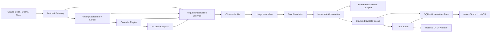

# Coding LLM Router v0.7 Cost、Trace and Metrics 可观测性设计规格

> 状态：Accepted | 版本：v0.7 | 日期：2026-08-19
>
> 前置版本：[v0.6 Controlled Canary Routing 设计规格](./coding-llm-router-v0.6-controlled-canary-spec.md)
>
> 本版本目标：把现有基础遥测补齐为可核算、可追踪、可查询、可监控且不影响实际路由的本地优先可观测性模块

## 1. 摘要

v0.6 已保存 RouteEvent、Provider Attempt、token、延迟和路由元数据，也暴露了 Prometheus Metrics。但是当前能力还没有构成完整的操作面：

- `RouteEvent.estimated_cost` 和 SQLite 列已存在，完成路径却没有计算成本；
- token 只有 input/output，不能正确处理 cache token，也没有 usage 完整性状态；
- request ID 可以关联记录，但没有标准 Trace Context、span 层级或 OTLP 导出；
- Metrics 在 SQLite 写成功后才更新，存储故障会同时造成指标缺口；
- 缺少通用 routes、trace、cost 查询命令，日常排查依赖手写 SQL；
- 部分 Gateway 早期失败不会形成完整终态记录。

v0.7 引入统一 `ObservationHub`。Gateway、RoutingCoordinator 和 ExecutionEngine 只产出有界事实；Hub 负责 usage 规范化、成本估算、Trace 构建、Metrics 更新和异步持久化。

```text
one model request
  -> one router-owned request ID + trace ID
  -> one terminal RouteObservation
  -> zero or more Provider Attempt observations
  -> one normalized Usage + CostEstimate
  -> one bounded Trace tree
  -> independent Metrics / SQLite / optional OTLP sinks
```

“完整实现”在 v0.7 中表示：

1. 每个模型请求恰好形成一个可关联终态，包括校验、路由和执行阶段的失败。
2. 已知 usage 和配置价格时，使用精确规则计算可审计的成本估算，并标记覆盖缺口。
3. 可以用 request/task/trace 查询模型、策略、fallback、耗时、token 和成本。
4. 可以查看请求、路由、执行和每次 Provider Attempt 的 Trace 树，并可选导出 OTLP。
5. Prometheus 覆盖流量、延迟、错误、fallback、token、成本、健康及观测模块自身状态。
6. 任意观测 sink 故障都不改变 RoutingKernel、ExecutionPlan、Provider 调用或客户端响应。

v0.7 不建设 Web Dashboard、账单系统或自动预算控制。这些能力不属于 Router 数据面的必要职责。

## 2. 问题、目标与非目标

### 2.1 目标

1. 建立协议无关、客户端无关的终态 `RouteObservation`。
2. 支持 Anthropic Messages 和 OpenAI Responses 的 JSON/SSE usage 规范化。
3. 支持 input、output、cache read、cache write 四类可计费 token；reasoning token 作为 output 子集记录，默认不重复计费。
4. 使用版本化 Pricing Catalog 和整数纳币计算成本，历史记录不受后续价格修改影响。
5. 生成 W3C Trace Context 兼容的 trace ID/span ID 和固定 span 层级。
6. 默认在本地 SQLite 保存有界 trace，可选通过 OpenTelemetry OTLP HTTP 导出。
7. 使 Metrics、SQLite 和 OTLP sink 相互隔离。
8. 提供 `routes`、`trace`、`cost` 三组只读 CLI。
9. 采用 additive migration，保持 v0.1-v0.6 数据可读。
10. 保持 prompt、response、源码、tool 参数和 credential 永不进入观测数据。

### 2.2 非目标

- 不解析 Claude Code、Cursor、Continue 或 Aider 的业务任务类型。
- 不保存 prompt、response、reasoning、源码、patch、命令或 tool 内容。
- 不从 Provider 官网自动抓取价格，不承诺与 Provider 最终账单完全相等。
- 不执行汇率转换，不跨币种相加。
- 不根据成本自动拒绝请求、降级模型或改变 Routing Policy。
- 不根据 Trace、Metrics 或 Outcome 在线学习或自动调整 Canary。
- 不做跨协议转换或新增入站协议。
- 不建设 Dashboard、多租户配额、发票或财务对账系统。
- 不让 OTLP Collector 成为 Router 就绪依赖。

## 3. 核心原则与架构不变量

### 3.1 Observation 不影响路由

```text
Routing inputs -> RoutingKernel -> ExecutionPlan -> ExecutionEngine
                                           |
                                           +-> bounded facts -> ObservationHub
```

`ObservationHub` 不返回模型选择，不修改 Session、Health、Policy、Canary assignment 或 fallback chain。删除 Observability 实现后，实际 Provider 请求及客户端响应必须保持不变。

### 3.2 每个请求恰好一个终态

所有模型端点在认证前创建 router-owned request ID 和 trace context，由一个生命周期对象负责终结：

- `success`：非流响应完成，或 SSE 收到协议终止事件；
- `error`：validation、routing、pre-commit、post-commit 任一阶段失败；
- `cancelled`：客户端取消或断开；
- `abandoned`：进程关闭期限内仍无法完成。

生命周期对象使用原子状态保证 `finish()` 至多成功一次。重复 finish 只增加内部指标，不覆盖首个终态。

“恰好一个终态”约束的是进程内生成的 immutable observation；durable sink 仍是 best-effort。queue 满或 SQLite 故障时必须通过 drop/capture-gap metric 暴露缺口，CLI 不得把未持久化请求伪装成可查询记录。

### 3.3 事实、估算和未知严格分开

| 数据 | 来源 | 语义 |
|---|---|---|
| token usage | Provider JSON/SSE | Provider 报告事实 |
| price | 本地版本化配置 | 用户声明的估算费率 |
| known estimated cost | usage × configured price | Router 可计算部分 |
| unknown cost | usage/price/attempt 信息不足 | 不能按 0 处理 |
| Provider invoice | Provider 账单 | v0.7 不采集 |

CLI、Metrics 和报告必须使用 `estimated` 或 `known` 命名，禁止显示 `actual_cost`、`billed_cost` 或“精确账单”。

### 3.4 Trace 默认不携带内容

Trace 只表示控制流和时间。Span name 和 attribute 使用白名单，未知 header、异常 message、URL query 和 Provider 响应字段不能自动进入 Trace。

### 3.5 Sink 独立且 fail-open

- Metrics 更新失败不能阻止 SQLite/OTLP；
- SQLite 写失败不能造成 Metrics 缺失；
- OTLP 不可用不能改变 `/ready` 或实际请求；
- queue 满时 drop-newest，不阻塞请求；
- 每个 sink 只记录 bounded reason，不把异常自由文本作为 label。

### 3.6 有界基数

Prometheus label 只能来自固定枚举或启动配置中的有限集合。request/task/trace ID、policy hash、bucket、HTTP path 原文和异常 message 禁止作为 label。

## 4. 架构与深层模块



### 4.1 模块职责

| 模块 | 责任 | 明确不负责 |
|---|---|---|
| `RequestObservation` | 收集阶段时间和有界事实，保证单终态 | 持久化、价格、路由 |
| `UsageNormalizer` | 把协议 usage 转成统一 token 分类 | 猜测 usage、价格计算 |
| `PricingCatalog` | 编译并标识版本化费率 | 网络拉价、汇率转换 |
| `CostCalculator` | 纯函数计算 line item、known amount 和覆盖状态 | Provider 账单、预算拦截 |
| `TraceBuilder` | 从 immutable observation 构造固定 span 树 | 读取内容、修改执行流程 |
| `ObservationHub` | 校验、丰富、更新 Metrics、异步 fan-out | Routing Policy、Provider 执行 |
| `ObservationStorePort` | 原子保存 request/attempt/usage/cost/trace | 报告聚合 |
| `TraceExporterPort` | 异步导出白名单 spans | 改变请求状态 |
| `ObservationQuery` | 只读过滤和数据库聚合 | 加载 secret、写数据库 |

`ObservationHub` 是主要深模块。生产调用者只学习一个 interface：

```python
class ObservationPort(Protocol):
    """Accept one immutable terminal observation without affecting execution."""

    def record(self, event: RouteObservation) -> None:
        """Update live metrics and enqueue durable observation best-effort."""
```

usage、cost、span、transaction 和 exporter failure 隐藏在 interface 后。测试可以使用 in-memory Adapter，不要求 Gateway 了解 SQLite 或 OpenTelemetry。

### 4.2 文件拆分

新增 `src/llm_router/observability/`：

```text
models.py          # observation、usage、cost、trace 领域值
lifecycle.py       # exactly-once 请求生命周期
hub.py             # fan-out、queue、sink 隔离
usage.py           # normalization helpers
pricing.py         # PricingCatalog 与 Decimal 计算
tracing.py         # Trace Context 与 span tree
metrics.py         # Prometheus definitions
sqlite_store.py    # schema 与 atomic append
query.py           # read-only filters/aggregations
renderers.py       # table/json rendering
```

现有 `telemetry/` 由新模块替换，不长期保留只转发调用的 shallow module。`app.py` 和 `cli.py` 只做组装/分派；任何文件接近 500 行前继续按职责拆分。

## 5. 核心领域契约

### 5.1 RouteObservation

`RouteObservation` 至少包含：schema version、request/task/trace ID、received/completed time、endpoint kind、protocol、profile、stream、terminal stage/status、routing、execution、usage 和 bounded error code。

```python
@dataclass(frozen=True, slots=True)
class RouteObservation:
    """Describe one terminal model request using sanitized bounded facts."""

    schema_version: int
    request_id: UUID
    task_id: UUID | None
    trace_context: TraceContext
    received_at: datetime
    completed_at: datetime
    endpoint_kind: EndpointKind
    protocol: Protocol | None
    profile: str | None
    stream: bool
    terminal_stage: TerminalStage
    status: RequestStatus
    routing: RoutingObservation | None
    execution: ExecutionObservation | None
    usage: UsageBreakdown
    error_code: str | None
```

`endpoint_kind` 固定为 `messages|count_tokens|responses`。`terminal_stage` 固定为：

```text
authentication | validation | routing |
execution_pre_commit | execution_post_commit | completed
```

`RoutingObservation` 保存 actual profile、plan/error、policy version/hash、Control/Canary role、route reason、health snapshot 和 routing duration。`ExecutionObservation` 保存 final target、commit 状态、总耗时、首事件耗时和 ordered attempts。

`RoutingObservation` 的字段至少包括：

- requested profile 和 effective profile；
- routing started_at 和 duration；
- primary model 和 ordered target aliases；
- actual policy version/hash；
- route reason 和 bounded auxiliary reasons；
- Control/Canary role 与 assignment reason；
- health snapshot revision、filtered count 和 health reason；
- result=`plan|error`。

它不保存 session ID、affinity value、HMAC digest 或 prompt-derived content。

`ExecutionObservation` 的字段至少包括：

- execution started_at、duration、time to first event；
- final target alias 和 Provider；
- attempt count、health skipped count；
- committed 状态和 terminal status；
- 有序 `AttemptObservation`。

Attempt 至少包含 sequence、provider、target alias、started_at、duration、status、HTTP status、bounded error code 和 `upstream_invoked`。`health_skipped` 必须为 `false`。

### 5.2 UsageBreakdown

统一 token 分类：

```text
input_uncached_tokens
input_cache_read_tokens
input_cache_write_tokens
output_tokens
reasoning_output_tokens
```

`reasoning_output_tokens` 是 output 子集，默认不重复计费。UsageStatus 为 `complete|partial|missing|invalid|not_applicable`。所有 token 必须是非负整数，Python `bool` 不作为整数接受。

```python
@dataclass(frozen=True, slots=True)
class UsageBreakdown:
    """Keep normalized provider-reported usage and its completeness."""

    status: UsageStatus
    input_uncached_tokens: int | None
    input_cache_read_tokens: int | None
    input_cache_write_tokens: int | None
    output_tokens: int | None
    reasoning_output_tokens: int | None
```

UsageStatus 的判定规则：

- `complete`：协议终态 usage 已解析且内部关系有效；
- `partial`：只得到部分 token 分类；
- `missing`：调用过上游但没有可用 usage；
- `invalid`：Provider 报告负数、类型错误或分类关系矛盾；
- `not_applicable`：未调用上游或 endpoint 明确不计费。

### 5.3 Anthropic Usage

Anthropic Messages JSON 和 SSE extractor 统一映射：

- `input_tokens` -> uncached input；
- `cache_read_input_tokens` -> cache read input；
- `cache_creation_input_tokens` -> cache write input；
- terminal `output_tokens` -> output；
- 未识别 usage 字段忽略，不保存原始 JSON。

SSE tracker 按完整事件合并已知字段。单事件超过既有 4 MiB 上限时清空 parser buffer，把 usage 标记为 `partial`，但不改变透传字节。

### 5.4 OpenAI Usage

OpenAI Responses JSON 和 SSE extractor 统一映射：

- `usage.input_tokens - input_tokens_details.cached_tokens` -> uncached input；
- `input_tokens_details.cached_tokens` -> cache read input；
- `usage.output_tokens` -> output；
- `output_tokens_details.reasoning_tokens` -> reasoning output 子集；
- cache write 没有协议字段，保持 `None`。

若 cached token 大于 total input，Usage 为 `invalid`，成本不可计算。Router 不根据请求文本或 tokenizer 自行估算 Provider usage。

### 5.5 JSON/SSE 一致性

同一协议的非流和流式响应必须通过相同 normalize 函数。Gateway 不再各自返回 `(input_tokens, output_tokens)` tuple，StreamSemantics 也不自行定义另一套领域结构。

## 6. Cost Accounting

### 6.1 Pricing Catalog

每个 model alias 可声明：version、三位大写 currency、input/output/cache read/cache write 的 per-million Decimal 字符串费率。配置生成 canonical `pricing_id`，完成时把 rate snapshot 与 line items 一并持久化，价格修改不能重算历史记录。

```yaml
models:
  anthropic_deep:
    provider: anthropic
    upstream_model: configured-deep-model
    tier: deep
    capabilities: [streaming, tools, thinking, vision, prompt_cache]
    max_input_tokens: 200000
    pricing:
      version: "anthropic-contract-2026-08-01"
      currency: USD
      input_per_million: "3.00"
      output_per_million: "15.00"
      cache_read_input_per_million: "0.30"
      cache_write_input_per_million: "3.75"
```

Pricing 校验规则：

1. 费率使用字符串 Decimal，禁止 YAML float 进入成本计算。
2. `currency` 是三位大写 ISO 4217 code；v0.7 不验证币种真实性，也不换汇。
3. pricing block 必须有非空 `version`。
4. `pricing_id=sha256(alias+version+currency+canonical rates)`。
5. input/output rate 可以分别缺失；缺失不是 0，而是该类别不可定价。
6. cache rate 缺失时不能套用普通 input rate；存在 cache token 时结果为 `partial`。

原有 `input_price_per_million`、`output_price_per_million` 作为 deprecated alias 读取；新旧格式不能同时出现。Pricing 属于 Observability，不参与 RoutingKernel 决策。v0.7 暂不改变 legacy Routing Policy identity，避免同时改变 v0.6 Canary hash 语义。

新 `pricing` block 由 `PricingCatalog` 单独编译，`canonical_policy_json()` 和 Candidate Catalog compatibility 必须忽略它；仅修改新 pricing 不改变 Routing Policy hash。deprecated legacy price 字段仍沿用 v0.6 的 policy identity 行为，迁移到新 block 视为一次显式配置变更，需要重新执行 Shadow/Canary gate。

### 6.2 精确计算

SQLite 使用 `amount_nanos`，表示十亿分之一货币单位：

```text
amount_nanos = ROUND_HALF_EVEN(tokens * price_per_million * 1000)
```

计算使用 `Decimal` 和整数，不使用 binary float。Prometheus 可以转成 double；SQLite/CLI 是审计来源。

例如 1,000 input tokens、`3.00 USD / 1M`：

```text
1000 * 3.00 * 1000 = 3,000,000 nanos = 0.003 USD
```

### 6.3 覆盖状态

CostStatus 为：

- `complete`：所有已报告 token 有价格，且没有 billing 未知的已调用失败 attempt；
- `partial`：存在已知金额，但有缺 price token 或未知失败 attempt；
- `unpriced`：有 usage，但 target 无可用 pricing；
- `usage_missing`：调用过上游，但没有足够 usage；
- `not_applicable`：没有可估算的 token 计费事实，例如路由前失败或 count-tokens 操作。

`health_skipped` 不产生 unknown attempt。已调用但无 usage 的失败 attempt 一律视为 billing unknown。最终响应 usage 只能归给 final target。多个 currency 分组展示，禁止混合求和。

```python
@dataclass(frozen=True, slots=True)
class CostEstimate:
    """Represent the priced subset without claiming Provider billing truth."""

    status: CostStatus
    currency: str | None
    pricing_id: str | None
    known_amount_nanos: int | None
    line_items: tuple[CostLineItem, ...]
    unknown_usage_kinds: tuple[str, ...]
    unknown_invoked_attempts: int
```

当 status=`partial` 时，`known_amount_nanos` 只表示可证明的已知部分。CLI 显示 `known` 和 coverage，不把它渲染成完整总额。

### 6.4 Fallback 与失败计费

- `health_skipped` 没有发出上游请求，确定不产生 billing unknown；
- Provider Adapter 已调用但没有 usage 的失败 attempt 记为 billing unknown；
- final target 的 usage 不能分摊给前面的失败 attempt；
- v0.7 不读取错误响应正文推断失败 attempt usage；
- 只要存在 billing unknown attempt，请求成本最多是 `partial`，即使 final response usage 完整。

## 7. Distributed Trace

每个请求生成 128-bit trace ID、64-bit root span ID 和 Router-owned UUID request ID。合法 W3C `traceparent` 可以作为父上下文；非法值忽略。`tracestate` 和 `baggage` 不接收、不保存、不转发。

入站 trace flags 不控制 Route/Cost capture，也不能强制采样。span capture 只由本地配置对 trace ID 做确定性采样，防止客户端关闭审计或制造额外导出负载。

Trace ID 必须是 32 位非全零 lowercase hex，span ID 必须是 16 位非全零 lowercase hex。Router 保存 trace source=`generated|remote_parent`，但不保存完整入站 `traceparent`。

响应始终包含：

```text
x-llm-router-request-id: <uuid>
x-llm-router-trace-id: <32 lowercase hex>
```

固定 Span 树：

```text
llm_router.request
├── llm_router.route
└── llm_router.execute
    ├── llm_router.provider.attempt
    ├── llm_router.provider.attempt
    └── llm_router.stream
```

auth/validation 失败只有 root；routing error 增加 route；stream spans 在 terminal/cancel 后结束。Span name 固定，provider/model 只作为白名单 attribute。

具体生命周期规则：

- auth/validation 失败只有 root span；
- routing error 有 root + route span；
- 非流执行有 root + route + execute + attempts；
- 流请求的 root/execute/stream 在 committed stream 真正终止后结束；
- health skip 可以生成 attempt span，但 `llm_router.upstream_invoked=false`；
- Trace 时间从 observation 中的 wall-clock timestamp 和 duration 重建；
- 业务模块不直接依赖 OpenTelemetry SDK。

### 7.1 Attribute 白名单

允许的核心属性：

```text
llm_router.request_id
llm_router.endpoint_kind
llm_router.protocol
llm_router.profile
llm_router.policy_version
llm_router.policy_role
llm_router.route_reason
llm_router.terminal_stage
llm_router.error_code
llm_router.fallback_used
llm_router.upstream_invoked
llm_router.usage_status
llm_router.cost_status
gen_ai.operation.name
gen_ai.provider.name
gen_ai.request.model
gen_ai.response.model
gen_ai.usage.input_tokens
gen_ai.usage.output_tokens
http.response.status_code
```

禁止属性：task/session 原值、prompt、response、tool 参数、reasoning、secret、完整 URL、request/response headers、异常 message、affinity/digest/salt。

request ID 允许作为 span attribute 支持单条关联，但禁止作为 Prometheus label。task ID 只保存在 SQLite route record，不导出 OTLP。

### 7.2 Local Trace 与 OTLP

本地 Trace 默认保存 SQLite。OTLP 默认关闭，启用时使用 OpenTelemetry SDK 和 OTLP HTTP exporter，不手写协议。Exporter 使用独立 bounded queue 和有限 timeout。

Collector 不可用时只增加 `trace_export_total{status="failed"}`，并记录固定英文 message：

```text
"OTLP trace export failed"
```

日志不能输出 exporter headers、响应 body 或异常自由文本。

Trace Context 默认不传播给外部 Provider。只有 Provider 显式配置 `propagate_trace_context: true` 时才注入 `traceparent`，永不传播 baggage。task/session、prompt/response、headers、完整 URL 和异常 message 禁止进入 Trace。

## 8. Metrics

v0.7 覆盖以下维度：

- request count、duration、inflight、active streams；
- routing duration/result、fallback count；
- Provider attempt count/duration/status；
- normalized token totals 和 usage coverage；
- known estimated cost 和 cost coverage；
- observation queue depth/drop、sink failure、trace export 和 DB size；
- 保留现有 Health、Outcome、Shadow、Canary 指标。

新 duration 指标统一使用 seconds。现有 `_ms` 指标保留一个版本并标记 deprecated。Metrics 在 `ObservationHub.record()` 的独立分支更新，不能依赖 SQLite append 成功。

### 8.1 请求与路由

```text
llm_router_requests_total{protocol,profile,status,stage}
llm_router_request_duration_seconds{protocol,profile,status}
llm_router_routing_duration_seconds{protocol,profile,result}
llm_router_inflight_requests{protocol}
llm_router_active_streams{protocol}
llm_router_fallback_total{protocol,profile}
```

早期失败时未知 protocol/profile 使用固定值 `unknown`，不使用客户端原值。

### 8.2 Provider 与 Usage

```text
llm_router_attempts_total{protocol,provider,model,status}
llm_router_attempt_duration_seconds{protocol,provider,model,status}
llm_router_tokens_total{protocol,provider,model,kind}
llm_router_usage_observations_total{protocol,status}
```

`kind` 只能是 `input_uncached|input_cache_read|input_cache_write|output|reasoning_output`。reasoning 是诊断子集，不能与 output 相加计算总 token。

### 8.3 Cost 与自观测

```text
llm_router_known_estimated_cost_total{currency,provider,model}
llm_router_cost_observations_total{currency,status}
llm_router_observation_queue_depth
llm_router_observation_dropped_total{reason}
llm_router_observation_sink_failures_total{sink,reason}
llm_router_trace_export_total{exporter,status}
llm_router_observation_store_size_bytes
```

Metrics 中成本使用 currency units 的 double；精确金额以 SQLite `amount_nanos` 为准。`currency` 缺失时使用固定 `unknown`，不能省略 coverage counter。

### 8.4 兼容性

现有 Health、Outcome、Shadow、Canary Metrics 保持名称和语义。现有 `llm_router_total_latency_ms` 与 `llm_router_first_event_latency_ms` 在 v0.7 保留并标记 deprecated，同时提供 seconds 版本；v0.8 才允许删除。

模型、Provider、profile label 只能来自启动配置；request/task/trace ID 禁止作为 label。remote listener 下 `/metrics` 必须复用 client Bearer auth。

## 9. 持久化与查询

v0.7 对 `route_requests` additive 增加 trace、terminal stage、routing duration、usage/cost status、currency、known cost 和 pricing ID。新增 `route_usage`、`route_cost_items`、`route_spans`。

### 9.1 route_requests additive columns

```text
trace_id TEXT
root_span_id TEXT
trace_source TEXT
trace_captured INTEGER NOT NULL DEFAULT 0
completed_at TEXT
endpoint_kind TEXT
terminal_stage TEXT
routing_duration_ms REAL
usage_status TEXT
cost_status TEXT
cost_currency TEXT
known_cost_nanos INTEGER
pricing_id TEXT
unknown_cost_attempts INTEGER NOT NULL DEFAULT 0
```

保留 `estimated_cost REAL` 作为 v0.1-v0.6 兼容字段。新记录只有 currency=`USD` 且存在 known amount 时才填入换算值；所有新 CLI 使用整数纳币字段。

`route_attempts` additive 增加：

```text
upstream_invoked INTEGER NOT NULL DEFAULT 1
```

旧 `health_skipped` row 读取时规范化为 `upstream_invoked=false`，其他旧 row 保持 true。

### 9.2 新表

```sql
CREATE TABLE route_usage (
    request_id TEXT NOT NULL,
    kind TEXT NOT NULL,
    tokens INTEGER NOT NULL,
    PRIMARY KEY (request_id, kind)
);

CREATE TABLE route_cost_items (
    request_id TEXT NOT NULL,
    kind TEXT NOT NULL,
    tokens INTEGER NOT NULL,
    rate_per_million TEXT NOT NULL,
    amount_nanos INTEGER NOT NULL,
    PRIMARY KEY (request_id, kind)
);

CREATE TABLE route_spans (
    trace_id TEXT NOT NULL,
    span_id TEXT NOT NULL,
    parent_span_id TEXT,
    request_id TEXT NOT NULL,
    name TEXT NOT NULL,
    started_at TEXT NOT NULL,
    duration_ms REAL NOT NULL,
    status TEXT NOT NULL,
    attributes_json TEXT NOT NULL,
    PRIMARY KEY (trace_id, span_id)
);
```

`attributes_json` 只能由 whitelist encoder 产生，最大 8 KiB，不能直接序列化任意 OpenTelemetry attributes。

### 9.3 Indexes

```text
route_requests(received_at)
route_requests(task_id, received_at)
route_requests(trace_id)
route_requests(final_model, received_at)
route_requests(status, received_at)
route_attempts(request_id, sequence)
route_spans(request_id, started_at)
```

### 9.4 原子写入与迁移

一次 terminal observation 的 request、attempt、usage、cost 和 local spans 在同一 SQLite transaction 写入。禁止继续用可能先删除旧 row 的 `INSERT OR REPLACE`；duplicate request 保留第一条事实。

旧 row 不回填虚构 trace/usage/cost，查询显示 `legacy_unknown`。迁移重复启动幂等，失败则启动 not-ready。Decision、Outcome、Shadow、Canary 数据不重写。

迁移必须满足：

1. 重复启动结果一致；
2. migration 自身在 transaction 内完成；
3. v0.1-v0.6 row 可继续查询；
4. 未知 schema 不猜测字段；
5. migration 失败不接收模型流量。

### 9.5 Routes CLI

新增只读命令：

```bash
llm-router routes --last 30
llm-router routes --task <task-uuid>
llm-router routes --request <request-uuid>
llm-router routes --from 2026-08-19T00:00:00Z --to 2026-08-20T00:00:00Z
llm-router routes --status error --model anthropic_deep --format json
```

table 默认展示：time、request、task、protocol、profile、policy role、primary、final、reason、attempts、status、latency、tokens、known cost、cost coverage、trace ID。

### 9.6 Trace CLI

```bash
llm-router trace --request <request-uuid>
llm-router trace --trace <32-hex-trace-id> --format tree
llm-router trace --task <task-uuid> --limit 20
```

tree 按时间显示固定 span 层级、duration、status、Provider/model、fallback 和 error code。若 route row 存在但未采样或未持久化 span，明确输出 `trace_not_captured`，不能伪造时间线。

### 9.7 Cost CLI

```bash
llm-router cost --today
llm-router cost --from 2026-08-01T00:00:00Z --group-by model
llm-router cost --task <task-uuid> --group-by request
llm-router cost --group-by day --format json
```

支持 group：day、provider、model、profile、task、request。每组必须输出：

- request count；
- usage complete/partial/missing count；
- cost complete/partial/unpriced/missing count；
- known estimated amount，按 currency 分行；
- token line items；
- fallback requests；
- unknown invoked attempts。

禁止把 coverage 不足的 known amount 标成“总成本”。

### 9.8 通用 CLI 约束

- `--db` 默认 `~/.llm-router/router.db`；
- `--limit` 默认 1000，上限 10000；
- 聚合在 SQL 中完成，不把全库载入内存；
- 时间统一解析和输出 UTC RFC3339；
- 支持 `table|json`，JSON 带 `schema_version`；
- exit code 0=成功、2=参数错误、3=数据库/schema 错误；
- 输出只含白名单字段。

CLI 以 read-only 模式打开 SQLite，不加载 YAML/secret；支持 table/json、UTC 时间、limit 上限 10000。Cost 必须同时显示 known amount 和 coverage，不能把部分金额标成总成本。

## 10. 生命周期、隐私与可靠性

Gateway 在认证前开始 lifecycle；RoutingCoordinator 只返回 actual resolution 和 timing；ExecutionEngine 只补 Attempt timing/`upstream_invoked`，不计算价格或操作 exporter。非流在 body/usage 完成后 finish；SSE 绑定既有 completion Future，在 terminal event、post-commit error 或 cancel 后 finish。

### 10.1 Gateway 流程

1. 请求进入模型端点，立即生成 request ID 和 Trace Context。
2. 创建 `RequestObservation` lifecycle，inflight +1。
3. auth、body size、JSON、feature extraction 失败时记录对应 terminal stage。
4. RoutingCoordinator 返回 resolution 后记录 route timing 和 actual metadata。
5. ExecutionEngine 返回非流响应或 committed stream handle。
6. 非流在 body/usage 完成后 finish；SSE 在 generator terminal/cancel 后 finish。
7. finally 保证 inflight/active stream gauge 回收。

### 10.2 RoutingCoordinator

Coordinator 只返回现有 `RoutingResolution` 加有界 timing metadata，不直接写 SQLite。Current/Canary 选择、policy hash 和 route reason 必须来自 actual resolution，不能从当前配置重新推断。

### 10.3 ExecutionEngine

ExecutionEngine 保持“只执行计划”的职责，只补充 Attempt 的 `upstream_invoked` 和精确 timing。它不计算价格、不创建 Prometheus label、不操作 Trace exporter。

### 10.4 Streaming

SSE observation completion 必须与既有 `completion: Future[ExecutionStats]` 绑定。客户端收到 response header 不代表请求成功；只有 terminal event、post-commit error 或 cancellation 才能结束 Trace 和写终态。

进程关闭时先停止接收请求，再给 active streams 和 observation queues 各自 bounded grace period。超期 observation 标记 `abandoned`，不能无限等待。

### 10.5 持久化白名单

允许持久化：request/task/trace/span ID、时间、协议、profile、model alias、Provider、policy metadata、固定 reason、attempt/status、HTTP status、bounded error code、token、价格快照、成本估算、health 和 Canary metadata。

禁止持久化：session ID、prompt、response、reasoning、源码、patch、tool 内容、完整 URL/query、任意 headers、API key、client token、OTLP headers、affinity、salt/digest、异常自由文本。

### 10.6 Log

所有 log message 使用英文，例如：

```text
"Observation store write failed"
"Observation queue is full"
"OTLP trace export failed"
"Duplicate terminal observation ignored"
"Observation retention batch completed"
```

异常类别映射为固定 `reason`；不使用 `logger.exception` 把未经审查的第三方异常正文输出到生产日志。

### 10.7 性能与容量

同步观测开销 p95 目标小于 1 ms；不增加 Provider 请求或 token；durable/OTLP queue 独立且有界；Trace span 上限为 `4 + attempt_limit`；运行期 sink 降级不改变 `/ready`。

补充约束：

- 成本计算只遍历最多 5 个 usage kind 和最多 `attempt_limit` 个 attempts；
- durable queue 默认 2048，满时 drop-newest；
- SQLite 一次 request 一个 transaction，继续 WAL + `synchronous=NORMAL`；
- OTLP 使用独立 queue，不共享 SQLite 的失败状态；
- Query 强制 limit，cost aggregation 在 SQL 中完成；
- shutdown 默认分别等待 durable/OTLP queue 最多 5 秒；
- 运行期 sink 降级由 Metrics 暴露，不把 Router 标成 not-ready。

## 11. 配置与保留

新增 `observability` 配置，包含 capture queue、trace sampling/local store/OTLP、metrics auth 和 optional retention。默认 local trace 开、OTLP 关、sample rate 1.0、retention disabled，以兼容现有“不自动删除”行为。

```yaml
observability:
  capture_enabled: true
  queue_capacity: 2048

  tracing:
    enabled: true
    sample_rate: 1.0
    accept_traceparent: true
    local_store: true
    otlp:
      enabled: false
      endpoint: http://127.0.0.1:4318/v1/traces
      headers_env: LLM_ROUTER_OTLP_HEADERS
      timeout_seconds: 3
      queue_capacity: 2048
      batch_size: 256

  metrics:
    enabled: true
    require_auth: false

  retention_days: null
```

配置约束：

1. `sample_rate` 为 0..1，最多四位小数，按 trace ID 确定性采样。
2. `local_store=false` 且 OTLP disabled 时仍生成 trace ID，但不捕获 spans。
3. remote server 下 `metrics.require_auth` 必须为 true。
4. 非 loopback 明文 OTLP endpoint 必须显式 `allow_insecure=true`；默认只允许 HTTPS 或 loopback HTTP。
5. OTLP headers 只从环境变量解析，禁止写入 YAML、日志或数据库。
6. `retention_days=null` 表示不自动删除；正整数表示启用分批清理。
7. `storage.queue_capacity` 与新 queue capacity 同时配置时必须相等。

配置 retention 后，每日按最多 1000 request 的短事务分批删除 Route/Attempt/Usage/Cost/Span，不删除 Outcome/Decision/Shadow/Canary；报告继续显示关联 gap。

现有 `storage.queue_capacity` 在 v0.7 作为 deprecated alias；新旧同时存在必须相等。

## 12. 验收、发布与版本边界

### 12.1 核心验收

1. 每个 success/error/cancelled 请求恰好一条 terminal observation。
2. Anthropic/OpenAI JSON 和 SSE fixture 得到一致 normalized usage。
3. Decimal 费率、rounding、fallback unknown billing 和多币种覆盖正确。
4. Trace parent、span 时间、SSE terminal、sampling 和隐私白名单正确。
5. SQLite、OTLP、queue 故障不改变 actual response，Metrics 仍反映请求。
6. migration 幂等，旧数据可查，一次 observation 原子提交。
7. routes/trace/cost 的 filter、coverage、UTC、limit 和只读 contract 正确。
8. 关闭 Observability 时，v0.6 canonical plan、fallback 和 Provider 调用完全一致。

#### 生命周期与回归

1. auth、validation、routing、pre/post-commit failure 的 stage 正确。
2. SSE Trace/latency 在 terminal event 后结束，不在 response header 时提前结束。
3. duplicate finish 保留首个终态并增加内部指标。
4. queue full、SQLite failure、OTLP failure 均不改变实际响应。
5. shutdown 超时只产生 bounded abandoned/drop 事实。

#### Usage 与 Cost

1. Anthropic/OpenAI JSON 和 SSE fixture 得到相同 normalized usage。
2. cache、reasoning、缺字段、负数、bool、超大 SSE event 状态正确。
3. Decimal rate、ROUND_HALF_EVEN 和 amount_nanos 有固定向量。
4. 缺 price、缺 usage、失败 attempt、health skip、count tokens 的 CostStatus 正确。
5. 多币种报告分行且禁止合计。
6. legacy price alias 可读取但不能与新 block 混用。
7. 历史记录保存 pricing ID/rate，修改配置后旧 cost 不变化。

#### Trace

1. W3C traceparent 合法/非法/缺失处理正确，拒绝 zero ID。
2. span parent、时间、status 和固定名称符合生命周期。
3. sampling 对相同 trace ID 可重复。
4. local store/OTLP enabled 组合语义正确。
5. Trace/OTLP payload 不含禁止字段，task/session/baggage 不导出。
6. Provider propagation 默认关闭，仅显式开启时发送 traceparent。

#### Metrics 与 Store

1. SQLite 写失败时 request/latency/error Metrics 仍更新。
2. labels 来自固定枚举或 catalog，无 request/task/trace ID。
3. additive migration 重复执行结果一致，v0.1-v0.6 row 可查。
4. request/attempt/usage/cost/span 原子提交。
5. duplicate request 不覆盖第一条终态。
6. retention 分批、级联范围和 report gap 正确。

#### CLI

1. request/task/trace/time/status/model filters 可正确组合。
2. routes 展示 actual final model、route reason、fallback、policy 和 coverage。
3. trace tree 顺序稳定，未捕获时明确显示 gap。
4. cost 聚合的 request/token/known amount/coverage denominator 正确。
5. read-only、limit、UTC、JSON schema 和 exit code contract 正确。
6. CLI 不读取配置或 secret，不修改 SQLite。

### 12.2 发布与回滚

先以 OTLP disabled 在本地完成 migration，依次验证 routes、cost coverage、trace 和 `/metrics`，最后按需连接本机 Collector。关闭 capture/tracing 并重启即可回滚观测行为；additive 表和历史数据保留。v0.6 二进制必须能忽略新表/列并继续工作。

### 12.3 后续边界

以下能力独立立项：Budget Policy、Provider invoice 对账、Dashboard、多机汇总、新协议 usage/pricing。它们可以消费 v0.7 数据，但不能反向污染 Observability interface。

v0.7 的成功标准不是采集尽可能多的数据，而是每个字段都有明确来源、完整性状态、隐私约束和可操作的查询入口。
