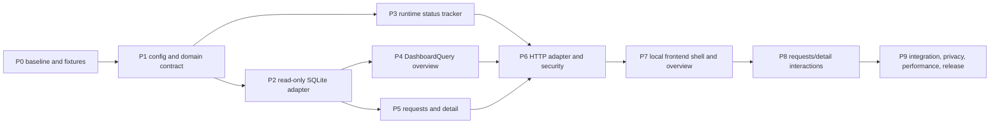

# Coding LLM Router v0.8 Local Observability Dashboard 执行计划

> 状态：Implemented and verified | 版本：v0.8 | 日期：2026-08-19
>
> 设计规格：[v0.8 Local Observability Dashboard 设计规格](./coding-llm-router-v0.8-dashboard-spec.md)
>
> 前置版本：[v0.7 Cost、Trace and Metrics 可观测性执行计划](./coding-llm-router-v0.7-observability-implementation-plan.md)

## 1. 目标与交付边界

本计划把 v0.8 Dashboard Spec 落成为一个本地优先、只读、可下钻的操作面。交付后，用户可以从 Overview 的聚合数字进入 Requests，再进入单个 Request Detail，查看实际模型、Provider、Profile、Policy Role、Route Reason、Fallback、Attempt、Usage、Known estimated cost 和 Trace。

本版本的主链路是：

```text
v0.7 SQLite observations
  -> read-only DashboardSQLiteReader
  -> DashboardQuery read models
  -> GET-only Dashboard HTTP Adapter
  -> packaged local HTML/CSS/ES modules
  -> Overview / Requests / Request Detail
```

本计划必须同时满足以下不变量：

1. Dashboard 不改变 RoutingKernel、ExecutionEngine、Provider Adapter、Session、Health、Outcome、Shadow、Canary 或 Observation 语义。
2. Dashboard HTTP namespace 只允许 `GET` 和 `HEAD`；没有写操作、配置编辑、策略控制或后台 mutation。
3. 浏览器只依赖版本化 JSON DTO，不接触 SQLite schema，不发送 SQL，不在前端复制成本、Fallback、coverage 或 percentile 规则。
4. 历史数据只来自 SQLite；Runtime/Health/Canary/queue 只作为明确标注的 live snapshot 展示。
5. 多币种 known amount 分开，`known_amount_nanos` 以十进制字符串返回；未知、partial、unpriced、legacy 和 capture gap 不按零处理。
6. Overview、Requests、Detail 查询均有固定时间、数量、响应大小、并发和 deadline 上限。
7. 查询失败、超时、数据库锁定或静态资源失败只影响 `/admin`，不影响模型端点、`/ready`、`/metrics` 或实际 Provider 调用。
8. 默认配置不启用 Dashboard；旧 YAML 和 v0.7 行为保持兼容。
9. 所有新增 Python 函数有简短 function-level docstring；日志 message 使用英文；测试使用函数式 pytest；源码文件不超过 500 行。
10. 页面可在无公网、无 Node runtime 的安装 wheel 中运行，静态资源不依赖 CDN、外部字体、第三方 SaaS 或远程 analytics。

本版本明确不交付：

- 配置、Provider、Model、Profile、Policy、Canary 或 Pricing 的在线编辑；
- 告警、Budget、自动调流量、自动晋级或自动回滚；
- 多用户、RBAC、租户隔离、共享链接或公网管理平面；
- 多 Router 实例汇总、长期时序数据库或 Provider invoice 对账；
- Prompt、Response、Reasoning、源码、Patch、命令、Tool 内容或 session ID 展示；
- 客户端业务任务分类，不识别“写 Spec、调试、重构”等类型；
- React/Vue/Vite/Node 构建链；
- 新入站协议、跨协议转换或 Provider Adapter 改造。

## 2. 当前基线与主要风险

### 2.1 v0.7 基线

当前代码基线为 v0.7，最近实现 commit 为 `db5a899`。现有关键模块：

| 位置 | 当前职责 | v0.8 处理 |
|---|---|---|
| `src/llm_router/observability/sqlite_store.py` | Observation schema、WAL、additive migration、atomic append | 复用表和连接约束；只增加 Dashboard 读取索引 |
| `src/llm_router/observability/query.py` | CLI-oriented routes/trace/cost 查询 | CLI 保持不变；Dashboard 使用独立 read model |
| `src/llm_router/observability/models.py` | Route、Attempt、Usage、Cost、Trace domain values | 复用值域；新增 Dashboard DTO 放到 `dashboard/models.py` |
| `src/llm_router/observability/metrics.py` | 请求、Attempt、Usage、Cost、Health、Canary Metrics | 不继续堆 Dashboard 查询指标 |
| `src/llm_router/observability/hub.py` | Metrics/SQLite/OTLP sink fan-out | 接入独立 runtime status tracker，不改变 ObservationPort |
| `src/llm_router/app.py` | Runtime assembly、lifespan、FastAPI route | 只负责构造/注册 Dashboard；拆出 bootstrap 避免继续膨胀 |
| `src/llm_router/config.py` | RouterConfig、ServerConfig、StorageConfig | 通过独立 `dashboard/config.py` 引入 DashboardConfig，最小修改 RouterConfig |
| `src/llm_router/evaluation/sqlite_store.py` | Outcome、Decision、Shadow、Canary evaluation data | Dashboard 只读 optional join，不改变 evaluation 写入 |
| `setup.py` | package、dependencies、entry point | 增加 package asset inclusion，不引入 Node dependency |
| `router.example.yaml` | 可加载示例配置 | 增加 disabled 默认和 loopback enable 示例 |
| `README.md` | 用户运行说明 | 增加 `/admin`、认证、只读和数据语义说明 |

### 2.2 已知文件规模风险

进入 v0.8 前必须关注以下文件：

- `src/llm_router/config.py` 已接近 500 行，不能把 DashboardConfig、validators 和所有 cross-validation 继续堆入其中；
- `src/llm_router/app.py` 已包含完整 runtime bootstrap，不能把 Dashboard SQL、HTTP 解析和静态资源逻辑放进去；
- `src/llm_router/observability/query.py` 已是 CLI 查询深模块，不能为了页面复用而继续扩大为 500+ 行万能查询器；
- `src/llm_router/observability/metrics.py` 已包含大量 Prometheus definitions，Dashboard metrics 必须独立；
- `src/llm_router/evaluation/sqlite_store.py` 维护 evaluation schema，Dashboard 不得把 optional evaluation 逻辑写入其写路径。

### 2.3 主要风险与处理

| 风险 | 处理原则 |
|---|---|
| 前端复制业务聚合 | 后端先冻结 DTO；前端只渲染 normalized values |
| Dashboard 读锁影响 writer | read-only connection、短事务、WAL、busy timeout、独立线程容量 |
| 大范围查询拖慢 event loop | 专用 bounded thread executor + SQLite progress deadline |
| percentile 结果不一致 | 固定 nearest-rank、SQLite window function、golden vectors |
| fallback 被 `attempt_count > 1` 错判 | 使用 actual primary/final/attempt model 规则并保留 unknown |
| cost coverage 被误显示为 100% | 全局 coverage 与按 currency known amount 分开 |
| 缺失的历史 Provider 被当前配置回填 | 只使用 persisted attempt，unknown 不猜测 |
| capture disabled 被当作数据库空 | 历史读取仍允许；live strip 显示 disabled |
| remote admin 未认证 | non-loopback 强制 `dashboard.require_auth=true` |
| client key 泄露到浏览器持久层 | memory-only token、提交后清空 input、无 URL/storage/log |
| static asset 依赖工作目录 | 使用 `importlib.resources`，在 wheel fixture 中验证 |
| UI 变成泛化监控平台 | v0.8 只做 Overview/Requests/Detail 和 bounded breakdown |
| 详情 join 产生不一致 | request detail 一个 read transaction，child list 固定顺序 |
| 数据库 optional table 损坏 | summary 可用，section 返回 bounded gap，不回写/修复 |
| Dashboard 引入新的观测事件 | Dashboard 请求不创建 RouteObservation，不进入模型 Metrics |

## 3. 设计不变量与依赖顺序

### 3.1 深模块和 seam

v0.8 的主要深模块为 `DashboardQuery`：

```python
class DashboardQuery:
    """Build bounded dashboard read models from persisted observations."""

    def overview(self, filters: DashboardFilters) -> OverviewSnapshot: ...
    def requests(self, query: RequestPageQuery) -> RequestPage: ...
    def request_detail(self, request_id: UUID) -> RequestDetail | None: ...
```

调用者只学习三个 read use case。SQLite table detection、optional columns、legacy normalization、aggregation、percentile、cursor、coverage 和 DTO assembly 都隐藏在 implementation 内。

`DashboardRuntimeSource` 是第二个真实 seam：

```python
class DashboardRuntimeSource(Protocol):
    """Expose current bounded runtime facts without mutation access."""

    def snapshot(self) -> DashboardRuntimeSnapshot:
        """Return one immutable sanitized process snapshot."""
```

生产 Adapter 读取 Runtime/Health/Canary/Observation status；测试使用 deterministic fake。它不暴露 `Runtime`、ProviderRegistry、RouterConfig、secret 或可变 Health internals。

### 3.2 阶段依赖图



### 3.3 提交切点

每个阶段完成后都必须保持 compile、lint 和已有测试可运行。建议提交顺序：

```text
P0 freeze v0.7 baseline and fixtures
P1 add Dashboard config and immutable query values
P2 add read-only SQLite adapter and indexes
P3 add runtime status tracker and Dashboard metrics
P4 add Overview query read model
P5 add Requests page and Request Detail read model
P6 add GET-only HTTP adapter, auth, and asset serving
P7 add local frontend shell, URL state, Overview, and charts
P8 add Requests table, detail, attempts, cost, and trace waterfall
P9 complete integration, privacy, performance, packaging, docs, and v0.8 release
```

P6 之前不注册 Dashboard route；P7 之前不引入静态页面；P8 之前不增加复杂交互。这样后端 read model 可以脱离浏览器验证，前端失败也不会污染模型数据面。

## 4. 文件变更地图

### 4.1 新增 Python 源码

```text
src/llm_router/dashboard/__init__.py
src/llm_router/dashboard/config.py
src/llm_router/dashboard/models.py
src/llm_router/dashboard/filters.py
src/llm_router/dashboard/cursor.py
src/llm_router/dashboard/sqlite_reader.py
src/llm_router/dashboard/query.py
src/llm_router/dashboard/query_overview.py
src/llm_router/dashboard/query_requests.py
src/llm_router/dashboard/runtime.py
src/llm_router/dashboard/metrics.py
src/llm_router/dashboard/auth.py
src/llm_router/dashboard/http.py
src/llm_router/dashboard/bootstrap.py
```

职责：

- `config.py`：DashboardConfig、字段约束和本模块配置错误；
- `models.py`：frozen/slotted filter、cursor、summary、series、breakdown、detail 和 runtime DTO；
- `filters.py`：query parameter parsing、UTC normalization、enum/catalog validation 和 bounds；
- `cursor.py`：versioned base64url keyset cursor encode/decode；
- `sqlite_reader.py`：read-only connection、query-only PRAGMA、deadline/progress handler、bounded executor adapter；
- `query.py`：三个 public DashboardQuery use cases 的组装；
- `query_overview.py`：summary、series、breakdown、facets、health projection 和 percentile SQL；
- `query_requests.py`：Requests keyset page、request detail、attempt/usage/cost/span/outcome join；
- `runtime.py`：生产和测试可替换的 DashboardRuntimeSource Adapter；
- `metrics.py`：Dashboard query/auth/active/timeout metrics，禁止并入 RouterMetrics；
- `auth.py`：复用 client Bearer key 的 constant-time auth Adapter；
- `http.py`：FastAPI route registration、status mapping、headers、thread scheduling 和 JSON rendering；
- `bootstrap.py`：创建 Dashboard dependencies、asset resolver 和 route registration，避免扩大 `app.py`。

如果 `query_overview.py` 或 `query_requests.py` 接近 500 行，按 SQL construction、decode/normalize、aggregation 或 detail child readers 拆成私有模块；不要通过减少校验和 docstring 规避限制。

### 4.2 新增静态资源

```text
src/llm_router/dashboard/assets/index.html
src/llm_router/dashboard/assets/styles.css
src/llm_router/dashboard/assets/app.js
src/llm_router/dashboard/assets/http.js
src/llm_router/dashboard/assets/state.js
src/llm_router/dashboard/assets/format.js
src/llm_router/dashboard/assets/charts.js
src/llm_router/dashboard/assets/views/overview.js
src/llm_router/dashboard/assets/views/requests.js
src/llm_router/dashboard/assets/views/request-detail.js
src/llm_router/dashboard/assets/icons/*
src/llm_router/dashboard/assets/licenses/*
```

前端全部使用 native ES modules。每个 JS 文件只负责单一职责：HTTP、state、format、chart renderer、view renderer 分开。动态文本使用 `textContent`，不使用 `innerHTML` 注入数据。

### 4.3 修改源码

```text
src/llm_router/config.py       # 引入 DashboardConfig 和最小 cross-validation
src/llm_router/app.py          # 构造 Dashboard bootstrap，保持 route assembly 简洁
src/llm_router/observability/hub.py
                               # 更新独立 ObservationRuntimeState tracker
src/llm_router/observability/sqlite_store.py
                               # 增加 Dashboard read indexes，仅 additive
setup.py                       # 包含 dashboard assets 和 licenses
router.example.yaml             # 增加 disabled 和 loopback enabled 示例
README.md                       # 增加 Dashboard 使用、安全和数据语义
```

如需修改 `observability/metrics.py`，只允许提供 status tracker 的 bounded hook；不改变既有 metric name、label 或 sink isolation contract。

### 4.4 新增测试

```text
tests/test_v08_dashboard_config.py
tests/test_v08_dashboard_models.py
tests/test_v08_dashboard_filters.py
tests/test_v08_dashboard_cursor.py
tests/test_v08_dashboard_sqlite_reader.py
tests/test_v08_dashboard_runtime.py
tests/test_v08_dashboard_overview.py
tests/test_v08_dashboard_requests.py
tests/test_v08_dashboard_detail.py
tests/test_v08_dashboard_http.py
tests/test_v08_dashboard_security.py
tests/test_v08_dashboard_assets.py
tests/test_v08_dashboard_frontend_contract.py
tests/test_v08_dashboard_performance.py
tests/test_v08_dashboard_regression.py
```

所有测试使用函数式 pytest。禁止新增测试 class；fixture 使用 `conftest.py` 的 Provider/observation helpers，并为 Dashboard 添加临时 SQLite fixture、deterministic RuntimeSnapshot fake 和 HTTP client fixture。

## 5. P0：冻结 v0.7 基线与 Dashboard Fixtures

### 5.1 工作项

1. 在任何源码修改前运行 v0.7 全量质量命令，保存输出和当前诊断。
2. 复制一份只读 v0.7 SQLite fixture，至少包含：
   - JSON success；
   - SSE success；
   - primary success；
   - primary failure + fallback success；
   - routing error；
   - auth/validation early error；
   - cancelled/abandoned row；
   - health skipped attempt；
   - usage complete/partial/missing；
   - cost complete/partial/unpriced/usage missing；
   - USD 与第二种 currency；
   - sampled trace、trace gap、legacy row；
   - explicit task ID 与 task_id NULL；
   - Control 与 Canary actual policy metadata；
   - Outcome present、Outcome conflict、Outcome absent。
3. 记录 `PRAGMA table_info`、index list、row counts 和 fixture content hash。
4. 固定 Dashboard golden vectors：success ratio、fallback denominator、nearest-rank P50/P95、UTC buckets、cost coverage、currency groups、known nanos string。
5. 固定禁止泄露 canary strings：prompt、response、reasoning、source、tool、session、secret、token、exception message。
6. 固定当前 v0.7 canonical behavior：model endpoints、CLI、`/metrics`、`/ready`、Health、Canary、Shadow、Outcome 和 Observation writer。
7. 建立 v0.7 regression command，不把 Dashboard tests 替代旧测试。

### 5.2 阶段验证

```bash
.venv/bin/python -m compileall -q src tests
.venv/bin/python -m pytest -q
.venv/bin/python -m ruff check src tests
.venv/bin/python -m mypy src
```

检查 fixture 前后数据库：

```bash
sqlite3 /tmp/v07-dashboard-fixture.db '.schema'
sqlite3 /tmp/v07-dashboard-fixture.db 'select count(*) from route_requests;'
```

### 5.3 完成条件

- v0.7 全量质量命令通过或已有失败被记录；
- fixture 覆盖所有 v0.8 计算分支；
- 任何 fixture 内容不包含禁止的 prompt/response/secret canary；
- Golden vectors 已写入测试数据，不依赖实时 wall clock；
- P1 只允许消费这些冻结 facts，不重新定义 v0.7 路由语义。

## 6. P1：Dashboard 配置与不可变领域契约

### 6.1 DashboardConfig

在 `src/llm_router/dashboard/config.py` 实现：

```yaml
dashboard:
  enabled: false
  require_auth: true
  default_range_hours: 24
  max_range_days: 90
  refresh_seconds: 15
  query_timeout_ms: 2000
```

约束：

- `enabled` 默认 false；
- `require_auth` 为 bool；
- `default_range_hours` 为 1..168；
- `max_range_days` 为 1..365 且覆盖 default range；
- `refresh_seconds` 为 5..300；
- `query_timeout_ms` 为 100..10000；
- 不增加 page limit、series limit、thread capacity、response size 等 implementation knob。

### 6.2 RouterConfig 集成

采用最小修改方式：

1. `RouterConfig` 引用 `DashboardConfig`，旧配置缺省得到 disabled default。
2. `config.py` 的 `validate_references()` 增加 non-loopback + unauthenticated dashboard rejection。
3. `observability.capture_enabled=false` 不阻止 Dashboard；页面显示 capture disabled，已有 SQLite 仍可读。
4. SQLite path 不存在时，Dashboard route 返回 bounded `observation_unavailable`，不在 Dashboard 启动时创建数据库。
5. Dashboard 与 Metrics 可以分别配置 auth，但复用已有 client key resolution。
6. Dashboard disabled 时不注册 `/admin` routes，由 FastAPI 返回普通 404。

不要把 DashboardConfig 的 validator 实现复制到 `config.py`；只保留 Router-level cross-validation。

### 6.3 领域 DTO

在 `dashboard/models.py` 定义 frozen/slotted values：

- `DashboardFilters`；
- `RequestCursor`；
- `RequestPageQuery`；
- `OverviewSnapshot`；
- `RequestPage`；
- `RequestDetail`；
- `DashboardRuntimeSnapshot`；
- `DashboardTargetHealth`；
- summary ratio、coverage、cost currency、time series、breakdown 和 gap values。

所有 DTO 满足：

- datetime 必须 timezone-aware，并在输出前 UTC；
- ID 使用 UUID/严格 trace ID 类型；
- ratio 没有 denominator 时为 `None`；
- known amount nanos 在 JSON boundary 转 decimal string；
- list 使用 tuple 或在 decode 后 immutable；
- status、stage、coverage、gap 使用固定枚举，不接收任意 string。

### 6.4 Filter 与 Cursor

在 `filters.py` 和 `cursor.py` 实现：

1. 默认范围：过去 24 小时；
2. `start` inclusive、`end` exclusive；
3. 最大历史范围由 DashboardConfig 限制；
4. multi-value filter 每类最多 20 个值；
5. query string 最大 8 KiB；
6. enum、alias、UUID、RFC3339、bucket 严格校验；
7. unknown parameter 返回 `invalid_filter`；
8. wildcard、regex、SQL fragment、free text 搜索全部拒绝；
9. cursor 是 versioned base64url JSON，只含 `(received_at, request_id)` 定位；
10. filter 改变后前端清空 cursor；
11. cursor 解码失败、版本不支持、时间/UUID 无效统一返回 `invalid_filter`。

### 6.5 阶段测试

函数式测试至少覆盖：

- old YAML default disabled；
- loopback/remote auth cross-validation；
- invalid range、too large range、future range；
- repeated parameters and limit bounds；
- UUID/trace/cursor strict validation；
- Unicode/control/free-text rejection；
- nanos string serialization and no float coercion；
- ratio null when denominator is zero；
- DTO immutability and timezone normalization。

### 6.6 完成条件

- `RouterConfig` 可以加载 v0.7 YAML 且不改变现有 hash/plan；
- v0.8 dashboard block strict validation 通过；
- 所有 filter/cursor input 在进入 SQL 前完成 typed validation；
- P2 可以只依赖 Dashboard domain values，不依赖 FastAPI Request。

## 7. P2：只读 SQLite Adapter 与查询资源隔离

### 7.1 DashboardSQLiteReader

在 `sqlite_reader.py` 实现一个短生命周期只读 Adapter：

```text
file:<expanded path>?mode=ro
PRAGMA query_only=ON
PRAGMA busy_timeout=250
PRAGMA trusted_schema=OFF
row_factory = sqlite3.Row
```

实现职责：

1. 校验 database file 存在；
2. 不创建目录、不创建数据库、不执行 DDL；
3. 只访问 fixed table names 和 fixed column mappings；
4. 对 required `route_requests` schema 做兼容检查；
5. 对 optional route_usage/cost/spans/evaluation tables 做 capability detection；
6. 提供短 read transaction；
7. 提供 `set_progress_handler()` monotonic deadline；
8. timeout 后 interrupt、rollback、close；
9. 将 sqlite exception 映射成 fixed `observation_unavailable`、`unsupported_schema` 或 `query_timeout`；
10. 不将 exception text、SQL、path、filter values 写日志或响应。

### 7.2 SQL 安全

- 所有 value 使用 parameterized SQL；
- client group/sort/filter 只进入 server-side fixed mapping；
- 不拼接任意 column、table、order 或 expression；
- 不允许 `ATTACH`、extension loading、writable PRAGMA、user-defined SQL function；
- `PRAGMA table_info()` 只用于固定表名；
- `query_only` 和 `mode=ro` 在每个 connection 验证；
- connection close 必须在 success、error、cancel、timeout 全路径执行。

### 7.3 并发与 event loop

SQLite `sqlite3` 查询不得直接运行在 FastAPI event loop。实现 Dashboard 专用 bounded executor：

```text
max concurrent queries = 2
queued query requests = 8
```

执行策略：

1. HTTP Adapter 先取得 bounded capacity token；
2. queue 满返回 `dashboard_busy`；
3. 查询函数在线程内完成 connection、transaction 和 DTO；
4. HTTP client disconnect 时取消 await，并由 progress handler 最终终止 DB 查询；
5. Provider HTTP、Shadow executor、Observation writer 不共享该 executor；
6. Dashboard read 不获取 Observation writer lock。

### 7.4 Additive indexes

在 v0.7 Observation Store startup 的 migration 中增加：

```sql
CREATE INDEX IF NOT EXISTS idx_route_received_request
ON route_requests(received_at DESC, request_id DESC);

CREATE INDEX IF NOT EXISTS idx_route_profile_received
ON route_requests(profile, received_at DESC);

CREATE INDEX IF NOT EXISTS idx_route_policy_received
ON route_requests(policy_role, received_at DESC);
```

索引 migration 必须：

- `IF NOT EXISTS` 幂等；
- 不改已有 row；
- 不删除旧 index；
- migration 失败遵循 v0.7 not-ready 语义；
- v0.7 binary 可以忽略新增 index 并继续打开 DB。

### 7.5 阶段测试

- read-only connection 无法执行 INSERT/UPDATE/DDL；
- query_only/ro PRAGMA 每次 connection 生效；
- missing DB 不被 Dashboard 创建；
- required/optional schema detection 正确；
- SQLite locked 映射为 bounded error；
- progress deadline 能中断长查询；
- query queue 满返回 `dashboard_busy`；
- concurrent readers 不造成 Observation writer 长期 busy；
- indexes migration 重复启动结果一致；
- DB content hash 在 Dashboard 查询前后不变。

### 7.6 完成条件

- P2 不依赖 FastAPI、浏览器或 Runtime；
- 只读 adapter 可以被 P4/P5 直接调用；
- 查询 deadline、并发和连接生命周期有函数式测试；
- 100,000 route fixture 的 `EXPLAIN QUERY PLAN` 使用预期 index。

## 8. P3：Runtime Snapshot 与 Dashboard Metrics

### 8.1 ObservationRuntimeState

Dashboard 需要显示 queue/drop/sink facts，但不能读取 Prometheus client private state。新增 internal tracker：

```python
class ObservationRuntimeState:
    """Track bounded observation status since process start."""

    def snapshot(self) -> ObservationRuntimeStatus:
        """Return an immutable status snapshot without changing sinks."""
```

tracker 只保存：

- queue depth/capacity；
- dropped count since process start；
- SQLite failure count since process start；
- OTLP failure count since process start；
- last status update timestamp。

不保存 prompt、response、ID、exception message 或 query data。

### 8.2 ObservationHub hook

在 `ObservationHub` 中通过小的 internal callback 更新 tracker：

- queue put success/update depth；
- queue full/drop；
- SQLite append failure；
- shutdown timeout；
- exporter failure（如需要展示）。

更新 tracker 失败不能改变当前 sink isolation；tracker 本身使用 bounded primitive，不引入 await 或 writer lock。

### 8.3 RuntimeSnapshot Adapter

`dashboard/runtime.py` 的 production Adapter 读取：

- `Runtime.ready`；
- config router version、capture/tracing/local trace flags；
- `CanaryRuntimeState` 的 enabled/active/reason；
- `HealthPort.snapshot()` 的 revision、target state、bounded retry time；
- ObservationRuntimeState；
- process started_at。

返回 `DashboardRuntimeSnapshot`，只保留 sanitized enums、aliases、bounded counts 和 UTC timestamps。任何 Runtime section 读取失败映射为 `status=unavailable`，历史 SQLite query 仍可成功。

### 8.4 DashboardMetrics

在 `dashboard/metrics.py` 定义：

```text
llm_router_dashboard_queries_total{view,status}
llm_router_dashboard_query_duration_seconds{view}
llm_router_dashboard_active_queries
llm_router_dashboard_auth_total{status}
```

labels 仅使用 `overview|requests|detail` 和固定 status。禁止 ID、filter、path、SQL、error message 作为 label。

### 8.5 阶段测试

- tracker counters 从 0 开始并只单调增加；
- dashboard runtime snapshot 不暴露 Runtime/secret；
- health snapshot failure 不丢历史 query；
- ObservationHub sink failure 仍更新 tracker/metrics，不改变模型响应；
- Dashboard metrics 无高基数 label；
- current counters 明确标注 `since process start`。

### 8.6 完成条件

- P3 不改变 v0.7 ObservationPort interface；
- `RuntimeSnapshotSource` 有 production 和 deterministic test Adapter；
- live status 可独立于 SQLite historical read model 测试；
- Dashboard metrics 可在 `/metrics` 中按固定名称出现，且不影响旧指标。

## 9. P4：DashboardQuery Overview Read Model

### 9.1 Query composition

在 `query.py` 只暴露三个 public methods；Overview implementation 放在 `query_overview.py`。一次 Overview query 需要：

1. 解析并冻结 DashboardFilters；
2. 创建 read-only connection；
3. 打开 deferred read transaction；
4. 计算 available range/freshness；
5. 计算 summary；
6. 计算 request/fallback/status series；
7. 计算 known cost series by currency；
8. 计算 model/provider/profile/policy/task-model/route-reason breakdown；
9. 计算 current health/runtime section；
10. 读取最近 20 条失败；
11. 返回 facets 和 truncation flags；
12. commit/close；
13. 生成 immutable OverviewSnapshot。

所有 historical sections 使用同一 filters 和 read transaction。Runtime snapshot 由 injected source 在事务外获取一次，失败时只影响 live section。

### 9.2 Summary rules

实现并测试以下规则：

- request count = persisted `route_requests` terminal rows；
- success numerator/denominator/ratio；
- error/cancelled/abandoned 进入 success denominator；
- fallback 使用 primary/final/attempt actual facts；
- fallback denominator 只含 reached routing 且 facts 足够的 rows；
- unknown fallback count 单独返回；
- provider 归属来自最后一个 `upstream_invoked=true` Attempt；
- no invoked attempt = `none`；
- legacy missing facts = `legacy_unknown`；
- token kind 逐项聚合，reasoning 不与 output 相加；
- cost global coverage 与 known currency amounts 分开；
- `known_amount_nanos` 只在 JSON boundary 转 decimal string；
- no cross-currency total；
- `not_applicable` 不进入 cost applicable denominator；
- partial/unpriced/usage_missing 进入 coverage denominator；
- ratio denominator 0 时为 null。

### 9.3 Time series

实现 UTC epoch bucket：

| 时间范围 | bucket |
|---|---|
| <= 6h | 5m |
| <= 48h | 1h |
| <= 14d | 6h |
| <= 90d | 1d |
| > 90d | 7d |

要求：

- auto 和 explicit bucket 均验证 <= 500 points；
- bucket start 使用 RFC3339 UTC；
- success/error/cancelled/abandoned/fallback series 有明确 null/zero 语义；
- cost series 按 currency 独立；
- 没有 known amount 的 request 不进入 currency amount series；
- 空 bucket 是否补零由 response contract 固定，不让前端猜测；
- SQL bucket 对齐不能依赖本地时区。

### 9.4 Percentile

在 SQL 中使用 window function 或等价 bounded query 实现 nearest-rank：

```text
rank(p) = ceil(p * N)
```

只使用 non-negative finite latency。P50/P95 的 N 必须是全局或各 breakdown group 自己的有效样本数。空样本为 null。

### 9.5 Breakdown 与 facets

返回：

- model；
- provider；
- profile；
- policy role/hash；
- task/model；
- route reason；
- current catalog/historical facets。

每个 breakdown 最多 100 groups，每类 facets 最多 200 values。超限返回 `truncated=true`，不执行无界 distinct scan。

task/model breakdown 只使用显式 `task_id`；NULL task 不合并成 synthetic task。每行保留等价 Requests filter payload。

### 9.6 Recent failures

最近失败只读 bounded fields：

- request ID；
- received/completed time；
- protocol/endpoint/profile；
- status/stage/error code；
- primary/final model；
- final Provider；
- attempt count/fallback；
- latency；
- trace captured flag。

不返回 exception message、Provider body、headers 或 raw JSON。

### 9.7 阶段测试

- fixture 与 golden vector 聚合一致；
- 同一 read transaction 内所有 sections filters 一致；
- mixed currency 永不合计；
- cost missing/unpriced 不被分配到 USD；
- fallback retry、same-model retry、health skip 分类正确；
- task_id NULL 和 explicit task 分开；
- percentile boundary N=0/1/2/odd/even 正确；
- buckets UTC 且 point count bounded；
- breakdown/filter 下钻 payload 等价；
- legacy_unknown 与 current catalog 不混淆；
- privacy canary strings 不出现在 DTO。

### 9.8 完成条件

- OverviewSnapshot 可以脱离 HTTP 直接断言；
- 100k fixture 的 query plan 和性能目标可测；
- P5 可以复用相同 SQLite reader 和 filter contract；
- 不修改 v0.7 `ObservationQuery` CLI semantics。

## 10. P5：Requests Page 与 Request Detail Read Model

### 10.1 Requests keyset page

在 `query_requests.py` 实现：

```text
ORDER BY received_at DESC, request_id DESC
```

分页规则：

1. 默认 limit 50，允许 1..100；
2. 查询 `limit + 1` 判定 has_more；
3. next cursor 只记录最后一条 `(received_at, request_id)`；
4. 不使用 offset；
5. 同 timestamp 使用 request UUID tie-breaker；
6. filter 改变后 cursor 失效；
7. response 不做昂贵 total count；
8. page item 提供 filters/drill-down metadata；
9. table columns 与 Spec 一致；
10. known cost 为 decimal string，coverage badge 独立返回。

### 10.2 Request Detail transaction

单个 detail query 在一个 read transaction 内读取：

1. `route_requests` base row；
2. `route_attempts` ordered by sequence；
3. `route_usage` fixed kind order；
4. `route_cost_items` fixed kind order；
5. `route_spans` ordered by started_at/span_id；
6. optional `outcome_events` ordered by observed_at/event_id；
7. optional `route_decision_inputs`/policy snapshot coverage；
8. legacy/optional table capability state。

不存在 request 返回 `None`，HTTP 映射 404。request 存在但 child 缺失返回 200 + section gap。

### 10.3 Detail normalization

Detail 必须按以下优先级显示实际事实：

- primary/final model：persisted route + execution；
- final provider：last invoked attempt；
- policy role/hash/reason：persisted route metadata；
- usage/cost：v0.7 normalized fields；
- trace：persisted spans only；
- outcome：optional persisted outcome only。

禁止使用当前 RouterConfig 补齐历史 Provider、Policy、Pricing 或 Profile。字段缺失显示 `legacy_unknown`、`not_observed` 或 `capture_gap`。

### 10.4 Trace integrity

Detail backend 校验：

- span ID/parent ID format；
- trace ID matches request trace；
- duration non-negative finite；
- attributes JSON 是 whitelist mapping；
- list <= 200 spans；
- parent relation 不自行修复；
- corrupted attributes 转 `trace_attributes_invalid`；
- missing spans 转 `trace_not_captured`；
- parent gap 转 `trace_integrity_gap`。

### 10.5 Outcome optional section

如果 evaluation table 存在且 request 有 outcome：只返回 verdict、evidence、source、observed_at、conflict flag。没有 outcome 不返回空 success，显示 `outcome_not_observed`。Dashboard 不由 detail 触发 Outcome 写入。

### 10.6 阶段测试

- keyset page 无重复、无漏项、稳定 tie-breaker；
- page cursor 版本、过期、非法和 filter mismatch；
- request 404 与 child gap 200 区分；
- detail transaction 内 sections 读取一致；
- attempts/fixed usage/cost/span order stable；
- fallback attempts 不被 final usage 掩盖；
- trace gap/integrity/corrupt attributes 语义正确；
- outcome present/absent/conflicting 正确；
- detail response size和 child caps 生效；
- request/task/trace/prompt/secret privacy scan 通过。

### 10.7 完成条件

- Requests page 和 Detail DTO 可直接被 HTTP Adapter 序列化；
- `routes` CLI 仍保持原有输出；
- P6 只负责 transport、auth 和 status mapping，不再写 SQL。

## 11. P6：GET-only HTTP Adapter、认证与静态资源服务

### 11.1 Route registration

在 `dashboard/http.py` 注册：

```text
GET  /admin
GET  /admin/
GET  /admin/requests/{request_id}
GET  /admin/assets/{asset_path}
GET  /admin/api/v1/overview
GET  /admin/api/v1/requests
GET  /admin/api/v1/requests/{request_id}
```

只有 `dashboard.enabled=true` 才注册。disabled 时不注册，由 FastAPI 返回普通 404。

HTTP handler 只负责：

1. method/path dispatch；
2. auth；
3. typed query parsing；
4. bounded executor scheduling；
5. call DashboardQuery；
6. DTO -> JSON conversion；
7. fixed status/error mapping；
8. response security headers；
9. Dashboard metrics。

HTTP handler 不构造 SQL、不读取 Runtime mutable object、不执行 config mutation。

### 11.2 Authentication

复用已有 client Bearer key：

- loopback + `require_auth=false` 可以本地无 token访问；
- remote listener 强制 `require_auth=true`；
- JSON endpoints 认证失败返回 401 `unauthorized`；
- static shell/assets 不包含动态数据，可按配置公开加载；
- constant-time comparison；
- Authorization header 不写日志、query、HTML 或 Metrics；
- 不引入 cookie/session/CSRF，因为 v0.8 无写操作；
- 浏览器 token 只在 memory，reload 需重新输入。

### 11.3 Error mapping

固定 mapping：

| 状态 | code |
|---|---|
| 400 | `invalid_filter` |
| 401 | `unauthorized` |
| 404 | `request_not_found` |
| 503 | `observation_unavailable` |
| 503 | `unsupported_schema` |
| 503 | `query_timeout` |
| 503 | `dashboard_busy` |

message 使用固定英文文本。SQLite path、SQL、exception message、query values 和 dynamic IDs 不返回。

### 11.4 Security headers

JSON：

```text
Cache-Control: no-store
Content-Type: application/json
X-Content-Type-Options: nosniff
Referrer-Policy: no-referrer
```

HTML：

```text
Cache-Control: no-cache
Content-Security-Policy: default-src 'self'; script-src 'self'; style-src 'self'; img-src 'self' data:; connect-src 'self'; object-src 'none'; base-uri 'none'; frame-ancestors 'none'; form-action 'none'
```

不注册 CORS，不接受 iframe embedding，不允许外部 script/font/analytics。静态 asset 如果使用 hash filename，可设置 immutable cache；动态 JSON 永不缓存。

### 11.5 Static asset resolver

使用 `importlib.resources`：

1. asset path 只允许 package 内固定文件；
2. reject `..`、绝对 path、NUL、encoded traversal；
3. MIME type 固定映射；
4. missing asset 返回普通 404 和固定英文日志；
5. HTML shell 不注入配置、token 或 Runtime data；
6. source checkout 与 installed wheel 使用同一个 resolver。

### 11.6 阶段测试

- disabled 404；
- enabled shell/assets MIME 和 headers 正确；
- GET/HEAD 成功，POST/PUT/PATCH/DELETE 不改变状态；
- auth loopback/remote cross-validation；
- invalid query、unknown parameter、too large response、busy/timeout mapping；
- no CORS/no external network headers；
- path traversal rejected；
- token、SQL、exception、IDs 不出 logs/response；
- Dashboard route 不生成 RouteObservation；
- model endpoint behavior 与 Dashboard disabled fixture 完全一致。

### 11.7 完成条件

- HTTP contract 可以通过 ASGI client 独立验证；
- 所有 query logic 留在 DashboardQuery；
- `app.py` 只调用 bootstrap/register，不承载 Dashboard implementation；
- P7 可以在本地浏览器访问稳定接口。

## 12. P7：本地前端 Shell、URL State、Overview 与图表

### 12.1 静态 Shell

先实现 `index.html`、`styles.css`、`app.js` 基础骨架：

- Overview/Requests navigation；
- current view route detection；
- global filter toolbar placeholder；
- loading/empty/error/stale states；
- locked/auth state；
- accessible landmark、heading、focus ring；
- no inline script/eval；
- CSP compatible。

页面不放置营销 hero 或说明性大段文字。首屏直接进入 Overview 操作面。

### 12.2 State module

在 `state.js` 管理：

- current view；
- filters；
- date preset/custom range；
- cursor；
- refresh state；
- auth memory token；
- last successful snapshot；
- pending request AbortController；
- stale/error state。

状态规则：

1. filters serializable 到 URL；
2. token 不序列化到 URL/storage/DOM；
3. filter change 清 cursor；
4. custom range Apply 后才 fetch；
5. refresh 取消旧 request；
6. hidden tab 暂停 auto-refresh；
7. request detail 不自动刷新；
8. failed refresh 保留 last success 并标 stale。

### 12.3 HTTP client module

在 `http.js` 实现：

- GET-only fetch wrapper；
- `Authorization: Bearer` header；
- 401 -> locked state + clear memory token；
- AbortController；
- fixed error contract decode；
- no response body logging；
- no retry storm；
- bounded retry/backoff only for 503 busy/timeout；
- JSON schema version check；
- unknown additive fields ignored。

### 12.4 Format module

在 `format.js` 实现：

- UTC/local time display with UTC tooltip；
- ratio `n/N` and percent；
- `null`/unknown/partial/legacy/gap badges；
- nanos decimal string -> BigInt formatting；
- no float cost arithmetic；
- token kind labels；
- policy hash short/full formatting；
- duration formatting；
- HTTP status/error code fixed rendering。

### 12.5 Overview view

按 Spec 顺序实现：

1. filter toolbar；
2. live status strip；
3. KPI band；
4. request status/fallback series；
5. known estimated cost series by currency；
6. Models/Providers/Profiles/Policies/Tasks segmented breakdown；
7. route reasons；
8. current health；
9. recent failures。

每个 breakdown row 都携带 server-provided filter payload，点击后进入 Requests，不在前端重新拼业务 filter。KPI tooltip 展示 numerator/denominator/unknown。

### 12.6 Chart renderer

`charts.js` 只接受 normalized series：

- line chart；
- stacked bar；
- compact waterfall placeholder for detail；
- SVG rendering；
- fixed aspect ratio/min height；
- hover/focus tooltip；
- keyboard data table toggle；
- screen-reader summary；
- reduced motion；
- no gradients/orbs/bokeh/decorative blobs。

renderer 不知道 success/fallback/cost coverage 业务语义，只知道 series label/value/status。

### 12.7 P7 前端验收

- 无公网请求；
- URL filters 可恢复；
- refresh/abort/stale state；
- KPI unknown/partial 不变成 0；
- cost BigInt 无精度损失；
- mixed currency 独立显示；
- chart <=500 points；
- keyboard/focus/aria；
- mobile 无横向溢出和文本重叠；
- CSS palette 非单一色系，radius <=8px；
- no inline/eval/external script。

## 13. P8：Requests、Request Detail、Attempts、Cost 与 Trace UI

### 13.1 Requests view

实现表格：

- time；
- request/task；
- protocol/endpoint；
- requested/effective profile；
- policy role/short hash；
- primary -> final model；
- final Provider；
- attempts/upstream invoked；
- status/stage/error code；
- latency；
- tokens；
- known estimated cost + coverage。

默认 50、最大 100，使用 next cursor。移动端保留 time/status/model/latency，其余字段通过 row expansion 展示。

### 13.2 Detail navigation

Request row、recent failure、breakdown row 都可以进入：

```text
/admin/requests/<request-uuid>
```

浏览器刷新/复制 URL 仍可加载 shell，并由 view state 请求 detail API。不存在 request 显示 404 state，child gap 显示 section-level gap。

### 13.3 Identity/Routing sections

Identity 展示：

- request/task/trace ID；
- received/completed；
- protocol/endpoint/stream；
- status/terminal stage。

Routing 展示：

- requested/effective profile；
- policy version/full hash/role；
- assignment/route reason；
- primary/final model；
- routing duration；
- health snapshot revision/filter count/reason。

ID 和 hash 使用 monospace，支持 copy button；copy feedback 使用 accessible live region。

### 13.4 Attempts section

每个 attempt 展示：

- sequence；
- provider/model；
- upstream invoked；
- started/duration；
- HTTP status；
- bounded status/error code；
- fallback relation。

health skipped 必须与真实 Provider failure 区分。失败 attempt 不隐藏，即使 final attempt success。

### 13.5 Usage/Cost section

分别展示 input_uncached、cache_read、cache_write、output、reasoning_output。Cost 展示：

- status；
- currency；
- pricing ID；
- known amount nanos formatted string；
- line item rate/tokens/amount；
- unknown usage kinds；
- unknown invoked attempts；
- global coverage gap。

禁止把 partial known amount 显示为 total bill。不同 currency 分 section。

### 13.6 Trace waterfall

按 server-provided parent relation 渲染：

```text
llm_router.request
  llm_router.route
  llm_router.execute
    llm_router.provider.attempt
    llm_router.stream
```

要求：

- 横轴以 root start 为 0；
- width 按 duration；
- 短 span 有视觉最小宽度但 tooltip 保留真实值；
- parent gap/overlap/out-of-root 显示 integrity gap；
- 不在浏览器重建父子关系；
- trace_not_captured 与 trace_integrity_gap 明确区分；
- attributes 只显示 backend whitelist keys；
- data table fallback 可键盘读取。

### 13.7 Optional Outcome

如果 API 返回 outcome：显示 verdict/evidence/source/time/conflict。不存在时显示 not observed，不产生写操作，不显示质量推断。

### 13.8 P8 前端验收

- 请求列表和详情深链接；
- filters/cursor/empty/loading/error 状态；
- Attempt 顺序与 server order 一致；
- partial/unpriced/missing/capture gap badge 正确；
- trace waterfall 与 server timestamps 一致；
- no private content in DOM/text/console；
- mobile detail 无重叠；
- copy buttons、tooltips、keyboard navigation；
- outcome absent/conflict 正确。

## 14. P9：集成、隐私、性能、打包与发布验收

### 14.1 Runtime integration

在 `dashboard/bootstrap.py` 创建：

1. DashboardConfig；
2. DashboardSQLiteReader factory；
3. DashboardQuery；
4. ObservationRuntimeState source；
5. DashboardRuntimeSource；
6. DashboardMetrics；
7. Dashboard HTTP Adapter；
8. asset resolver；
9. bounded query executor。

`app.py` 只在 `dashboard.enabled` 时调用 bootstrap/register。启动顺序：

```text
load/validate config
start v0.7 ObservationStore and evaluation modules
create Dashboard dependencies
register admin routes if enabled
mark Router ready
```

Dashboard 不创建新的 background query worker，不在启动时创建数据库，不影响 v0.7 lifespan close。

### 14.2 Full regression matrix

固定演练至少包含：

1. v0.7 YAML without dashboard block；
2. dashboard disabled -> `/admin` 404；
3. loopback dashboard without auth；
4. loopback dashboard with auth；
5. remote dashboard without auth rejected at config validation；
6. missing DB；
7. legacy-only DB；
8. v0.7 complete schema；
9. 100k request DB；
10. concurrent Dashboard reads during model traffic；
11. SQLite locked/timeout；
12. Observation queue full/SQLite sink failure；
13. JSON/SSE success/fallback/error/cancelled/abandoned；
14. mixed currency and cost missing/unpriced；
15. trace captured/not captured/corrupt optional span；
16. explicit task/no task；
17. Outcome present/absent/conflicting；
18. retention shortened range；
19. browser reload/back/forward/deep link；
20. offline installed wheel asset load。

### 14.3 Privacy scan

将固定 canary strings写入禁止出现的 fixture 字段：

```text
prompt-canary
response-canary
reasoning-canary
source-code-canary
tool-argument-canary
session-canary
provider-secret-canary
client-token-canary
exception-message-canary
```

扫描：

- Dashboard JSON；
- HTML/CSS/JS；
- browser DOM snapshot；
- URL/history；
- localStorage/sessionStorage/IndexedDB/cookies；
- console output；
- application logs；
- Prometheus exposition；
- installed wheel asset output。

任何命中阻断发布。允许 request/task/trace ID 仅在对应白名单位置出现。

### 14.4 Performance and capacity

固定 fixture 目标：

- Overview p95 < 500 ms；
- Requests first page p95 < 200 ms；
- Detail p95 < 100 ms；
- JSON encode p95 < 50 ms；
- shell gzip < 250 KiB；
- Dashboard model request p95 increment < 2%；
- max two concurrent queries、queue eight；
- response <= 2 MiB；
- series <=500、groups <=100、facets <=200；
- detail attempts <=100、spans <=200、outcomes <=100。

性能测试同时记录：

- `EXPLAIN QUERY PLAN`；
- p50/p95；
- SQLite busy/timeout count；
- Observation writer latency；
- query executor queue depth；
- browser initial load and refresh overlap。

CI 采用宽松上限，真实本机结果作为发布记录，不用单次 wall-clock 作为唯一 gate。

### 14.5 Packaging and offline verification

修改 `setup.py` 或 package data，使 wheel/sdist 包含：

- HTML；
- CSS；
- JS modules；
- icons；
- third-party licenses。

在临时 virtualenv 中：

1. `pip install` 本地 wheel；
2. 使用临时 router YAML 启动；
3. 无公网访问 `/admin`；
4. 验证 MIME/CSP/asset resolver；
5. 验证 source checkout 与 installed wheel 一致；
6. 确认没有 Node runtime 或 CDN 请求。

### 14.6 全量质量命令

```bash
.venv/bin/python -m compileall -q src tests
.venv/bin/python -m pytest -q
.venv/bin/python -m ruff check src tests
.venv/bin/python -m mypy src
```

Dashboard 核心回归：

```bash
.venv/bin/python -m pytest -q \
  tests/test_v08_dashboard_config.py \
  tests/test_v08_dashboard_filters.py \
  tests/test_v08_dashboard_cursor.py \
  tests/test_v08_dashboard_sqlite_reader.py \
  tests/test_v08_dashboard_overview.py \
  tests/test_v08_dashboard_requests.py \
  tests/test_v08_dashboard_detail.py \
  tests/test_v08_dashboard_http.py \
  tests/test_v08_dashboard_security.py \
  tests/test_v08_dashboard_assets.py \
  tests/test_v08_dashboard_regression.py
```

### 14.7 发布文件

- `src/llm_router/__init__.py`、FastAPI title/version、`setup.py` 更新为 `0.8.0`；
- `router.example.yaml` 增加 dashboard disabled 和 loopback enabled 示例；
- `README.md` 增加启用命令、`/admin`、认证、只读、known cost 和 gap 说明；
- dashboard Spec 状态改为 `Accepted`；
- 本计划状态改为 `Implemented and verified`；
- 发布说明明确 Dashboard 不保存 Prompt/Response，不控制路由，不提供账单真值。

## 15. 建议提交顺序与每步回滚

### 15.1 提交顺序

```text
P0 freeze fixtures and baseline
P1 dashboard config/models/filters/cursor
P2 read-only SQLite reader and additive indexes
P3 runtime status tracker and dashboard metrics
P4 overview query/read model
P5 requests/detail query/read model
P6 HTTP adapter/auth/assets resolver
P7 frontend shell/URL state/overview/charts
P8 requests/detail/attempts/cost/trace UI
P9 integration/security/performance/package/release
```

### 15.2 每步回滚原则

- P0/P1：删除未启用配置和 DTO，不触碰 v0.7 runtime；
- P2：保留 additive indexes，v0.7 忽略 indexes；不执行 downgrade；
- P3：移除 tracker hook，Observation sink contract 不变；
- P4/P5：DashboardQuery 未注册，不影响任何运行时请求；
- P6：关闭 dashboard 或删除 route registration，模型端点完全不变；
- P7/P8：删除 assets，保留 HTTP 404/disabled；
- P9：发布回滚到 v0.7 binary，保留 SQLite rows/indexes，不删除数据库。

### 15.3 禁止操作

- 不运行 `git reset --hard`、`git checkout --` 或删除用户已有 DB；
- 不为了 Dashboard 清理旧 telemetry/evaluation 数据；
- 不执行 downgrade migration；
- 不把 Dashboard query error 传播到 model gateway；
- 不把当前 RouterConfig 用来覆盖历史事实；
- 不把 `estimated_cost` legacy 字段重新解释成 billing truth。

## 16. 完成定义

v0.8 只有同时满足以下条件才能标记完成：

### 16.1 后端

- Dashboard 默认 disabled，旧 YAML 启动和 v0.7 behavior 不变；
- remote listener + unauthenticated dashboard config 被拒绝；
- `/admin` 与 `/admin/api/v1/*` 仅 GET/HEAD，disabled 普通 404；
- DashboardQuery 三个 use case 可独立测试；
- SQLite 查询只读、有界、有 deadline、线程隔离；
- query queue/capacity/full/timeout semantics 通过；
- Overview filters、summary、series、breakdowns、facets、health、recent failures 正确；
- Requests keyset pagination 无重复、无漏项；
- Detail 一个 read transaction 关联 request/attempt/usage/cost/span/optional outcome；
- fallback、provider、task、policy、coverage、cost、trace gap 语义与 Spec 一致；
- mixed currency 永不合计；
- known nanos 使用 decimal string；
- v0.1-v0.7 legacy rows 可展示且不虚构字段；
- Dashboard query 不创建 RouteObservation，不改变 model request/response；
- Dashboard failure 不改变 `/ready`、`/metrics`、Provider call 或 Observation writer。

### 16.2 前端

- Overview、Requests、Request Detail 三个 view 可用；
- URL filter、cursor、deep link、back/forward、reload 正常；
- auto-refresh 取消旧请求，hidden tab 暂停，失败保留 stale snapshot；
- unknown/partial/legacy/gap 不渲染为零或完整账单；
- models/providers/profiles/policies/tasks/route reasons 可下钻；
- attempts/fallback/usage/cost/trace/outcome detail 可审计；
- desktop/mobile 无重叠、无横向溢出、文本不遮挡；
- keyboard、focus、ARIA、contrast、reduced motion 和 data table fallback 通过；
- CSP、no-store、no CORS、no external network 和 path traversal 通过；
- token 不进入 URL、storage、DOM attribute/text、console 或日志，提交后 input 立即清空；
- installed wheel 离线加载成功。

### 16.3 隐私

- SQLite、Dashboard JSON、HTML、DOM、URL、storage、logs、Metrics 和 assets 无禁止 canary strings；
- 不展示 Prompt、Response、Reasoning、源码、Patch、Command、Tool content、session、secret、headers 或异常自由文本；
- policy/task/trace/request ID 只在明确白名单位置出现；
- no remote analytics、CDN、external font 或 OTLP readback。

### 16.4 性能与质量

- 100k fixture 达成 Overview/Requests/Detail p95 预算；
- query executor、SQLite writer 和 Provider runtime 没有可重复的 lock regression；
- response、series、groups、facets、child 和 query time 上限生效；
- compileall、pytest、Ruff、mypy 通过；
- v0.1-v0.7 regression 全绿；
- 所有新增源码文件不超过 500 行；
- 所有新增 Python functions 有 function-level docstring；
- 所有 logs 使用英文 message。

## 17. 后续版本边界

v0.8 之后的能力不应直接塞入本计划：

- v0.9：告警、SLO、可配置通知；
- 后续版本：Budget Policy、账单对账、多实例聚合；
- 后续版本：Outcome/Shadow/Canary 专用实验分析；
- 后续版本：多用户、RBAC、写操作和审计；
- 后续版本：业务任务分类或客户端 adapter metadata；
- 后续版本：长期时序存储和高基数检索。

任何写操作都必须新建 Spec，重新定义认证、授权、审计、CSRF、幂等、冲突、回滚和数据保留。不能在 v0.8 GET-only interface 上直接添加管理按钮。
