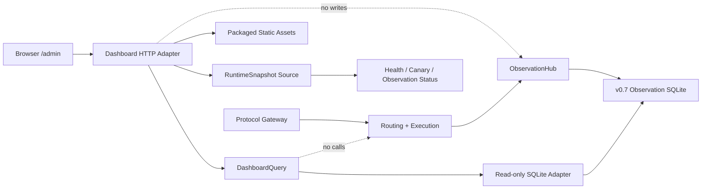

# Coding LLM Router v0.8 Local Observability Dashboard 设计规格

> 状态：Accepted | 版本：v0.8 | 日期：2026-08-19
>
> 前置版本：[v0.7 Cost、Trace and Metrics 可观测性设计规格](./coding-llm-router-v0.7-observability-spec.md)
>
> 本版本目标：把 v0.7 已持久化的路由、执行、Usage、Cost 和 Trace 事实组织成一个本地优先、只读、安全且可下钻的操作看板

## 1. 摘要

v0.7 已经解决“有没有可信数据”的问题：每个模型请求形成 terminal observation，SQLite 原子保存 Route、Attempt、Usage、Cost 和 Trace，Prometheus 暴露实时 Metrics，并提供 `routes`、`trace`、`cost` 三组只读 CLI。

当前仍缺少一个适合持续使用的操作界面。用户虽然可以通过 CLI 回答单个问题，但不能快速完成以下日常判断：

- 最近请求量、成功率、fallback 率和延迟是否异常；
- 不同模型、Provider、Profile 和 Policy Role 分别承担了多少流量；
- 哪些请求触发了 Control/Canary、什么 route reason，最终落到了哪个模型；
- known estimated cost 是多少，Usage/Cost 覆盖是否完整；
- 某个失败请求经历了哪些 Attempt，错误发生在哪个阶段；
- 单个请求的 Trace 时间花在 Routing、Execution、Provider 还是 Stream；
- 当前 Target Health、Canary 状态和 Observation capture 是否正常。

v0.8 新增 Local Observability Dashboard。它不新增路由事实，不从 Prompt 推断业务任务，也不控制 Router。Dashboard 只消费 v0.7 已有事实和有限的进程内运行状态。

```text
historical terminal facts -> SQLite -> DashboardQuery -> Dashboard HTTP interface -> Browser
live bounded state -------> RuntimeSnapshot -------------------------------^
```

Dashboard 默认不启用。启用后由现有 FastAPI 进程在 `/admin` 提供静态页面，在 `/admin/api/v1/*` 提供 GET-only JSON。页面资源随 Python package 本地分发，不依赖 CDN、外部字体、第三方 SaaS 或第二套后端。

v0.8 的完成标准不是“画出几个图”，而是让用户从汇总数字一路下钻到可审计事实，并始终保留 denominator、coverage、currency、capture gap 和数据来源语义。

## 2. 问题、目标与非目标

### 2.1 v0.7 之后缺少什么

v0.7 的 CLI 适合精确排查，但它具有以下操作成本：

1. 用户需要记住命令、参数和 request/task/trace ID。
2. `routes`、`cost` 和 `trace` 是分开的查询入口，缺少连续下钻流程。
3. CLI 没有时间序列、模型对比、Provider 对比和 Policy 分布。
4. Prometheus `/metrics` 是机器读取格式，不是历史看板；进程重启后 counter 不能替代 SQLite 事实。
5. 单条 Route、Attempt、Usage、Cost 和 Span 虽然可以关联，但没有统一详情视图。
6. 用户难以区分“金额为 0”和“成本未知”，也难以快速发现 capture gap。
7. 当前 Health 是进程内状态，SQLite 是历史终态，两者尚未在同一个操作视图呈现。

因此 v0.8 需要增加的是 read model 和交互界面，而不是继续扩充 Router 数据面。

### 2.2 目标

1. 提供 Overview，展示请求量、成功率、fallback 率、P50/P95、token、known estimated cost 和覆盖率。
2. 支持按 Model、Provider、Profile、Policy Role 和 Route Reason 对比真实执行事实。
3. 提供 Requests 列表，支持时间、协议、端点、状态、模型、Provider、Profile、Policy Role、fallback 和 task ID 过滤。
4. 提供单请求详情，关联 routing metadata、Attempts、Usage、Cost line items、Trace spans 和 optional Outcome。
5. 显示当前 Runtime、Target Health、Canary 和 Observation capture 状态，但不把当前状态冒充历史状态。
6. 使用稳定、版本化、白名单 JSON contract，使浏览器不依赖 SQLite schema。
7. 所有聚合保留 denominator、coverage 和 currency，未知值不按 0 处理。
8. 所有查询只读、有界、可取消，并且不阻塞 FastAPI event loop。
9. Dashboard 故障只影响 `/admin`，不改变模型请求、Provider 调用、Routing Policy、readiness 或 Metrics。
10. 保持 v0.1-v0.7 历史数据可展示，缺失字段明确标记 `legacy_unknown` 或 capture gap。
11. 页面资源完全本地分发，可在无公网、无 Node runtime 的安装环境运行。
12. 保持桌面和移动端可用，支持键盘操作、深链接和浏览器前进/后退。

### 2.3 非目标

- 不在线修改 Router YAML、Provider、Model、Profile、Policy、Canary rate 或 Pricing。
- 不提供 start/stop/retry/promote/rollback 等写操作。
- 不根据 Dashboard 数据自动路由、自动调权、自动熔断或自动晋级 Candidate。
- 不解析 Prompt、Response、Reasoning、源码、Patch、命令或 Tool 参数。
- 不识别“写 Spec、调试、重构”等客户端业务任务类型。
- 不推断 Claude Code 主 Agent、Subagent 或 Task List 的业务层级。
- 不保存或展示 session ID；task ID 继续只是客户端显式提供的 opaque UUID。
- 不做 Provider invoice 对账、Budget Policy、汇率转换或跨币种总计。
- 不建设告警通知、值班、SLO 管理或事件响应平台。
- 不建设多用户、RBAC、租户隔离、共享链接或公网管理平面。
- 不做多 Router 实例汇总、远程 Collector 查询或长期 Metrics 时序数据库。
- 不新增 OpenAI/Anthropic 协议能力，也不做跨协议转换。
- 不建设完整 Shadow/Canary 实验看板；只展示 actual request 上已有的 Policy Role 和 assignment facts。
- 不替代 `routes`、`trace`、`cost` CLI 或 `/metrics`。
- 不在 v0.8 引入 React、Vue、Vite、Node package manager 或 CDN 依赖。

## 3. 核心原则与架构不变量

### 3.1 Dashboard 严格只读

Dashboard 的 HTTP namespace 只允许 `GET` 和 `HEAD`。不存在表单写入、POST、PUT、PATCH、DELETE、WebSocket command 或后台 mutation。

```text
DashboardQuery -> SQLite mode=ro + PRAGMA query_only=ON
DashboardQuery -X-> RoutingKernel / ProviderRegistry / SessionStateStore mutations
Dashboard HTTP -X-> Router configuration writes
```

删除整个 `dashboard/` 模块后，模型端点、Provider 调用、路由计划、fallback、Session、Health、Outcome、Shadow、Canary、Observation 和 Metrics 语义必须保持不变。

### 3.2 历史事实与实时状态分开

Dashboard 同时展示两类数据，但必须明确来源：

| 类型 | 来源 | 语义 |
|---|---|---|
| 历史请求、Attempt、Usage、Cost、Trace | v0.7 SQLite | 已持久化 terminal facts |
| 当前 readiness、Health、Canary、queue | 进程内 RuntimeSnapshot | 当前进程瞬时状态 |
| Prometheus Metrics | `/metrics` | 独立机器接口，不被 Dashboard 反向抓取 |

当前 Health 不能回填到历史请求；历史 request status 也不能推断当前 Health。UI 必须分别标注 `Live` 和选定时间范围。

### 3.3 浏览器不学习 SQLite schema

浏览器只能学习版本化 HTTP JSON contract。它不能：

- 发送 SQL、列名、排序表达式或任意 group expression；
- 直接打开 SQLite；
- 根据 `route_requests`、`route_attempts` 等表结构拼接逻辑；
- 在前端重新定义 success、fallback、coverage 或 cost 语义；
- 从多个低层 endpoint 自行 join request facts。

所有 join、legacy normalization、coverage 和聚合由 `DashboardQuery` 隐藏。

### 3.4 Observation 是唯一历史事实来源

历史图表只使用 SQLite terminal observations。Dashboard 不使用当前 Prometheus counter 反推历史，不解析日志，不访问 Provider，不抓取 OTLP Collector，也不从当前 Router YAML 重建历史决策。

当前配置只用于显示当前 catalog 和 live status。历史 Provider、Model、Profile 和 Policy 必须来自当时持久化的事实；缺失时显示 unknown，不能用当前配置猜测。

### 3.5 汇总必须能下钻

Overview 中每个可操作维度都必须能转成 Requests filter：

```text
Model row -> Requests filtered by final model
Provider row -> Requests filtered by final invoked provider
Policy row -> Requests filtered by actual policy role/hash
Task/model row -> Requests filtered by explicit task ID and final model
Error stage -> Requests filtered by terminal stage/status
Recent failure -> Request detail
Trace gap -> Request detail with explicit gap
```

不能出现无法解释来源、无法验证 denominator、无法下钻的装饰性 KPI。

### 3.6 未知不等于零

- `known_amount_nanos=0` 且 `cost_status=complete` 表示已知成本为 0；
- `known_amount_nanos=null` 表示没有 known amount；
- `cost_status=partial` 的 amount 只表示已知部分；
- legacy row 缺少 usage/cost 字段时显示 `legacy_unknown`；
- trace 未采样、未本地保存或 durable capture 失败时显示 capture gap；
- denominator 为 0 时 ratio 为 `null`，不显示 0%。

### 3.7 多币种永不合计

每个 currency 独立形成 cost summary 和 time series。Dashboard 禁止生成一个跨币种 total，也不使用前端汇率换算。

### 3.8 有界输入、有界输出

所有时间范围、filter 数量、分页、breakdown、series points、spans、response bytes 和查询时间都有固定上限。客户端不能通过构造 query string 触发全库无界扫描或无界 JSON。

### 3.9 Dashboard fail-open 于模型数据面

- Dashboard query timeout 只返回 Dashboard 503；
- 浏览器资源缺失不改变模型请求；
- Dashboard 请求不产生 `RouteObservation`；
- Dashboard 查询错误不改变 `/ready`；
- Dashboard 不持有 Observation writer lock；
- Dashboard Metrics 与模型请求 Metrics 分开。

## 4. 架构与深层模块

### 4.1 总体架构



### 4.2 模块职责

| 模块 | 责任 | 明确不负责 |
|---|---|---|
| `DashboardQuery` | 过滤、聚合、legacy normalization、coverage、下钻 DTO | HTTP、HTML、认证、路由控制 |
| `DashboardSQLiteReader` | read-only connection、schema inspection、deadline、参数化 SQL | 业务指标定义、JSON rendering |
| `DashboardRuntimeSource` | 返回 sanitized current runtime snapshot | 历史查询、修改 Health/Canary |
| `DashboardHTTPAdapter` | 认证、参数解析、线程调度、状态码、JSON contract | SQL、聚合算法、静态资源实现 |
| `DashboardAssets` | 提供本地 HTML/CSS/ES modules/icons | 动态数据注入、外部网络 |
| `DashboardMetrics` | 记录 bounded query/auth/timeout 指标 | request/task/trace ID labels |

`DashboardQuery` 是 v0.8 的主要深模块。它的 public interface 保持为三个用例：

```python
class DashboardQuery:
    """Build bounded dashboard read models from persisted observations."""

    def overview(
        self,
        filters: DashboardFilters,
    ) -> OverviewSnapshot:
        """Return one internally consistent summary and breakdown snapshot."""

    def requests(self, query: RequestPageQuery) -> RequestPage:
        """Return one stable keyset-paginated request page."""

    def request_detail(self, request_id: UUID) -> RequestDetail | None:
        """Return all approved facts for one persisted terminal request."""
```

HTTP handler 和测试都通过这个 interface 验证行为。SQLite table、column detection、join 和 percentile SQL 是 implementation details。

`DashboardRuntimeSource` 在构造 `DashboardQuery` 时注入，调用者不为每次查询组装 Runtime facts。Overview implementation 在 historical read transaction 外获取一次 live snapshot，并把 Runtime 失败规范化为 unavailable section；它不会让 live snapshot 失败破坏已成功读取的历史汇总。

### 4.3 Seam 选择

`DashboardQuery` 当前只有 SQLite implementation，因此不为它增加一个假想 `DashboardQueryPort`。测试直接使用临时 SQLite 和 public interface。

当前运行状态确实存在两个 Adapter：

- production Adapter 从 Runtime、HealthPort、CanaryRuntimeState 和 Observation status 生成 snapshot；
- test Adapter 返回 deterministic immutable snapshot。

因此在 RuntimeSnapshot seam 定义一个小 interface：

```python
class DashboardRuntimeSource(Protocol):
    """Expose current bounded runtime facts without mutation access."""

    def snapshot(self) -> DashboardRuntimeSnapshot:
        """Return one immutable sanitized process snapshot."""
```

该 interface 不返回 `Runtime`、`RouterConfig`、Provider objects、secret 或 mutable Health internals。

### 4.4 与现有 ObservationQuery 的关系

v0.7 `ObservationQuery` 继续服务 CLI，不直接作为 HTTP contract。原因是：

1. 它返回 CLI-oriented `dict`，不是稳定的页面 DTO。
2. 它的 `routes/cost/trace` 方法不能原子生成一个 Overview snapshot。
3. 页面需要 percentile、time series、facets、keyset pagination 和 detail join。
4. 直接扩展会让单文件和 public interface 过大。

两者只共享 private read-only SQLite helpers，例如 schema inspection、legacy optional-column expression、UTC parser 和 query deadline。不能建立一层只转发调用的 public wrapper。

### 4.5 建议文件结构

```text
src/llm_router/dashboard/
  __init__.py
  config.py              # DashboardConfig
  models.py              # immutable query/filter/result values
  filters.py             # bounded parsing and cursor codec
  sqlite_reader.py       # read-only connection and deadlines
  query_overview.py      # overview SQL and aggregation
  query_requests.py      # request page and detail SQL
  query.py               # small DashboardQuery interface composition
  runtime.py             # sanitized live RuntimeSnapshot Adapter
  http.py                # FastAPI route registration and response mapping
  auth.py                # optional Bearer verification for admin JSON
  metrics.py             # bounded Dashboard metrics
  assets/
    index.html
    styles.css
    app.js
    http.js
    state.js
    format.js
    charts.js
    views/
      overview.js
      requests.js
      request-detail.js
    icons/
      ...                # vendored selected Lucide assets + license
```

`app.py` 只增加 Dashboard module 的构造和一次 route registration。任何 Python 或 JavaScript 源码文件接近 500 行前按语义拆分；HTML/CSS 也按可维护性控制，不把全部页面逻辑塞入一个文件。

## 5. 用户流程与信息架构

### 5.1 页面结构

v0.8 只有两个一级视图和一个详情视图：

```text
/admin
  Overview
  Requests

/admin/requests/{request_id}
  Request Detail
```

Overview 内部包含 Model、Provider、Profile、Policy 和 Route Reason 分析区，但不为每个维度增加独立一级页面。这样保持导航稳定，并让同一组时间/filter 作用于所有聚合。

### 5.2 Overview

Overview 从上到下展示：

1. 顶部工具栏：时间范围、protocol、profile、model、provider、policy role、status 和 refresh。
2. Live status strip：Router ready、Observation capture、last persisted event、Canary state、unhealthy targets。
3. KPI band：requests、success rate、fallback rate、P50、P95、known estimated cost、cost coverage。
4. Requests time series：success/error/cancelled/abandoned 和 fallback。
5. Cost time series：按 currency 分 series，标题固定为 `Known estimated cost`。
6. Breakdown segmented control：Models、Providers、Profiles、Policies、Tasks。
7. Tasks：显式 task ID 与 actual final model 的 observed request 分布。
8. Route reasons：reason、requests、rate、success、fallback、P95。
9. Current target health table。
10. Recent failures：最近 20 条 error/cancelled/abandoned 请求。

所有 KPI 和 breakdown 都使用同一 `DashboardFilters` 和同一 SQLite read transaction，避免页面上不同区域来自不同快照。

### 5.3 Requests

Requests 视图提供可扫描的 terminal request 表：

| 列 | 来源/语义 |
|---|---|
| Time | `received_at`，浏览器按本地时区显示并保留 UTC tooltip |
| Request | request UUID，支持复制和详情链接 |
| Task | optional opaque UUID，不显示任务名称 |
| Protocol | persisted protocol |
| Profile | requested/effective profile，存在差异时并列显示 |
| Policy | actual role + short hash |
| Model | primary -> final；相同则只显示一次 |
| Provider | final invoked Provider 或 unknown |
| Attempts | total attempts + upstream invoked count |
| Status | terminal status + stage/error code |
| Latency | terminal total latency |
| Tokens | input/output，缺失显示 unknown |
| Cost | known estimated amount + coverage badge |

表格默认每页 50 条，最大 100 条。分页使用 keyset cursor，不使用 offset。排序固定为：

```text
received_at DESC, request_id DESC
```

v0.8 不支持客户端任意列排序，因为这会扩大索引、SQL 和 cursor contract。用户可以通过 filter 缩小范围并下钻详情。

### 5.4 Request Detail

详情视图按事实来源分为五个 full-width section：

1. Identity：request/task/trace ID、received/completed time、protocol、endpoint、stream、status。
2. Routing：requested/effective profile、policy version/hash/role、assignment reason、route reason、primary/final model、routing duration、health filtering facts。
3. Execution Attempts：sequence、Provider、model、upstream invoked、start、duration、HTTP status、bounded error code。
4. Usage and Cost：usage coverage、token kinds、pricing ID、line item rate、known amount、unknown attempts。
5. Trace：固定 span tree 的 waterfall、status、duration 和白名单 attributes。

如果 `outcome_events` 表存在，详情底部增加 optional Outcome summary，只显示 verdict、evidence、source、observed time 和 conflict 状态。v0.8 不新增 Outcome 写入，也不据此输出模型质量排名。

详情必须显示 gap，而不是隐藏 section：

```text
request_not_found
legacy_unknown
usage_missing
cost_unpriced
trace_not_captured
outcome_not_observed
decision_not_captured
```

### 5.5 深链接和 URL 状态

时间范围与所有 filters 写入 query string；request detail 使用真实 path。浏览器刷新、前进、后退和复制 URL 后应恢复相同视图。

Bearer token、cursor 内部状态、secret 和异常 message 禁止写入 URL。分页 cursor 可以写入 URL，因为它只包含版本化的 `(received_at, request_id)` 定位信息。

### 5.6 空状态与部分状态

必须区分：

- filter 范围内没有请求；
- observation capture disabled；
- SQLite 不可读；
- 请求存在但 trace 未捕获；
- 请求为 legacy row，字段不可用；
- query timeout；
- retention 或首次启动导致 available data 从较晚时间开始。

不能用一个通用 `No data` 覆盖所有情况。UI 不推断 retention 已删除数据，只显示数据库中最早/最新可用时间。

## 6. 查询领域契约

### 6.1 DashboardFilters

```python
@dataclass(frozen=True, slots=True)
class DashboardFilters:
    """Bound one UTC historical observation slice."""

    start: datetime
    end: datetime
    protocols: tuple[str, ...] = ()
    endpoint_kinds: tuple[str, ...] = ("messages", "responses")
    statuses: tuple[str, ...] = ()
    terminal_stages: tuple[str, ...] = ()
    profiles: tuple[str, ...] = ()
    models: tuple[str, ...] = ()
    providers: tuple[str, ...] = ()
    policy_roles: tuple[str, ...] = ()
    route_reasons: tuple[str, ...] = ()
    fallback: bool | None = None
    task_id: UUID | None = None
```

约束：

- `start` inclusive，`end` exclusive；
- 所有 datetime 必须有 timezone，进入 query 前规范化为 UTC；
- 默认范围为过去 24 小时；
- 最大范围默认 90 天，由 config 限制为 1..365 天；
- 每个 multi-value filter 最多 20 个值；
- 总 query string 最大 8 KiB；
- model/provider/profile/reason 只接受 `1..128` 字符的已知安全字符集；
- 不支持 wildcard、regex、free-text SQL search；
- task/request/trace selector 必须是完整合法 ID。

默认 `endpoint_kinds=(messages,responses)`，不让 count-tokens 流量稀释生成请求的 success、latency 和 cost。用户可以显式加入 `count_tokens`。

### 6.2 RequestPageQuery

```python
@dataclass(frozen=True, slots=True)
class RequestPageQuery:
    """Describe one stable page over filtered terminal requests."""

    filters: DashboardFilters
    cursor: RequestCursor | None = None
    limit: int = 50
```

`limit` 为 1..100。cursor 是 base64url 编码的 versioned JSON：

```json
{"v":1,"before_time":"2026-08-19T08:00:00.000000Z","before_request":"uuid"}
```

cursor 解码后重新验证时间和 UUID。它不是授权令牌，不包含 filter、secret 或 SQL。filter 改变时浏览器必须清空 cursor。

### 6.3 OverviewSnapshot

Overview response 至少包含：

```text
schema_version
generated_at
range + bucket
freshness
runtime
summary
request_series
known_cost_series_by_currency
model_breakdown
provider_breakdown
profile_breakdown
policy_breakdown
task_model_breakdown
route_reason_breakdown
current_health
recent_failures
facets
```

`generated_at` 是服务器生成 snapshot 的 UTC 时间；`freshness.latest_completed_at` 是 filter 范围外也可查询的最新持久化 terminal event。两者不能混用。

### 6.4 RequestPage

```text
schema_version
generated_at
filters
items
next_cursor
has_more
```

`has_more` 通过读取 `limit + 1` 条确定。response 不返回总行数，避免每次分页额外执行可能昂贵的全范围 `COUNT(*)`。Overview 已提供当前 filter 的 request count。

### 6.5 RequestDetail

Request detail 使用一个 read transaction 读取 request、attempt、usage、cost item、span 和 optional outcome，保证内部一致。

所有列表顺序固定：

- attempts：`sequence ASC`；
- usage：固定 kind 顺序；
- cost items：固定 kind 顺序；
- spans：`started_at ASC, span_id ASC`；
- outcomes：`observed_at ASC, event_id ASC`。

`attributes_json` 在服务端解析并验证为 whitelist mapping。解析失败时返回 `trace_attributes_invalid` gap，不把原始 JSON 字符串直接发给浏览器。

### 6.6 RuntimeSnapshot

```python
@dataclass(frozen=True, slots=True)
class DashboardRuntimeSnapshot:
    """Expose current sanitized process facts to the read-only dashboard."""

    observed_at: datetime
    ready: bool
    started_at: datetime
    router_version: str
    capture_enabled: bool
    trace_enabled: bool
    local_trace_store: bool
    observation_queue_depth: int
    observation_queue_capacity: int
    observation_dropped_since_start: int
    sqlite_failures_since_start: int
    canary_enabled: bool
    canary_active: bool
    canary_reason: str | None
    health_revision: int
    targets: tuple[DashboardTargetHealth, ...]
```

这些 counter 明确标记 `since process start`，不能与 SQLite 历史范围相加。为了避免读取 Prometheus client private state，v0.8 增加一个 internal `ObservationRuntimeState` tracker，由 `ObservationHub` 更新 queue/drop/sink facts，由 `DashboardRuntimeSource` 只读 snapshot。该 tracker 不持久化、不影响 sink 行为，也不扩张模型请求使用的 `ObservationPort` interface。

### 6.7 Facets

Overview 返回当前查询范围内出现过的 bounded facet values，并与当前 sanitized catalog 合并：

```text
protocols
endpoint_kinds
statuses
terminal_stages
profiles
models
providers
policy_roles
route_reasons
```

每类最多 200 项，按 current catalog first、historical value second 排序。超过上限时返回 `truncated=true`，但不开放 free-text distinct scan。

当前 catalog 只允许 alias、protocol 和 Provider name，不返回 base URL、auth scheme、environment variable name、pricing details 或 secret。

## 7. 指标语义与计算规则

### 7.1 Request count

`request_count` 是 filter 范围内成功持久化到 `route_requests` 的 terminal rows 数量。它不是进程收到的全部请求数量，也不能覆盖 durable queue drop。

Overview 同时展示：

- persisted terminal requests in range；
- observation drops since current process start；
- latest persisted terminal time。

两者来源不同，不尝试计算一个虚假的“绝对 capture rate”。

### 7.2 Success rate

```text
numerator   = status == success
denominator = all persisted terminal requests matching filters
ratio       = numerator / denominator, or null when denominator == 0
```

error、cancelled、abandoned 都进入 denominator。Dashboard 不排除 auth/validation error，除非用户使用 terminal-stage filter。

Response 必须同时返回 numerator、denominator 和 ratio。UI tooltip 必须展示 `n / N`。

### 7.3 Fallback

v0.8 使用 actual persisted execution facts定义 `fallback_used`：

```text
fallback_used =
  final_model is known and primary_model is known and final_model != primary_model
  OR
  an attempt after sequence 1 targets a different model than primary_model
```

只有 `health_skipped` 而没有转向其他模型时，不单独计为 successful fallback。多个同模型 Provider retry 不计为 model fallback，但仍在 Attempt count 中展示。

Fallback rate：

```text
numerator   = requests where fallback_used
denominator = requests that reached routing and have enough routing/execution facts
ratio       = numerator / denominator
unknown     = rows without enough facts
```

Response 必须返回 `unknown` count。不能用 `attempt_count > 1` 作为唯一 fallback 定义。

### 7.4 Provider 归属

`final_provider` 来自最后一个 `upstream_invoked=true` 的 persisted Attempt。没有 invoked Attempt 时为 `none`；legacy attempt 缺少字段时按 v0.7 兼容规则处理并标记 source。

禁止用当前 Model catalog 推断历史 Provider，因为 alias mapping 可能在历史上不同。

### 7.5 Token

Dashboard 分别展示：

```text
input_uncached
input_cache_read
input_cache_write
output
reasoning_output
```

`reasoning_output` 是 output 子集，不能与 output 相加。推荐的 top-level token 展示为：

```text
input_total = input_uncached + input_cache_read + input_cache_write
output_total = output
```

只有相关 kind 都 known 时才计算 derived total；缺一项则显示 partial/unknown，并保留各项已知值。

### 7.6 Cost

所有页面必须使用 `Known estimated cost` 命名。禁止使用 `Actual cost`、`Billed cost` 或 `Total bill`。

Cost summary 分为两个互不替代的部分。

全局 coverage 不按 currency 拆分：

```text
request_count
complete_count
partial_count
unpriced_count
usage_missing_count
not_applicable_count
unknown_invoked_attempts
coverage_numerator
coverage_denominator
coverage_ratio
```

这是因为 `unpriced`、`usage_missing` 和 `not_applicable` 通常没有可归属的 currency。它们不能被复制到 USD 等已知币种，也不能从 coverage denominator 中消失。

known amount 和 cost time series 按已知 currency 独立输出：

```text
currency
known_amount_nanos
complete_requests
partial_requests
unknown_invoked_attempts
```

没有 known amount 的 request 不进入任何 currency amount group。`known_amount_nanos` 在 JSON 中使用十进制字符串，防止 JavaScript Number 丢失 64-bit integer 精度。浏览器使用 `BigInt` 完成格式化，不重新计算价格。

Cost coverage rate：

```text
numerator   = cost_status == complete
denominator = applicable requests
```

`not_applicable` 不进入 denominator；partial/unpriced/usage_missing 进入 denominator。known amount 可以包含 partial 的已知部分，但 UI 必须在金额旁显示 coverage 状态。

多币种页面分别展示每种 known amount；全局 coverage 只表示“请求成本事实是否完整”，不表示任一币种的覆盖率。

### 7.7 Latency percentile

P50/P95 使用 nearest-rank：

```text
rank(p) = ceil(p * N)
```

只使用非负、有限的 `total_latency_ms`。无有效样本时为 `null`。SQLite 使用 window functions 在 SQL 内计算，不把完整范围 latency 加载到 Python 内存。

模型/Provider/Profile/Policy breakdown 的 percentile 必须使用各自 group 的 N，不能复用全局 percentile。

### 7.8 Time bucket

`bucket=auto` 根据范围选择固定宽度，保证每个 series 不超过 500 points：

| 范围 | 默认 bucket |
|---|---|
| <= 6 小时 | 5 分钟 |
| <= 48 小时 | 1 小时 |
| <= 14 天 | 6 小时 |
| <= 90 天 | 1 天 |
| > 90 天 | 7 天 |

HTTP interface 允许 `auto|5m|1h|6h|1d|7d`，但会拒绝产生超过 500 points 的组合。

bucket alignment 使用 UTC epoch。point timestamp 是 bucket start 的 RFC3339 instant；浏览器可以本地化显示，但不能改变分桶或日界线，并在时间范围控件标注 `Buckets: UTC`。

### 7.9 Policy

Policy breakdown 使用 actual persisted values：

```text
policy_role
policy_hash
policy_version
assignment_reason
route_reason
```

缺失时使用 `legacy_unknown`，不能根据当前 Canary 配置回填。UI 默认显示 role 和 8-char hash，详情显示完整 hash并支持复制。

Dashboard 只报告 observed association，不输出“Canary 提升了 X%”等因果结论。

### 7.10 Task 与 Model

Task 分析只使用客户端显式提供并由 v0.7 持久化的 opaque UUID `task_id`。Dashboard 不从 session、trace、request 顺序、Prompt 或 Claude Code UI 推断任务。

`task_model_breakdown` 按 `(task_id, final_model)` 分组，最多返回最近活跃的 100 个组合：

```text
task_id
final_model
request_count
success numerator/denominator/ratio
fallback numerator/denominator/unknown/ratio
latency p50/p95
known amounts by currency
latest_received_at
```

`task_id IS NULL` 的请求不进入该 breakdown，但仍进入全局 summary 和其他 breakdown。没有显式 Task ID 时 UI 显示 `No explicit task IDs captured`，不能把所有请求合并成一个虚假的 task。

Task row 可下钻到同一个 task/model filter 的 Requests 列表。Task ID 仍只是关联键，页面不显示推断出的任务名称或“写 Spec/调试/重构”等类别。

### 7.11 Error

错误聚合只使用 bounded fields：

```text
status
terminal_stage
error_code
attempt.status
attempt.http_status
attempt.error_code
```

不读取异常自由文本、Provider response body 或日志。HTTP status 只在 Attempt detail 展示，不作为高基数 Metrics label。

## 8. Dashboard HTTP Interface

### 8.1 Namespace

```text
GET  /admin
GET  /admin/
GET  /admin/requests/{request_id}
GET  /admin/assets/{asset_path}

GET  /admin/api/v1/overview
GET  /admin/api/v1/requests
GET  /admin/api/v1/requests/{request_id}
```

`/admin` 与 `/admin/` 返回同一个 shell。详情 path 返回 shell，由 browser module 根据 location 加载 detail。`/admin/api/v1` 不提供 catch-all route。

### 8.2 Overview request

示例：

```http
GET /admin/api/v1/overview?from=2026-08-18T00:00:00Z&to=2026-08-19T00:00:00Z&profile=balanced&policy_role=canary&bucket=1h
Authorization: Bearer <client-key>
```

重复 query parameter 表示 multi-value filter，例如：

```text
status=error&status=cancelled
model=anthropic_deep&model=openai_fast
```

未知 parameter 返回 400，不能静默忽略拼写错误。

### 8.3 Overview response

示意 contract：

```json
{
  "schema_version": 1,
  "generated_at": "2026-08-19T08:30:00Z",
  "range": {
    "start": "2026-08-18T08:30:00Z",
    "end": "2026-08-19T08:30:00Z",
    "bucket": "1h",
    "bucket_timezone": "UTC"
  },
  "freshness": {
    "earliest_available_at": "2026-08-01T00:00:00Z",
    "latest_completed_at": "2026-08-19T08:29:58Z"
  },
  "runtime": {
    "ready": true,
    "capture_enabled": true,
    "queue_depth": 0,
    "dropped_since_start": 0,
    "canary": {"enabled": true, "active": true, "reason": null}
  },
  "summary": {
    "requests": 412,
    "success": {"numerator": 398, "denominator": 412, "ratio": 0.966019},
    "fallback": {"numerator": 21, "denominator": 406, "unknown": 6, "ratio": 0.051724},
    "latency_ms": {"p50": 1842.3, "p95": 9211.8},
    "cost": {
      "coverage": {
        "complete": 380,
        "partial": 10,
        "unpriced": 8,
        "usage_missing": 14,
        "not_applicable": 0,
        "numerator": 380,
        "denominator": 412,
        "ratio": 0.92233
      },
      "known_amounts": [
        {
          "currency": "USD",
          "known_amount_nanos": "18420300000",
          "complete_requests": 380,
          "partial_requests": 10
        }
      ]
    }
  }
}
```

实际 response 继续包含 bounded series、breakdowns、health、recent failures 和 facets。字段只允许 additive extension；breaking change 使用 `/v2` 或提升 schema version 并保持旧 path 一个版本。

### 8.4 Requests request

```http
GET /admin/api/v1/requests?from=...&to=...&status=error&limit=50&cursor=...
```

支持与 Overview 相同的 filters，加 `cursor` 和 `limit`。不支持任意 `sort`、`select`、`group_by` 或 `include_sql`。

### 8.5 Request detail response

```json
{
  "schema_version": 1,
  "generated_at": "2026-08-19T08:30:00Z",
  "request": {},
  "routing": {},
  "execution": {"attempts": []},
  "usage": {"status": "complete", "items": []},
  "cost": {
    "status": "partial",
    "currency": "USD",
    "known_amount_nanos": "1234000",
    "items": [],
    "unknown_invoked_attempts": 1
  },
  "trace": {"gap": null, "spans": []},
  "outcome": {"status": "not_observed", "events": []},
  "gaps": []
}
```

不存在的 request 返回 404。request 存在但 section 未捕获时仍返回 200，并在对应 section 和 top-level `gaps` 中说明。

### 8.6 错误 contract

```json
{
  "error": {
    "code": "query_timeout",
    "message": "Dashboard query timed out",
    "request_id": "admin-request-uuid"
  }
}
```

固定状态码：

| HTTP | code | 场景 |
|---|---|---|
| 400 | `invalid_filter` | 时间、ID、cursor、枚举或上限无效 |
| 401 | `unauthorized` | Dashboard JSON 需要认证且 token 无效 |
| 404 | `request_not_found` | detail request 不存在 |
| 503 | `observation_unavailable` | SQLite 不可读 |
| 503 | `unsupported_schema` | required observation schema 不兼容 |
| 503 | `query_timeout` | 超过查询 deadline |
| 503 | `dashboard_busy` | 并发查询和等待队列均已满 |

Dashboard disabled 时不注册 `/admin` routes，由 FastAPI 返回普通 404；这不是 Dashboard JSON error contract 的一部分。

message 是固定英文字符串；日志不记录 query parameter 原文、token、task/request/trace ID 或 SQLite exception message。

### 8.7 Response headers

所有 JSON：

```text
Cache-Control: no-store
Content-Type: application/json
X-Content-Type-Options: nosniff
Referrer-Policy: no-referrer
```

HTML：

```text
Cache-Control: no-cache
Content-Security-Policy: default-src 'self'; script-src 'self'; style-src 'self'; img-src 'self' data:; connect-src 'self'; object-src 'none'; base-uri 'none'; frame-ancestors 'none'; form-action 'none'
```

带 content hash 的静态 asset 可以使用：

```text
Cache-Control: public, max-age=31536000, immutable
```

v0.8 不注册 CORS，不允许第三方 origin 读取 Dashboard JSON。

## 9. 前端交互与视觉规格

### 9.1 技术选型

前端使用：

- semantic HTML；
- 本地 CSS；
- 浏览器原生 ES modules；
- 原生 Fetch、History、AbortController、Intl 和 BigInt；
- SVG 只用于数据图表；
- selected Lucide icons 作为本地 vendored assets，并保留 license。

不使用 React/Vue/Vite 的原因不是否定这些工具，而是当前页面只有三个 views、状态模型简单、仓库没有 Node toolchain。引入第二套编译和依赖供应链不会给 v0.8 带来足够 leverage。

如果后续 Dashboard 发展为配置编辑、多用户或大量交互，再独立评估前端构建系统；v0.8 不预埋 framework abstraction。

### 9.2 视觉方向

Dashboard 是高频操作工具，采用安静、紧凑、可扫描的工作台布局：

- neutral background 和清晰分隔线，不使用渐变、光晕、装饰性插画；
- blue 仅用于 selection/link，green/red/amber 分别用于 success/error/gap；
- section 使用 full-width band，不把每个区域做成浮动卡片；
- 不使用 card-inside-card；
- radius 不超过 8px；
- 字号固定分级，不随 viewport width 缩放；
- letter spacing 为 0；
- 数字使用 tabular numerals；
- policy hash、request ID 使用 monospace；
- 表格密度适合连续扫描，不使用营销式 hero。

### 9.3 布局

Desktop：

```text
top navigation: product / Overview / Requests / live status
filter toolbar: sticky below navigation
content: constrained wide workspace
detail: full-width sections with aligned definition grids
```

Mobile：

- 一级 tabs 保持可见；
- filter 收入 drawer；
- KPI 使用两列 compact grid；
- request table 保留 time/status/model/latency，其他字段进入 row expansion；
- detail definition grid 变为单列；
- chart 使用稳定 `aspect-ratio` 和最小高度；
- 不允许按钮、label、ID 相互遮挡。

### 9.4 图表

图表使用同一 time scale，最多 500 points。必须满足：

- hover/focus 显示 bucket start/end 和精确值；
- success/error 不能只靠颜色区分，线型/marker 也不同；
- cost 每种 currency 独立 panel/series；
- unknown/coverage 使用邻近数字或 table，不伪造成 0-value series；
- resize 不改变页面其他 section 的高度；
- 每个 chart 提供 screen-reader summary 和可访问的数据表切换；
- `prefers-reduced-motion` 下不做动画。

不引入完整 chart library。v0.8 图表类型只有 bounded line/stacked bar/waterfall，使用小型本地 SVG renderer 足够；renderer 只接受 normalized series，不学习业务语义。

### 9.5 Trace waterfall

Trace section 使用固定 span names 和 parent relation：

```text
llm_router.request
  llm_router.route
  llm_router.execute
    llm_router.provider.attempt
    llm_router.stream
```

横轴以 root span start 为 0，宽度按 root duration 归一。极短 span 只设置视觉最小宽度，tooltip 仍显示真实 duration；不能修改数值本身。

缺父 span、重叠或 duration 超出 root 时显示 `trace_integrity_gap`，并按原始时间排序展示，不能在浏览器猜测或修复 span tree。

### 9.6 Filter 行为

- 时间 preset：1h、6h、24h、7d、30d、custom；
- 任何 filter 修改后清空 page cursor；
- Apply 后才执行 custom range，避免每个输入字符发请求；
- Overview auto-refresh 只在 tab 可见且没有在途请求时运行；
- 默认 refresh 15 秒，可暂停；
- 新 refresh 使用 AbortController 取消旧请求；
- Request detail 默认不自动刷新，因为 terminal observation immutable；
- optional Outcome 可以通过显式 Refresh 获取后到达数据。

### 9.7 认证交互

当 JSON interface 返回 401 时，页面进入 locked state并要求输入 client key。token：

- 提交后只保存在当前 page JavaScript memory；
- 只通过 `Authorization: Bearer` header 发送；
- 不进入 URL、DOM attribute/text、localStorage、sessionStorage、IndexedDB、cookie 或日志；
- password input 只用于短暂输入，unlock 后立即清空其 value；
- 页面 reload 后需要重新输入；
- 401 后从 memory 清除。

v0.8 不实现长期浏览器 session，因为它会引入 cookie signing、logout、expiration 和 CSRF contract，而当前 interface 完全只读。

### 9.8 可访问性

- 所有 controls 有 visible label；
- icon-only button 使用 `aria-label` 和 tooltip；
- tabs、dialog、drawer 和 table 支持键盘；
- focus ring 不被移除；
- status 不只靠颜色；
- copy action 使用 live region反馈；
- chart 有文本 summary 和数据表；
- 颜色对比满足 WCAG AA；
- 页面标题随 view/request 改变。

页面不放置解释产品功能或操作教程的大段文案。状态、字段、gap 和必要 tooltip 直接表达当前事实。

## 10. 安全与隐私

### 10.1 启用和认证

Dashboard 默认关闭。启用后：

- loopback listener 可以显式配置 `require_auth=false`；
- non-loopback listener 必须 `require_auth=true`；
- JSON interface 复用现有 client Bearer key 和 constant-time authentication；
- static shell/assets 不包含用户数据，可以公开加载；
- 所有动态 JSON 在认证通过后返回；
- remote deployment 必须由操作方在可信网络或 TLS reverse proxy 后使用。

Dashboard 不增加第二套 admin secret，避免 secret lifecycle 分叉。未来出现写操作或多用户需求时必须单独设计管理凭证，不能继续复用 model client key。

### 10.2 持久化和输出白名单

允许展示：

- request/task/trace/span ID；
- time、protocol、endpoint、profile、model alias、Provider name；
- actual policy version/hash/role/reasons；
- attempt/status/HTTP status/bounded error code；
- token、pricing ID/rate snapshot、known estimated cost；
- bounded health、Canary 和 capture status；
- whitelist span attributes；
- bounded Outcome verdict/evidence/source。

禁止读取或展示：

- prompt、response、reasoning content；
- source code、patch、command、tool name/argument/result；
- session ID、affinity、salt、digest；
- Provider credential、client token、OTLP headers 或 environment variable value；
- Provider base URL、full request URL/query；
- arbitrary request/response headers；
- arbitrary exception message、stack trace 或 Provider body；
- raw routing request JSON 或 raw evaluation payload。

### 10.3 SQL 安全

- 所有 value 使用 parameterized SQL；
- table、column、sort、group expression 来自 server-side fixed mapping；
- client 不能传 SQL fragment；
- connection 使用 `mode=ro`、`query_only=ON`；
- 不使用 `ATTACH`、extension loading、user-defined SQL function 或 writable PRAGMA；
- cursor 和 IDs 解码后按类型验证；
- optional schema detection只访问固定表名。

### 10.4 Browser 安全

- CSP 禁止 inline/eval/external script；
- 不使用 `innerHTML` 写入动态值；
- dynamic text 使用 `textContent`；
- URL 只由 router-owned path builder 生成；
- 禁止 service worker，避免私密 JSON 离线缓存；
- JSON 使用 `no-store`；
- no CORS、no iframe、no external analytics；
- dependency assets vendored、版本固定并保留 license。

### 10.5 日志

所有 log message 使用英文固定文本，例如：

```text
"Dashboard query timed out"
"Dashboard observation database is unavailable"
"Dashboard authentication failed"
"Dashboard static asset is missing"
"Dashboard response limit exceeded"
```

日志只允许 bounded event、view 和 reason。禁止记录 Authorization、query string、filter value、request/task/trace ID、SQLite exception text 或浏览器 User-Agent 原文。

## 11. 查询实现、并发与性能

### 11.1 Read-only connection

每次 Query 用例创建短生命周期 `sqlite3` read-only connection：

```text
file:<path>?mode=ro
PRAGMA query_only=ON
PRAGMA busy_timeout=250
PRAGMA trusted_schema=OFF
row_factory=sqlite3.Row
```

不能使用 `immutable=1`，因为同一进程中的 Observation writer 会持续更新 WAL。Overview 和 detail 在一个 deferred read transaction 中执行多个 statement，获得一致 snapshot。

### 11.2 Event loop 隔离

Python `sqlite3` 查询是同步的，不能直接运行在 FastAPI event loop。HTTP Adapter 使用一个 Dashboard 专用 bounded thread capacity limiter：

```text
max concurrent dashboard queries = 2
queued dashboard requests = 8
```

超过队列上限返回 503 `dashboard_busy`。Dashboard 线程池不能与 Provider HTTP 或 Shadow executor 共用。

### 11.3 Query deadline

每个查询使用 `sqlite3.Connection.set_progress_handler()` 检查 monotonic deadline。默认 deadline 2000 ms，可配置范围 100..10000 ms。

超时后 interrupt query、rollback read transaction、关闭 connection，返回 `query_timeout`。HTTP client disconnect 时也触发 cancellation；取消不能泄漏 thread/connection。

### 11.4 固定上限

| 项目 | 上限 |
|---|---:|
| 历史时间范围 | default 90 days，config max 365 |
| series points | 500 per series |
| breakdown groups | 100 per dimension |
| facets | 200 per dimension |
| recent failures | 20 |
| request page | 100 |
| detail attempts | 100 |
| detail spans | 200 |
| detail outcomes | 100 |
| JSON response | 2 MiB |
| concurrent SQLite queries | 2 |
| queued queries | 8 |

超过 detail child 上限时 response 返回 `truncated=true` 和 count，不继续加载。

### 11.5 SQL 聚合

- count、sum、group、bucket 和 percentile 在 SQLite 完成；
- 不加载全范围 request rows 到 Python 后聚合；
- latest Provider 使用 fixed correlated query/window，不读取当前 config；
- percentile 使用 window functions；
- time series 使用 recursive bucket CTE 或 server-generated bounded bucket table补零；
- currency 在 SQL group key 中；
- Overview 多个 statement 共享同一 filter CTE 生成规则和 read transaction。

Python 只负责 typed decoding、coverage normalization、DTO 组装和响应上限检查。

### 11.6 Index

复用 v0.7 indexes，并 additive 增加：

```sql
CREATE INDEX IF NOT EXISTS idx_route_received_request
ON route_requests(received_at DESC, request_id DESC);

CREATE INDEX IF NOT EXISTS idx_route_profile_received
ON route_requests(profile, received_at DESC);

CREATE INDEX IF NOT EXISTS idx_route_policy_received
ON route_requests(policy_role, received_at DESC);
```

`status, received_at`、`final_model, received_at`、`task_id, received_at`、`attempt(request_id, sequence)` 和 span index 继续复用 v0.7。

新增 index 只优化读取，不改变 observation facts。migration 使用 `IF NOT EXISTS`，失败遵循 v0.7 store startup 语义，不删除 DB。

### 11.7 性能目标

在 100,000 route rows、默认 24h 范围的固定 fixture 上：

- Overview response p95 < 500 ms；
- first Requests page p95 < 200 ms；
- Request Detail p95 < 100 ms；
- JSON encoding p95 < 50 ms；
- 静态 shell first load gzip < 250 KiB；
- auto-refresh 不产生重叠请求；
- Dashboard load 下模型请求 p95 增量 < 2%；
- Observation writer 无额外 lock wait regression。

CI 使用宽松上限验证 algorithmic regression，本机记录真实 query plan 和 p50/p95。不能用不稳定的单次 wall-clock 作为唯一发布 gate。

### 11.8 Dashboard Metrics

```text
llm_router_dashboard_queries_total{view,status}
llm_router_dashboard_query_duration_seconds{view}
llm_router_dashboard_active_queries
llm_router_dashboard_auth_total{status}
```

`view` 只能是 `overview|requests|detail`，status 是固定枚举。禁止把 filter、ID、HTTP path 原文、error message 作为 label。

Dashboard Metrics 放在独立 `dashboard/metrics.py`，避免继续扩张已经接近 500 行的 `observability/metrics.py`。

## 12. 配置、启动与资源分发

### 12.1 配置

新增：

```yaml
dashboard:
  enabled: false
  require_auth: true
  default_range_hours: 24
  max_range_days: 90
  refresh_seconds: 15
  query_timeout_ms: 2000
```

字段约束：

| 字段 | 约束 |
|---|---|
| `enabled` | bool，默认 false |
| `require_auth` | bool，remote listener 必须 true |
| `default_range_hours` | 1..168 |
| `max_range_days` | 1..365，必须覆盖 default range |
| `refresh_seconds` | 5..300 |
| `query_timeout_ms` | 100..10000 |

固定而不配置的值：`/admin` path、page limit、series limit、thread/queue capacity、response size 和 color palette。v0.8 不为每个实现细节增加 YAML knob。

### 12.2 Cross validation

1. non-loopback `server.host` 下要求 `dashboard.require_auth=true`。
2. Dashboard 和 Metrics auth 可以分别配置，但都复用 client key。
3. `observability.capture_enabled=false` 不阻止读取已有历史；Live strip 显示 capture disabled。SQLite 不存在时返回 `observation_unavailable`。
4. local trace disabled 不阻止 Dashboard，只让 detail 显示 `trace_not_captured`。
5. Outcome/Shadow/Canary disabled 不阻止 Dashboard，相应 optional section 显示 unavailable/not observed。
6. retention 不改变 Dashboard contract，只缩短 available historical range。

`DashboardConfig` 放在 `dashboard/config.py`，由 `RouterConfig` 引用；不要继续把所有字段实现堆入已经较大的 `config.py`。

### 12.3 Runtime assembly

启动顺序：

```text
load and validate config
build existing v0.7 runtime
start ObservationStore migration
start ObservationHub / evaluation modules
build DashboardQuery with DB path
build sanitized RuntimeSnapshot Adapter
register /admin routes when enabled
mark Router ready
```

Dashboard 不新增 background query worker。只有浏览器请求时执行查询。auto-refresh 在浏览器端调度。

### 12.4 Static asset packaging

静态资源必须进入 wheel/sdist，并通过 `importlib.resources` 定位，不能依赖当前 working directory。构建配置显式包含 `dashboard/assets/**` 和第三方 asset license。

发布验收必须在安装后的临时 virtualenv 中启动 wheel，确认：

- `/admin` 返回 shell；
- JS/CSS/icon MIME 正确；
- asset path 不逃逸 package directory；
- 无公网时页面完整加载；
- source checkout 和 installed wheel 行为一致。

### 12.5 Compression

如果现有 FastAPI stack 没有 compression middleware，v0.8 可以对 text assets/JSON 启用 GZip，minimum size 1024 bytes。Compression 只作用 response，不缓存动态私密 JSON。

## 13. 兼容性与迁移

### 13.1 配置兼容

旧 YAML 不含 `dashboard` 时，默认 disabled，启动和 v0.7 完全一致。示例配置显式展示如何启用。

### 13.2 数据兼容

- v0.7 schema 完整展示所有核心 section；
- v0.1-v0.6 row 通过 optional-column normalization 展示；
- 缺 `route_usage` 时使用 legacy input/output columns并标记 coverage；
- 缺 `route_cost_items` 时不重算历史价格；
- 缺 `route_spans` 时显示 trace gap；
- 缺 policy/canary字段时显示 `legacy_unknown`；
- 缺 outcome/evaluation table 时不创建表，不写 migration，只显示 optional gap。

Dashboard query 不执行 DDL。所有 additive index migration 仍由 Observation Store startup 完成。

### 13.3 CLI 和 Metrics 兼容

- `routes`、`trace`、`cost` 输出 contract 保持；
- `/metrics` 名称和认证保持；
- v0.7 deprecated `_ms` Metrics 是否删除不属于 Dashboard 必需工作，v0.8 默认继续保留，单独评估后再移除；
- Dashboard JSON schema 独立于 CLI JSON schema。

### 13.4 Routing 兼容

以下必须与 v0.7 canonical fixture 完全一致：

- RoutingKernel plan/error；
- Current/Canary selection；
- fallback order 和 Commit Point；
- Provider request body/header；
- Session state update；
- Health transition；
- Observation terminal facts；
- client response/status/stream。

开启 Dashboard 只增加 admin GET 流量和 SQLite read connections。

### 13.5 Retention

Dashboard 尊重 v0.7 retention 结果，不保留第二份历史数据，不建立浏览器永久缓存，不阻止清理 transaction。

如果查询范围早于 `earliest_available_at`，UI 显示 available range，但不声称缺失数据一定由 retention 导致。

## 14. 可靠性与降级

### 14.1 SQLite failure

- app 启动阶段 ObservationStore migration 失败继续遵循 v0.7 not-ready；
- 运行期 Dashboard read failure 返回 admin 503；
- 不关闭 Observation writer；
- 不改变 Router readiness；
- 不把 exception detail 返回客户端。

### 14.2 Query timeout/busy

- timeout 返回 503 + fixed retryable code；
- capacity full 返回 503 `dashboard_busy`；
- UI 保留上一次成功 snapshot，显式标记 stale 和失败时间；
- 自动刷新使用 capped exponential backoff，最大 60 秒；
- 手动 Retry 立即尝试一次；
- 失败时不清空当前图表为 0。

### 14.3 Runtime snapshot failure

Overview 历史查询仍可成功，runtime section 返回 `status=unavailable` 和 bounded reason。不能因为 current Health snapshot 失败丢弃历史数据。

### 14.4 Partial schema/corrupt child

required `route_requests` schema 不兼容时整体返回 503。optional child table/row 损坏时：

- request summary 仍可展示；
- 对应 section 返回 bounded integrity gap；
- 不发送原始 corrupt payload；
- Dashboard Metrics 记录 fixed status；
- 不尝试在线修复或删除 row。

### 14.5 Browser failure

JS 加载失败时 shell 显示简短 static failure state 和 asset version，不展示数据。前端异常不发送到外部 error tracking；console message 不包含动态响应内容。

## 15. 验收标准

### 15.1 Query contract

1. 同一 SQLite snapshot 下 Overview 各 section 使用一致 filters 和 denominator。
2. success/fallback/cost coverage 返回 numerator、denominator、unknown 和 ratio。
3. 多币种独立输出，永不跨 currency 合计。
4. amount nanos 以 decimal string 输出，浏览器格式化无精度损失。
5. P50/P95 nearest-rank 与固定 golden vectors 一致。
6. Provider 来自 actual attempt，不由当前 catalog 推断。
7. default endpoint filter 排除 count_tokens，显式加入后结果正确。
8. keyset pagination 无重复、无跳行，时间相同用 request ID 稳定排序。
9. request detail 在一个 read transaction 内关联所有 section。
10. v0.1-v0.7 fixture 的 legacy gap 和 coverage 正确。

### 15.2 HTTP

1. Dashboard disabled 时所有 `/admin` path 404。
2. enabled 时 shell/assets 可加载，JSON interface 按配置认证。
3. non-loopback + unauthenticated dashboard 配置启动失败。
4. 未知 parameter、过长范围、非法 enum/ID/cursor 返回 400。
5. 不存在 request 返回 404；trace/outcome gap 返回 200。
6. 所有动态 response 有 `no-store` 和安全 headers。
7. JSON response schema version 固定、字段顺序不构成 contract。
8. Dashboard route 不创建 terminal observation。

### 15.3 UI

1. Overview、Requests、Detail 在 desktop/mobile viewport 无重叠和横向页面溢出。
2. request filters 可写入并恢复 URL；浏览器前进/后退正确。
3. breakdown row 可下钻为等价 Requests filter。
4. cost partial/unknown 不显示为完整 total。
5. trace waterfall 与 span timestamp/duration 一致，gap 不伪造。
6. auto-refresh 无重叠，hidden tab 暂停，失败保留 stale snapshot。
7. token 不进入 storage、URL、DOM attribute/text 或 console，password input 在提交后立即清空。
8. keyboard、focus、screen reader summary、contrast 和 reduced motion 通过。
9. 本地无公网环境页面不产生外部网络请求。
10. installed wheel 中所有 assets 正常加载。

### 15.4 安全与隐私

使用固定 canary strings 写入禁止出现的输入位置：

```text
prompt-canary
response-canary
reasoning-canary
source-code-canary
tool-argument-canary
session-canary
provider-secret-canary
client-token-canary
exception-message-canary
```

扫描 Dashboard JSON、HTML、DOM snapshot、browser storage、URL、logs、Prometheus 和 static build output，任何命中均阻断发布。

### 15.5 可靠性与性能

1. SQLite locked、corrupt optional row、query timeout、capacity full 只影响 admin response。
2. Dashboard load 不改变 model response、Provider calls、routing or observation facts。
3. read connection 始终 `mode=ro/query_only`，测试前后 DB content hash/row counts 不变。
4. 100k fixture 达成 Overview/Requests/Detail 性能目标。
5. series、groups、facets、page、children 和 response bytes 上限生效。
6. client disconnect 后 query 最终被取消，connection/thread capacity 回收。
7. Observation writer 在并发 Dashboard reads 下持续写入，无长期 busy failure。

### 15.6 工程约束

- 所有新增 Python function 有简短 function-level docstring；
- 所有 log message 使用英文；
- 测试使用函数式 pytest，不创建 test class；
- Python/JavaScript 源码文件超过 500 行前拆分；
- `app.py` 只组装和注册，不承载 Dashboard 查询逻辑；
- 不引入未使用的 abstraction、frontend framework 或 remote dependency；
- lint、type check、全量测试和 v0.1-v0.7 regression 全绿。

## 16. 发布与回滚

### 16.1 发布顺序

1. 使用 v0.7 DB 启动 v0.8，完成 additive index migration。
2. 保持 `dashboard.enabled=false` 验证模型端点和 CLI 回归。
3. 在 loopback 启用 Dashboard，验证 Overview、Requests、Detail。
4. 验证 cost coverage、trace gap、legacy row 和 current health。
5. 使用 packaged wheel 在离线环境验证 assets。
6. 如需 non-loopback 使用，启用 auth 并放在可信网络/TLS reverse proxy 后。

### 16.2 回滚

配置回滚：

```yaml
dashboard:
  enabled: false
```

重启后 `/admin` 消失，模型数据面继续运行。新增 indexes 可以保留，v0.7 会忽略它们。Dashboard 不创建新的事实表，因此无需数据回滚。

二进制回滚到 v0.7 时：

- observation/evaluation rows 保留；
- indexes 保留且不影响 v0.7；
- static assets 随 v0.8 package 消失；
- 不删除 SQLite，不执行 downgrade migration。

## 17. 版本范围与后续方向

v0.8 只完成本地只读操作面。以下能力必须独立立项：

- Dashboard 配置编辑和策略操作；
- authenticated cookie session、RBAC 和多用户；
- 多实例汇总与集中管理平面；
- Alert rules、通知和 SLO；
- Budget Policy 和自动拒绝/降级；
- Provider invoice 导入与对账；
- Shadow/Canary 专用实验分析；
- Outcome 质量趋势和人工标注；
- 客户端业务任务分类；
- 长期时序存储和高基数分析。

如果后续加入任何写操作，必须新建设计规格，重新定义认证、授权、审计、CSRF、幂等、冲突和回滚。不能在 v0.8 GET-only interface 上直接追加管理按钮。

v0.8 的成功标准是：用户能够在一个本地页面中回答“哪些请求用了哪些模型、触发了什么实际策略、为何 fallback、耗时和 known cost 如何”，并能下钻到原始有界事实；同时 Dashboard 的存在不会让 Router 数据面承担新的决策职责或可靠性风险。
